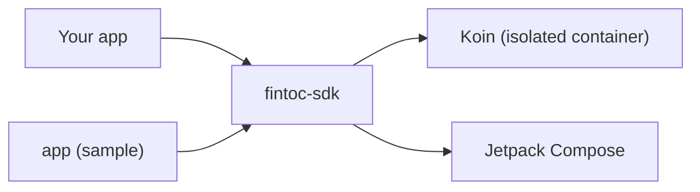

# Fintoc Android SDK

**English** · [Español](docs/es/README.md) · [Français](docs/fr/README.md) · [Português](docs/pt/README.md)

Kotlin and Jetpack Compose SDK for the [Fintoc](https://fintoc.com) API. It is the Android counterpart of the
[Fintoc Swift](https://github.com/sergiocampama/Fintoc) library and is built Compose-first, with Koin for dependency
injection.

> **Status: foundation.** The build, the dependency-injection container, the test pipeline and the sample app are in
> place. API features (links, accounts, movements) are added feature by feature through pull requests.

## Modules

| Module | Purpose |
|---|---|
| [`fintoc-sdk`](fintoc-sdk) | The library published to Maven: `mx.dev1.fintoc:fintoc-sdk`. |
| [`app`](app) | Sample application that consumes the SDK. Not published. |



## Requirements

| Tool | Version |
|---|---|
| JDK to launch Gradle | 11 or newer (the build provisions a JDK 21 toolchain automatically) |
| Android SDK Platform | 37 (`compileSdk`) |
| Android Studio | A recent stable release that supports Android Gradle Plugin 9.4 |
| Device or emulator | Android 6.0 (API 23) or newer, only needed for instrumented tests |

Supported on Android 6.0 (API 23) and newer. The SDK is compiled with `compileSdk 37`; because it depends on
Jetpack Compose, host applications must compile against `compileSdk 37` too, or pin an older Compose BOM.

## Quick start

```bash
git clone git@github.com:DEV1-Softworks/fintoc-android.git
cd fintoc-android

./gradlew :app:assembleDebug          # build the sample app
./gradlew testDebugUnitTest           # unit tests (JUnit, Robolectric, Mockito)
```

Using the SDK from an app:

```kotlin
class MyApplication : Application() {
    override fun onCreate() {
        super.onCreate()
        Fintoc.initialize(
            context = this,
            configuration = FintocConfiguration(authToken = "<your token>"),
        )
    }
}
```

## Documentation

| Topic | English | Español | Français | Português |
|---|---|---|---|---|
| Overview | this file | [es](docs/es/README.md) | [fr](docs/fr/README.md) | [pt](docs/pt/README.md) |
| Architecture | [en](docs/en/architecture.md) | [es](docs/es/architecture.md) | [fr](docs/fr/architecture.md) | [pt](docs/pt/architecture.md) |
| Contributing | [en](docs/en/contributing.md) | [es](docs/es/contributing.md) | [fr](docs/fr/contributing.md) | [pt](docs/pt/contributing.md) |

## Credits and license

The API is being modeled after [sergiocampama/Fintoc](https://github.com/sergiocampama/Fintoc), released under the
MIT License (© 2021 Sergio Campamá). That notice is kept in [NOTICE](NOTICE).

This project is licensed under the [Apache License 2.0](LICENSE).
