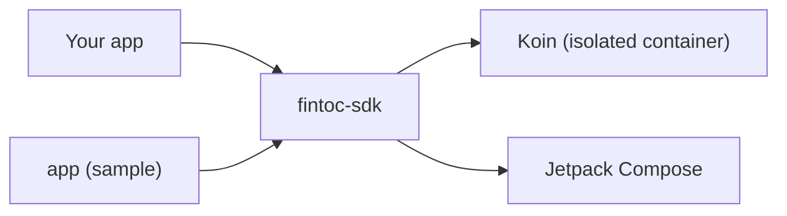

# Fintoc Android SDK

**English** · [Español](docs/es/README.md) · [Français](docs/fr/README.md) · [Português](docs/pt/README.md)

Unofficial, community-built Kotlin and Jetpack Compose SDK to add [Fintoc](https://fintoc.com) payments (such as
SPEI in Mexico) and bank connections to an Android app. It wraps Fintoc's Widget, is built Compose-first and uses Koin
for dependency injection.

> **Not affiliated with Fintoc.** This is a community project. "Fintoc" is a trademark of its respective owners.

> **Status: in development.** The build, the dependency-injection container, the test pipeline, the sample app and the
> Widget configuration (public key check, options per product and URL builder), the Widget event parser, the Compose
> `FintocWidget`, the Activity host for apps without Compose, the language override, the accessibility checks, the
> hosted checkout and the full sample app are in place, and publishing to Maven Central is set up. The first release is
> still to come.

## Modules

| Module | Purpose |
|---|---|
| [`fintoc-sdk`](fintoc-sdk) | The library published to Maven: `mx.dev1.fintoc:fintoc-sdk`. |
| [`app`](app) | Sample application that consumes the SDK. Not published. |



## Requirements

| Tool | Version |
|---|---|
| JDK to launch Gradle | 11 or newer (the build provisions a JDK 21 toolchain automatically) |
| Android SDK Platform | 37 (`compileSdk`) |
| Android Studio | A recent stable release that supports Android Gradle Plugin 9.4 |
| Device or emulator | Android 6.0 (API 23) or newer, only needed for instrumented tests |

Supported on Android 6.0 (API 23) and newer. The Jetpack Compose and AndroidX libraries that the SDK builds on need
`compileSdk 37`, and the SDK says so in its own metadata: an app that compiles against an older API stops with a clear
message. [Installation](#installation) lists what your own app needs.

## Installation

> **Not published yet.** The first release has not reached Maven Central. Until it does, build the library from source:
> run `./gradlew :fintoc-sdk:publishToMavenLocal`, add `mavenLocal()` to the repositories of your app, and use the
> `VERSION_NAME` of `gradle.properties`.

```kotlin
dependencies {
    implementation("mx.dev1.fintoc:fintoc-sdk:<version>")
}
```

What your app needs:

| | Requirement | Why |
|---|---|---|
| `compileSdk` | 37 or higher | The Compose and AndroidX libraries that the SDK builds on require it. Gradle stops with a clear message if yours is lower, and pinning an older Compose BOM does not help. |
| Android Gradle Plugin | One that supports `compileSdk 37` | This project uses 9.4.1. |
| `minSdk` | 23 | Android 6.0. |
| Kotlin | 2.2 or newer | Checked with compilers 2.2.0 and 2.4.20. The library is compiled at language level 2.2, and asks only for a 2.2 standard library, so it does not push your app to a newer Kotlin. |
| Jetpack Compose | Only for the `FintocWidget` composable | An app without Compose uses `FintocWidgetContract`, with no Compose plugin or code of its own. The Compose libraries still join your app, because the SDK depends on them. |
| Permissions and Activities | Nothing to declare | The SDK adds the `INTERNET` permission and its own private Activity to your manifest. |

If you publish an Android App Bundle and want to force the language of the SDK's own texts, turn off language splits: see
[Languages](docs/en/architecture.md#languages).

## Quick start

```bash
git clone git@github.com:DEV1-Softworks/fintoc-android.git
cd fintoc-android

./gradlew :app:assembleDebug          # build the sample app
./gradlew testDebugUnitTest           # unit tests (JUnit, Robolectric, Mockito)
```

To try the SDK against Fintoc's sandbox with the sample app, follow the [sample app guide](docs/en/sample-app.md).

Using the SDK from an app:

```kotlin
class MyApplication : Application() {
    override fun onCreate() {
        super.onCreate()
        Fintoc.initialize(
            context = this,
            configuration = FintocConfiguration(publicKey = "pk_test_…"),
        )
    }
}
```

Describe what to show with `FintocWidgetOptions`. The tokens come from your backend:

```kotlin
val options = FintocWidgetOptions.Payments(sessionToken = tokenFromYourBackend)
```

Show the Widget from Compose with `FintocWidget`. When the session token comes from your backend, pass a `suspend`
provider: the SDK calls it once for each attempt and shows a progress indicator while it waits.

```kotlin
FintocWidget(
    sessionTokenProvider = { myBackend.createSessionToken(orderId) },
    onEvent = { event ->
        when (event) {
            is FintocWidgetEvent.Succeeded -> showReceipt()
            FintocWidgetEvent.Exited -> closeScreen()
            is FintocWidgetEvent.Occurred -> Unit
        }
    },
    modifier = Modifier.fillMaxSize(),
)
```

If you already hold the options, for example `Movements`, which needs no token, pass them directly with
`FintocWidget(options = …, onEvent = …)`. The SDK declares the `INTERNET` permission itself, so your app does not have to.

Apps without Compose open the Widget in a screen of its own, with the Activity Result API:

```kotlin
private val fintocWidget = registerForActivityResult(FintocWidgetContract()) { result ->
    when (result) {
        is FintocWidgetResult.Succeeded -> checkThePaymentOnYourBackend()
        FintocWidgetResult.Exited -> Unit
    }
}

fintocWidget.launch(FintocWidgetOptions.Payments(sessionToken = tokenFromYourBackend))
```

Without that API, call `FintocWidgetContract().createIntent(…)` and `parseResult(…)` from `startActivityForResult`.

The SDK's own texts (loading message, errors, buttons) come in English, Spanish, French and Portuguese, and follow the
language of the device. To force one, for example because your app has its own language picker:

```kotlin
FintocConfiguration(publicKey = "pk_test_…", language = FintocLanguage.SPANISH)
```

The Widget page is Fintoc's and keeps its own language.

To send the customer to a Fintoc-hosted checkout page instead, open the `redirect_url` of your Checkout Session in a
Custom Tab and read what comes back to your app:

```kotlin
val nonce = UUID.randomUUID().toString() // keep it with the order; send both addresses to your backend
val checkout = FintocHostedCheckout(
    successUrl = "https://merchant.com/pay/success?n=$nonce",
    cancelUrl = "https://merchant.com/pay/cancel?n=$nonce",
)

checkout.open(this, redirectUrlFromYourBackend)

// In the Activity that receives those addresses, in onCreate and onNewIntent:
when (checkout.outcomeOf(intent)) {
    FintocHostedCheckoutOutcome.Succeeded -> showThatTheOrderIsBeingConfirmed()
    FintocHostedCheckoutOutcome.Cancelled -> showThatThePaymentWasCancelled()
    FintocHostedCheckoutOutcome.Unrelated -> Unit
}
```

The returned address is only a hint: confirm payments with Fintoc webhooks on your backend.

## Security model

- The app only holds the **public key** (`pk_test_` or `pk_live_`). The SDK refuses secret keys (`sk_…`).
- Your backend creates the Checkout Session with its secret key and hands the short-lived `session_token` to the app;
  the app passes it to the SDK.
- Tokens are never logged: the `toString()` of every option redacts them.
- The Widget runs in a hardened WebView: no access to files or content providers, no insecure subresources, Safe
  Browsing on, no JavaScript interface, and certificate errors are never accepted. The SDK never turns WebView
  debugging on.
- The WebView stays on Fintoc's hosts (`webview.fintoc.com`, `wizard.fintoc.com` and `js.fintoc.com`). Other `https`
  links, such as the payment voucher, open in the browser, and everything else is blocked.
- When the page cannot be loaded, the SDK shows its own message. The error page of the WebView would print the address,
  and the address holds the session token.
- The screen for apps without Compose is private to your app and hides itself from screenshots and the recent apps
  list. Session tokens never travel inside an `Intent`.
- A hosted checkout only opens `https` addresses on a `fintoc.com` subdomain, in a Custom Tab whose address bar stays
  visible. The address that comes back to your app can be forged by any app on the device, so the SDK requires the
  secret value that you put in your own return address to come back too.
- What the Widget reports to the app is not proof of payment. Confirm payments with Fintoc webhooks on your backend.

## Documentation

| Topic | English | Español | Français | Português |
|---|---|---|---|---|
| Overview | this file | [es](docs/es/README.md) | [fr](docs/fr/README.md) | [pt](docs/pt/README.md) |
| Architecture | [en](docs/en/architecture.md) | [es](docs/es/architecture.md) | [fr](docs/fr/architecture.md) | [pt](docs/pt/architecture.md) |
| Sample app | [en](docs/en/sample-app.md) | [es](docs/es/sample-app.md) | [fr](docs/fr/sample-app.md) | [pt](docs/pt/sample-app.md) |
| Releasing | [en](docs/en/releasing.md) | [es](docs/es/releasing.md) | [fr](docs/fr/releasing.md) | [pt](docs/pt/releasing.md) |
| Changelog | [en](docs/en/changelog.md) | [es](docs/es/changelog.md) | [fr](docs/fr/changelog.md) | [pt](docs/pt/changelog.md) |
| Contributing | [en](docs/en/contributing.md) | [es](docs/es/contributing.md) | [fr](docs/fr/contributing.md) | [pt](docs/pt/contributing.md) |

## Credits and license

The Widget integration follows [Fintoc's public documentation](https://docs.fintoc.com) and the behavior of the
official [React Native SDK](https://github.com/fintoc-com/fintoc-react-native). The MIT notice of the community Swift
client [sergiocampama/Fintoc](https://github.com/sergiocampama/Fintoc) (© 2021 Sergio Campamá) is kept in
[NOTICE](NOTICE) in case code derived from it is added.

This project is licensed under the [Apache License 2.0](LICENSE).
