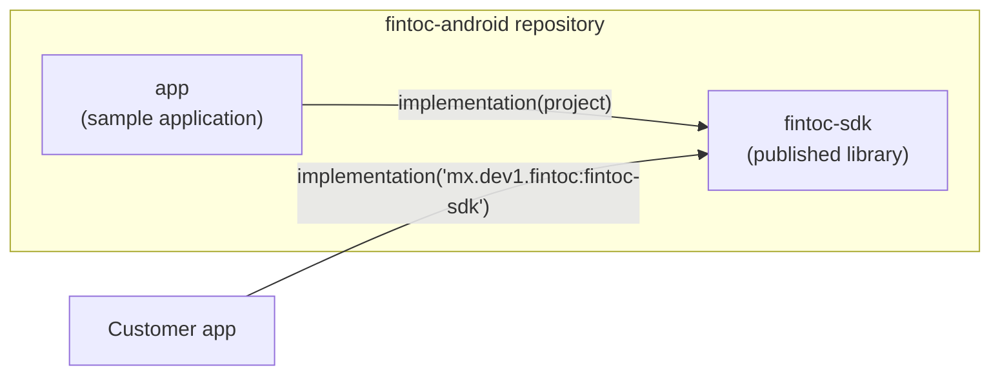
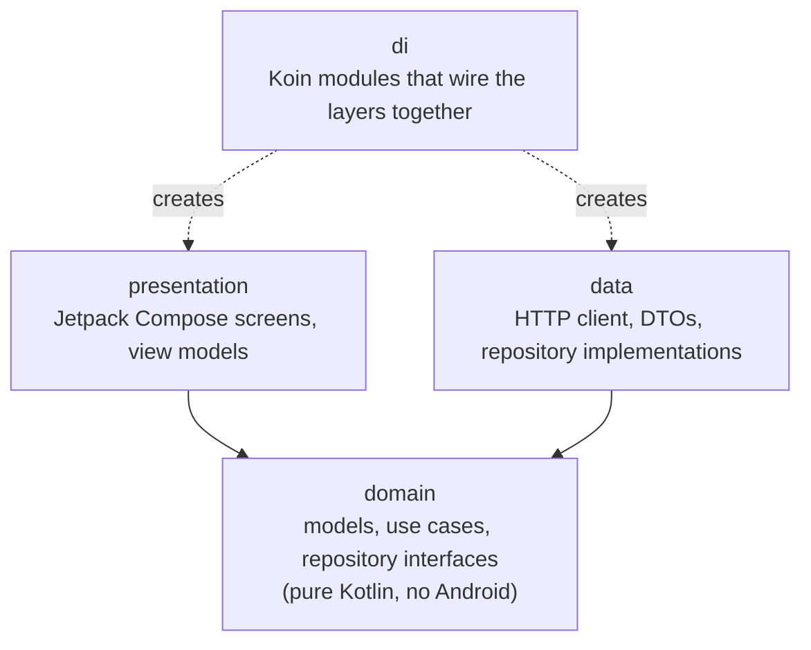
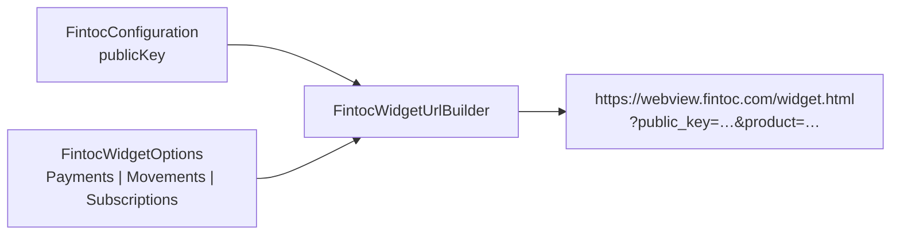
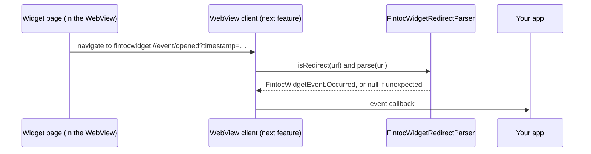
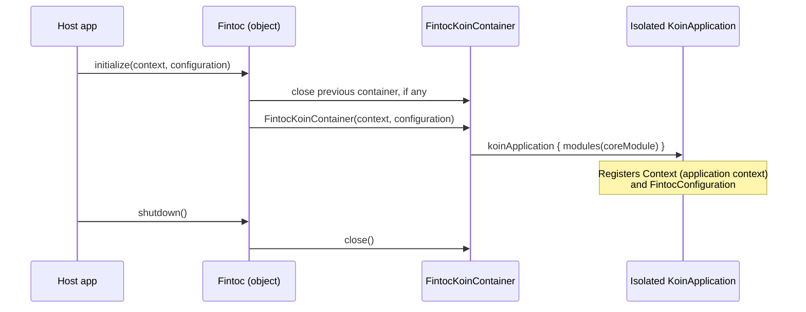

# Architecture

[Español](../es/architecture.md) · [Français](../fr/architecture.md) · [Português](../pt/architecture.md) · [Back to README](../../README.md)

This page explains how the project is organized. You do not need prior Android experience to follow it.

## Big picture

The repository is a Gradle build with two modules:

- **`fintoc-sdk`** is an *Android library*: code that other apps include as a dependency. It is what gets published to Maven.
- **`app`** is an *Android application* that uses the SDK the way a customer would. It doubles as a living example.

## Clean architecture

Every module follows the same three layers. Dependencies only point **inwards**, towards the domain.

| Layer | Knows about | Must never know about |
|---|---|---|
| `domain` | Kotlin standard library, coroutines | Android, Koin, HTTP, Compose |
| `data` | `domain` | `presentation`, Compose |
| `presentation` | `domain` | `data` |
| `di` | all layers | — |

Today the `domain` layer (packages `domain.widget` and `domain.security`), the `di` package and the public entry point
exist. The other layers are created as features arrive, under the base package `mx.dev1.fintoc.sdk`.

## Public API and explicit API mode

The SDK enables Kotlin's **explicit API mode**. Every declaration is `internal` unless it is deliberately marked
`public`, so the public surface of the library is always intentional. Today it is:

| Type | Role |
|---|---|
| `Fintoc` | Entry point: `initialize`, `shutdown`, `isInitialized`. |
| `FintocConfiguration` | Settings: `publicKey` (only `pk_test_` or `pk_live_`; `sk_` secret keys are rejected) and `environment`, deduced from the prefix. Its `toString()` hides the key. |
| `FintocEnvironment` | `TEST` or `LIVE`. |
| `FintocWidgetOptions` | What the Widget should do: `Payments`, `Movements` or `Subscriptions`. Each validates its data and hides its tokens in `toString()`. |
| `FintocCountry`, `FintocHolderType` | Accepted values for `country` and `holder_type`. |
| `FintocWidgetEvent` | What the Widget reports: `Succeeded`, `Exited` or `Occurred`. |
| `FintocWidgetEventType` | The events Fintoc documents, such as `OPENED` or `PAYMENT_ERROR`. |
| `FintocLinkIntentResult` | The `exchangeToken` of a bank account connected with `Movements`. Its `toString()` hides the token. |

## Widget configuration

Fintoc's Widget is a web page that the SDK shows in a WebView. It reads its settings from the URL query string, so the
SDK turns your `FintocConfiguration` and your `FintocWidgetOptions` into that URL.

| Options | Product | Parameters sent after `public_key` and `product` |
|---|---|---|
| `Payments(sessionToken)` | `payments` (SPEI in Mexico, bank transfer in Chile) | `session_token` |
| `Movements(holderType, country, linkToken?, webhookUrl?)` | `movements` | `holder_type`, `country`, `link_token`, `webhook_url` |
| `Subscriptions(widgetToken, holderType, country)` | `subscriptions` | `holder_type`, `country`, `widget_token` |

Safety rules enforced when you create the objects:

- Blank values, values with whitespace and values starting with `sk_` are rejected. Error messages never repeat the
  rejected value.
- `webhookUrl` must be an absolute `https` URL.
- Values are percent-encoded (RFC 3986), so a token cannot add or replace parameters.
- `toString()` hides the tokens.

The URL always ends with `_on_event=true`, which asks the Widget to report its events to the app.

## Widget events

The Widget talks back by navigating the WebView to addresses that start with `fintocwidget://`. The SDK never lets the
WebView actually open those addresses: it hands each one to `FintocWidgetRedirectParser`, which turns it into a
`FintocWidgetEvent`.

| Redirect from the Widget | Event |
|---|---|
| `fintocwidget://succeeded` | `Succeeded`. For `Movements` it also carries `?object=link_intent&exchange_token=…&id=…`, which becomes `linkIntent`. |
| `fintocwidget://exit` | `Exited`: the user closed the Widget before finishing. |
| `fintocwidget://event/{name}?timestamp=…` | `Occurred(name, timestampMillis, metadata)`. `type` is the matching `FintocWidgetEventType`, or `null` when Fintoc added an event this SDK does not know yet. |

Safety rules of the parser:

- It works on the raw text and never throws. A wrong scheme, an unknown action or an odd event name gives `null`, so the
  page can never crash your app.
- Event names may only use letters, digits, `_`, `.` and `-`, up to 64 characters. Redirects longer than 8,192
  characters and parameters beyond the 64th are ignored.
- The Widget does not encode what it sends, so decoding is lenient: only well-formed `%XX` escapes are decoded.
- The first occurrence of a key wins. A stray `&` inside a value cannot replace an earlier `exchange_token`.
- Values the Widget wrote as `null`, `undefined` or `[object Object]` are dropped.
- `FintocLinkIntentResult.toString()` hides the `exchangeToken`, and `Occurred.toString()` lists the metadata keys but
  not their values.

> **An event is not proof of payment.** A user, or a compromised device, can fake what a WebView reports. Send the
> `exchangeToken` to **your backend**, which is the only place that can exchange it, and confirm payments with Fintoc
> webhooks before you fulfil an order.

## Dependency injection with an isolated Koin container

Koin is the dependency-injection framework. The SDK creates **its own** container instead of using Koin's global one.
That way the SDK can never collide with a Koin instance that the host app starts.

Internal code gets dependencies through `Fintoc.requireKoin()`. If the host forgot to call `initialize`, it fails
immediately with a message explaining what to do.

## Build decisions

| Decision | Value | Why |
|---|---|---|
| Kotlin | 2.4.20 | Current stable release. Android Gradle Plugin 9 ships Kotlin support built in, so no separate Kotlin plugin is applied. |
| Android Gradle Plugin | 9.4.1 (requires Gradle 9.6.0) | Current stable release. |
| `minSdk` | 23 (Android 6.0) | Lowest level Jetpack Compose supports, to reach as many devices as possible. Do not call APIs above API 23 (such as `java.time`) without a guard or desugaring. |
| `compileSdk` | 37 | Required by Compose BOM 2026.09.00. |
| `targetSdk` (sample app) | 36 | The level currently required by Google Play. |
| Jetpack Compose | BOM 2026.09.00 | Compose-first UI. XML is only used where the platform requires it (manifest, window theme). |
| Java bytecode | 11 | Keeps the library consumable by as many host apps as possible. |
| Versions | `gradle/libs.versions.toml` | Single place for every dependency version. |

## Testing and coverage

Three kinds of tests exist, and the coverage report merges all of them:

| Kind | Location | Tools | Runs on |
|---|---|---|---|
| Unit | `src/test` | JUnit 4, Mockito, Robolectric | Your computer |
| Instrumented | `src/androidTest` | AndroidX Test, Espresso, Compose UI test | Device or emulator |
| Coverage | `gradle/jacoco-coverage.gradle.kts` | JaCoCo | Combines both |

The build fails when line or instruction coverage of a module drops below **80%**. See [Contributing](contributing.md)
for the exact commands.
