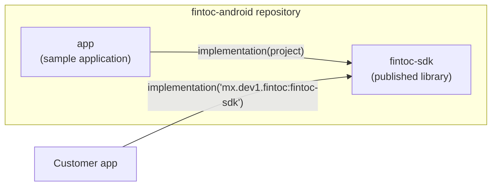
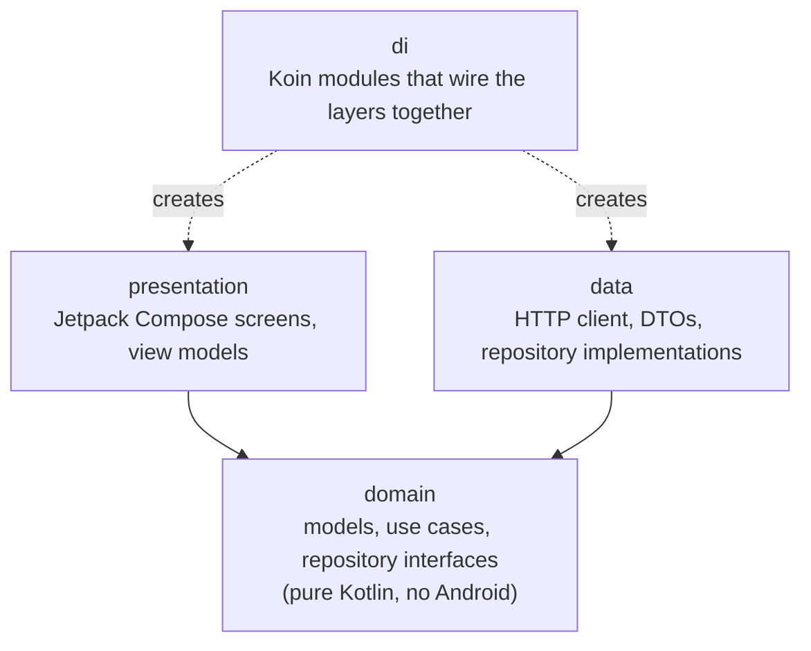
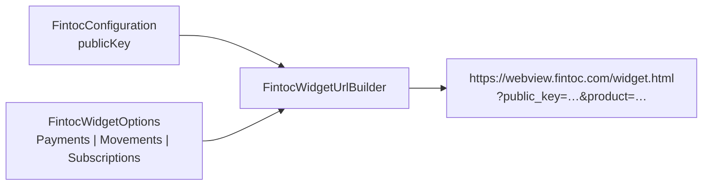
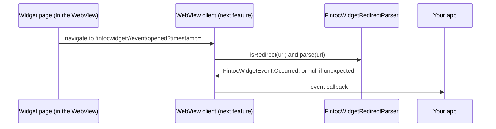
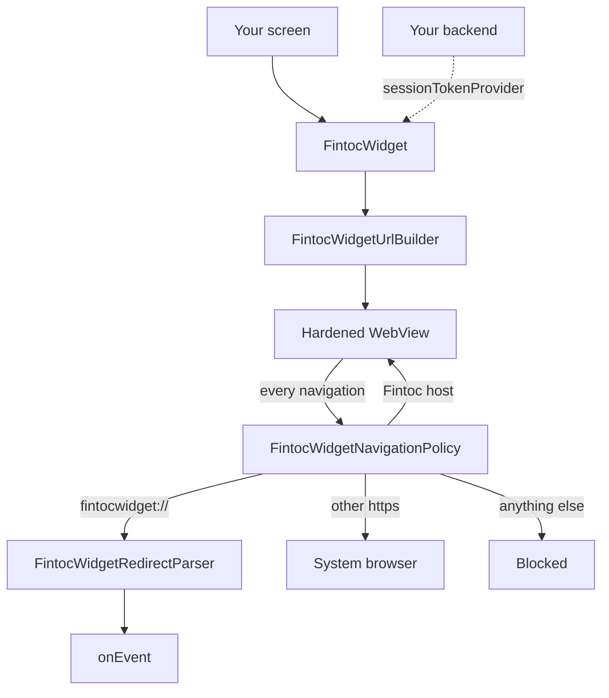
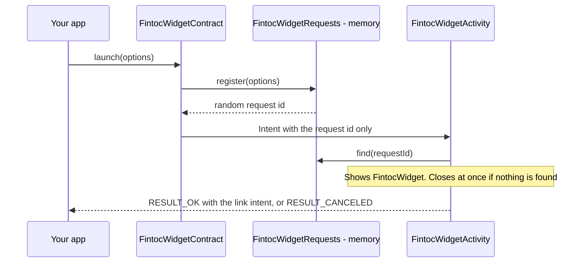
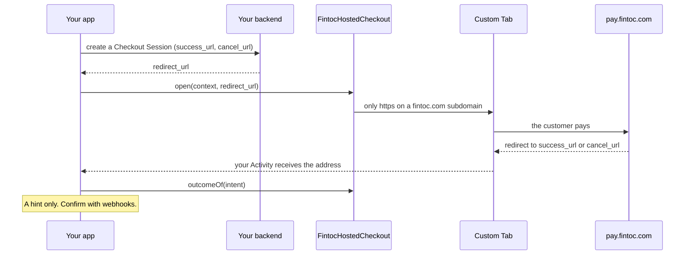
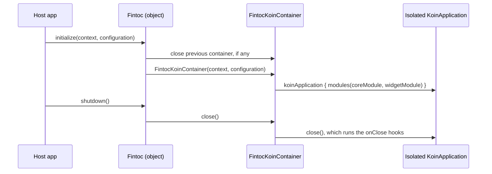

# Architecture

[Español](../es/architecture.md) · [Français](../fr/architecture.md) · [Português](../pt/architecture.md) · [Back to README](../../README.md)

This page explains how the project is organized. You do not need prior Android experience to follow it.

## Big picture

The repository is a Gradle build with two modules:

- **`fintoc-sdk`** is an *Android library*: code that other apps include as a dependency. It is what gets published to Maven.
- **`app`** is an *Android application* that uses the SDK the way a customer would. It doubles as a living example.



## Clean architecture

Every module follows the same three layers. Dependencies only point **inwards**, towards the domain.



| Layer | Knows about | Must never know about |
|---|---|---|
| `domain` | Kotlin standard library, coroutines | Android, Koin, HTTP, Compose |
| `data` | `domain` | `presentation`, Compose |
| `presentation` | `domain` | `data` |
| `di` | all layers | — |

Today the `domain` layer (packages `domain.widget` and `domain.security`), the `presentation` layer (package
`presentation.widget`), the `di` package and the public entry point exist. The other layers are created as features arrive, under the base package `mx.dev1.fintoc.sdk`.

## Public API and explicit API mode

The SDK enables Kotlin's **explicit API mode**. Every declaration is `internal` unless it is deliberately marked
`public`, so the public surface of the library is always intentional. Today it is:

| Type | Role |
|---|---|
| `Fintoc` | Entry point: `initialize`, `shutdown`, `isInitialized`. |
| `FintocConfiguration` | Settings: `publicKey` (only `pk_test_` or `pk_live_`; `sk_` secret keys are rejected), `environment`, deduced from the prefix, and `language`, to force the language of the SDK's own texts. Its `toString()` hides the key. |
| `FintocEnvironment` | `TEST` or `LIVE`. |
| `FintocWidgetOptions` | What the Widget should do: `Payments`, `Movements` or `Subscriptions`. Each validates its data and hides its tokens in `toString()`. |
| `FintocCountry`, `FintocHolderType` | Accepted values for `country` and `holder_type`. |
| `FintocWidgetEvent` | What the Widget reports: `Succeeded`, `Exited` or `Occurred`. |
| `FintocWidgetEventType` | The events Fintoc documents, such as `OPENED` or `PAYMENT_ERROR`. |
| `FintocLinkIntentResult` | The `exchangeToken` of a bank account connected with `Movements`. Its `toString()` hides the token. |
| `FintocWidget` | The composable that shows the Widget. One overload takes `FintocWidgetOptions`, the other a `suspend` session token provider for payments. |
| `FintocLanguage` | Languages of the SDK's own texts: English, Spanish, French and Portuguese. |
| `FintocWidgetContract`, `FintocWidgetResult` | Open the Widget in a screen of its own, for apps without Compose, and read how it ended: `Succeeded` or `Exited`. |
| `FintocHostedCheckout`, `FintocHostedCheckoutOutcome` | Open a Fintoc-hosted checkout in a Custom Tab, and tell whether the address that came back to your app is your success address, your cancel address or neither. |

## Widget configuration

Fintoc's Widget is a web page that the SDK shows in a WebView. It reads its settings from the URL query string, so the
SDK turns your `FintocConfiguration` and your `FintocWidgetOptions` into that URL.



| Options | Product | Parameters sent after `public_key` and `product` |
|---|---|---|
| `Payments(sessionToken)` | `payments` (SPEI in Mexico, bank transfer in Chile) | `session_token` |
| `Movements(holderType, country, linkToken?, webhookUrl?)` | `movements` | `holder_type`, `country`, `link_token`, `webhook_url` |
| `Subscriptions(widgetToken, holderType, country)` | `subscriptions` | `holder_type`, `country`, `widget_token` |

Safety rules enforced when you create the objects:

- Blank values, values with whitespace and values starting with `sk_` are rejected. Error messages never repeat the
  rejected value.
- `webhookUrl` must be an absolute `https` URL.
- Values are percent-encoded (RFC 3986), so a token cannot add or replace parameters.
- `toString()` hides the tokens.

The URL always ends with `_on_event=true`, which asks the Widget to report its events to the app.

## Widget events

The Widget talks back by navigating the WebView to addresses that start with `fintocwidget://`. The SDK never lets the
WebView actually open those addresses: it hands each one to `FintocWidgetRedirectParser`, which turns it into a
`FintocWidgetEvent`.



| Redirect from the Widget | Event |
|---|---|
| `fintocwidget://succeeded` | `Succeeded`. For `Movements` it also carries `?object=link_intent&exchange_token=…&id=…`, which becomes `linkIntent`. |
| `fintocwidget://exit` | `Exited`: the user closed the Widget before finishing. |
| `fintocwidget://event/{name}?timestamp=…` | `Occurred(name, timestampMillis, metadata)`. `type` is the matching `FintocWidgetEventType`, or `null` when Fintoc added an event this SDK does not know yet. |

Safety rules of the parser:

- It works on the raw text and never throws. A wrong scheme, an unknown action or an odd event name gives `null`, so the
  page can never crash your app.
- Event names may only use letters, digits, `_`, `.` and `-`, up to 64 characters. Redirects longer than 8,192
  characters and parameters beyond the 64th are ignored.
- The Widget does not encode what it sends, so decoding is lenient: only well-formed `%XX` escapes are decoded.
- The first occurrence of a key wins. A stray `&` inside a value cannot replace an earlier `exchange_token`.
- Values the Widget wrote as `null`, `undefined` or `[object Object]` are dropped.
- `FintocLinkIntentResult.toString()` hides the `exchangeToken`, and `Occurred.toString()` lists the metadata keys but
  not their values.

> **An event is not proof of payment.** A user, or a compromised device, can fake what a WebView reports. Send the
> `exchangeToken` to **your backend**, which is the only place that can exchange it, and confirm payments with Fintoc
> webhooks before you fulfil an order.

## Widget view

`FintocWidget` is the composable that puts the Widget on screen. It builds the Widget URL from the public key you gave
to `Fintoc.initialize`, shows it in a hardened WebView and reports the events through `onEvent`.



Every address the page navigates to goes through `FintocWidgetNavigationPolicy`, so a misbehaving page cannot turn the
WebView into a general-purpose browser inside your app:

| Address | Main frame | Frames inside the page |
|---|---|---|
| `fintocwidget://…` | Reported to the app, never opened | Same |
| `https` on `webview.fintoc.com`, `wizard.fintoc.com` or `js.fintoc.com` | Stays in the WebView | Loads |
| Any other `https` address, such as the payment voucher | Opens in the browser | Loads |
| `http`, `intent:`, `javascript:`, `file:`, `data:`… | Blocked | Loads |

The check is strict: an address that hides its host behind a backslash, a percent escape or an `@` does not count as a
Fintoc host.

What the user sees:

- A progress indicator covers the page while it loads.
- If the page cannot be loaded, the WebView is removed and a message with a "Try again" button replaces it. That
  covers network errors, HTTP errors of the page itself, certificate problems with a Fintoc host and, on Android 8.0
  and newer, a crashed WebView renderer, which would otherwise close your app. Tapping the button creates a fresh WebView.
- The messages come in English, Spanish, French and Portuguese, following the language of the device.

The `sessionTokenProvider` overload is for payments. Fintoc session tokens belong to one payment attempt, so the SDK
calls the provider once when the composable enters the composition and again each time the user taps "Try again" after
a failure. If the provider throws, or returns a blank token or a secret key, the user sees the same message. Logs
never include the token or the message of the error your provider threw.

Good to know:

- The SDK declares the `INTERNET` permission in its own manifest. Without it the WebView fails every load with the
  cryptic `net::ERR_CACHE_MISS`.
- The Widget loads again from the start when the screen is recreated, because a session token is not something the SDK
  can keep safely. To keep a payment going through a rotation, let your activity handle the change itself with
  `android:configChanges="orientation|screenSize|keyboardHidden"`.
- WebView debugging is a setting of your whole app. The SDK never turns it on.
- The downloads the Widget offers, such as the payment voucher, are handed to the browser.

## Activity host

Apps that do not use Compose open the Widget with `FintocWidgetContract`, an `ActivityResultContract`. It starts
`FintocWidgetActivity`, which shows the same `FintocWidget` under a title bar.



Design decisions:

- The options hold session tokens, so they never travel inside the `Intent`. It only carries a random identifier and the
  options stay in memory. If the system restores the screen after the process died, nothing is found and the screen
  closes as cancelled.
- The screen is not exported, so no other app can start it, and `FLAG_SECURE` hides it from screenshots, screen
  recordings and the recent apps list, because the Widget asks for bank credentials.
- It handles configuration changes itself (rotation, font size, language, dark mode), so a payment in progress is not
  restarted.
- After a success the screen stays open, because Fintoc's guide says the user may need to download a payment voucher. The
  button turns from "Close" into "Done", and the result reaches your app when the user taps it or goes back. An exit
  that the Widget reports after a success does not turn it into a cancellation.
- Only the end of the flow comes back, as `Succeeded` or `Exited`. To follow every event of the Widget, use the
  composable.
- It is edge-to-edge and pads its content for the keyboard and the system bars, so no field of the Widget ends up under
  them.

## Hosted checkout

Besides the Widget, Fintoc offers a **hosted checkout**. Your backend creates a Checkout Session and Fintoc answers with
a `redirect_url`, such as `https://pay.fintoc.com/checkout/cs_…`, where the customer pays. When they finish, Fintoc
sends them back to the `success_url` or the `cancel_url` that you gave. The `payment`, `setup` and `subscription` flows
all work this way. `FintocHostedCheckout` opens that page in a **Custom Tab**, a browser view with a visible address bar,
and tells you what came back.



What is checked:

| What | Rule |
|---|---|
| The `redirectUrl` you open | `https`, on a subdomain of `fintoc.com`, with no credentials and the default port. Anything else throws `IllegalArgumentException` and nothing opens. Look-alikes such as `fintoc.com` itself, `pay.fintoc.com.evil.example` or `evilfintoc.com` are refused. |
| Your `successUrl` and `cancelUrl` | An absolute `https` address, or a custom scheme of your app. `http`, `javascript:`, `file:`, `intent:` and the like are refused, and so are two addresses that cannot be told apart. |
| An address that reaches your app | The same scheme, host, port and path as one of yours (case and a trailing slash do not matter). Its query is ignored, except for the parameters that your own address carries: each must come back with the same value. An address that fits both of yours is not acted on. |

To receive the customer back, declare the Activity that handles your return addresses, here an App Link, and read the
outcome in `onCreate` and in `onNewIntent`:

```xml
<activity
    android:name=".PaymentReturnActivity"
    android:exported="true"
    android:launchMode="singleTask">
    <intent-filter android:autoVerify="true">
        <action android:name="android.intent.action.VIEW" />
        <category android:name="android.intent.category.DEFAULT" />
        <category android:name="android.intent.category.BROWSABLE" />
        <data android:scheme="https" android:host="merchant.com" android:pathPrefix="/pay" />
    </intent-filter>
</activity>
```

Good to know:

- **A returned address is a hint, never proof.** Any app can open your deep link, and the customer may close the tab and
  never come back. Fintoc says the same: use webhooks. Closing the Custom Tab tells your app nothing, so refresh the
  order status from your backend when your screen resumes.
- **Put an unguessable value in your own addresses**, such as the `n` of the example. The SDK requires every query
  parameter of your addresses to come back with the same value. Checked against Fintoc's sandbox: Fintoc accepts a
  query string in your `success_url` and returns it.
- **Prefer verified App Links to custom schemes.** Any other app can claim a custom scheme and would receive the redirect,
  secret value included. A verified App Link cannot be claimed.
- **Use `launchMode="singleTask"`** for the Activity that receives the return addresses. Checked on a Pixel 10 with
  Chrome: the Activity that is already open gets the address through `onNewIntent` and the Custom Tab closes. With the
  default launch mode a second copy of the Activity is created. On the same device, a server redirect from a Custom Tab
  into a custom scheme opened the app without a tap, but other browsers and versions may behave differently.
- `open` returns `false` when no app can open the address, and needs `Fintoc.initialize`. `outcomeOf` needs nothing, so it
  also works when the system restores your Activity in a new process.

## Languages

The SDK's own texts (loading message, error message, buttons and title) exist in English, Spanish, French and
Portuguese.

| You set | The SDK uses |
|---|---|
| Nothing (`language = null`) | The language of the device and, on Android 13 and newer, the language chosen for your app in the system settings. Regional variants such as `es-MX` or `pt-BR` use their language. Any other language falls back to English. |
| A `FintocLanguage` in `FintocConfiguration` | That language, whatever the device says. The rest of the configuration of the device, such as the font size, is kept. |

Good to know:

- The override only changes what the SDK draws. The Widget page is Fintoc's web page and keeps its own language.
- To change the language later, call `Fintoc.initialize` again before showing the Widget. A Widget that is already on
  screen keeps the language it had.
- If you publish an Android App Bundle, turn off language splits with
  `android { bundle { language { enableSplit = false } } }`. By default Google Play delivers only the languages of the
  user's device, so a language that you force but the device does not use would fall back to English.
- Resources use the `fintoc_` prefix. To add a text, add it in `values/` and also in `values-es`, `values-fr` and
  `values-pt`: lint reports a missing translation as an error.

## Accessibility

The SDK's own screens keep working with the tools Android offers to people who need them:

| Concern | What the SDK does |
|---|---|
| Screen readers (TalkBack) | The loading indicator has a description and is announced politely. The failure message is announced when it appears. The title of the Activity host is a heading. Buttons have visible text, not only icons. The Widget page is a web page, which TalkBack reads natively. |
| Large fonts and display size | Texts use `sp`. The failure view scrolls, so at the largest sizes on a small screen the message and the button stay reachable. The language override keeps the font scale. The WebView is never prevented from zooming. |
| Touch targets | Buttons are at least 48 dp. |
| Keyboard and system bars | The Activity host is edge-to-edge and pads its content for both. |
| Light and dark themes | The Activity host follows the theme of the device. |

How it is checked: the instrumented tests run Google's Accessibility Test Framework on a real device over the loading
view, the failure view and the Activity host, at the default settings and at 200% font size with 150% display size.
Any error fails the build. The accessibility of the Widget page itself is Fintoc's.

## Dependency injection with an isolated Koin container

Koin is the dependency-injection framework. The SDK creates **its own** container instead of using Koin's global one.
That way the SDK can never collide with a Koin instance that the host app starts.



What lives in the container, and why:

| Module | Definition | Kind | Why it is in the container |
|---|---|---|---|
| `coreModule` | `Context` | `single` | The application context, never an Activity, so nothing leaks. |
| `coreModule` | `FintocConfiguration` | `single` | The settings given to `Fintoc.initialize`. |
| `widgetModule` | `FintocWidgetRequests` | `single`, with `onClose` | Holds the session tokens of the screens of the Activity host. It is cleared when the container closes, so `Fintoc.shutdown()`, or initializing again, forgets every token. |
| `widgetModule` | `ExternalLinkLauncher` | `factory` | Needs the context the Widget is shown in, so it is created with `parametersOf(context)`. |

The rule: **the container owns what has state or depends on Android.** Pure functions with nothing to release, such as
`FintocWidgetUrlBuilder`, `FintocWidgetNavigationPolicy` and `FintocWidgetRedirectParser`, stay plain Kotlin objects:
injecting them would only add indirection.

Internal code gets its dependencies through `Fintoc.requireKoin()`. If the host app forgot to call `initialize`, it fails
immediately with a message explaining what to do. Code that must not crash without the SDK, such as an Activity that the
system restores after the process died, uses `Fintoc.koinOrNull()` and closes instead.

The SDK needs no extra consumer rules for R8. A minified release build with resource shrinking was checked on a real
device: the Activity host opened and resolved everything through Koin.

## Build decisions

| Decision | Value | Why |
|---|---|---|
| Kotlin | 2.4.20 | Current stable release. Android Gradle Plugin 9 ships Kotlin support built in, so no separate Kotlin plugin is applied. |
| Android Gradle Plugin | 9.4.1 (requires Gradle 9.6.0) | Current stable release. |
| `minSdk` | 23 (Android 6.0) | Lowest level Jetpack Compose supports, to reach as many devices as possible. Do not call APIs above API 23 (such as `java.time`) without a guard or desugaring. |
| `compileSdk` | 37 | Required by Compose BOM 2026.09.00. |
| `targetSdk` (sample app) | 36 | The level currently required by Google Play. |
| Jetpack Compose | BOM 2026.09.00 | Compose-first UI. XML is only used where the platform requires it (manifest, window theme). |
| Java bytecode | 11 | Keeps the library consumable by as many host apps as possible. |
| Espresso | 3.7.0, pinned in `fintoc-sdk` too | Compose UI tests use an Espresso hook that fails on recent Android versions when an older release is pulled in indirectly. |
| Publishing | `com.vanniktech.maven.publish` 0.37.0 | Publishes to Maven Central with sources, API docs and GPG signatures. Coordinates and POM data live in `gradle.properties`. |
| API documentation | Dokka 2.2.0 | Turns the KDoc of the public API into the javadoc jar. The Java doclet cannot read Kotlin, so without it the jar holds only stylesheets. |
| Kotlin language level | 2.2, standard library 2.2.0 | A compiler reads metadata up to one version newer than itself, and Gradle gives an app the newest standard library that any dependency asks for. Compiling this build's 2.4 would force newer Kotlin on every app. Checked with a consumer app on Kotlin 2.2.0. |
| Versions | `gradle/libs.versions.toml` | Single place for every dependency version. |

## Testing and coverage

Three kinds of tests exist, and the coverage report merges all of them:

| Kind | Location | Tools | Runs on |
|---|---|---|---|
| Unit | `src/test` | JUnit 4, Mockito, Robolectric | Your computer |
| Instrumented | `src/androidTest` | AndroidX Test, Espresso, Compose UI test | Device or emulator |
| Coverage | `gradle/jacoco-coverage.gradle.kts` | JaCoCo | Combines both |

The build fails when line or instruction coverage of a module drops below **80%**. See [Contributing](contributing.md)
for the exact commands.
