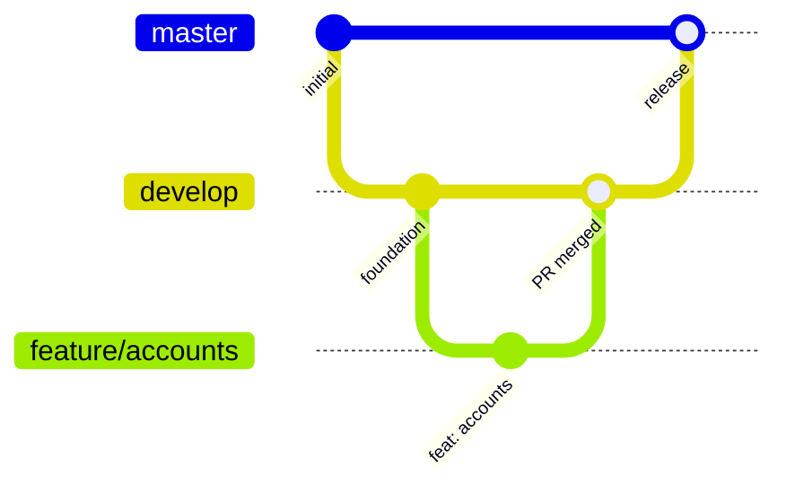

# Contributing

[Español](../es/contributing.md) · [Français](../fr/contributing.md) · [Português](../pt/contributing.md) · [Back to README](../../README.md)

Thank you for helping. This guide assumes no previous Android experience.

## 1. Set up your machine

1. Install a recent stable **Android Studio**. It bundles the Android SDK manager.
2. In *SDK Manager*, install **Android SDK Platform 37**.
3. Make sure a JDK 11 or newer is available to launch Gradle. The build downloads the JDK 21 toolchain it needs by itself.
4. Clone the repository and open the folder in Android Studio, or work from the terminal with `./gradlew`.

```bash
git clone git@github.com:DEV1-Softworks/fintoc-android.git
cd fintoc-android
./gradlew :app:assembleDebug
```

## 2. Project layout

```text
fintoc-android/
├── fintoc-sdk/                 # the published library
│   └── src/
│       ├── main/kotlin/        # SDK source code
│       ├── test/kotlin/        # unit tests (run on your computer)
│       └── androidTest/kotlin/ # instrumented tests (run on a device)
├── app/                        # sample application (same src layout)
├── .github/workflows/          # continuous integration, run on every pull request
├── gradle/
│   ├── libs.versions.toml      # every dependency version lives here
│   ├── jacoco-coverage.gradle.kts
│   └── robolectric.gradle.kts
└── docs/                       # documentation in en, es, fr and pt
```

## 3. Run the tests

| Goal | Command |
|---|---|
| Unit tests | `./gradlew testDebugUnitTest` |
| Instrumented tests (device connected) | `./gradlew connectedDebugAndroidTest` |
| Coverage report | `./gradlew jacocoDebugCoverageReport` |
| Enforce the 80% rule | `./gradlew jacocoDebugCoverageVerification` |
| Everything, in the right order | `./gradlew clean testDebugUnitTest connectedDebugAndroidTest jacocoDebugCoverageReport jacocoDebugCoverageVerification` |

The HTML report is written to `<module>/build/reports/jacoco/jacocoDebugCoverageReport/html/index.html`.

**Run all tests before every commit.** The coverage tasks do not start the tests by themselves, because instrumented tests
need a device. If you skip the test tasks, the coverage check only sees stale or missing data.

### Instrumented tests tips

- Use a physical device with USB debugging enabled, or an emulator running Android 6.0 (API 23) or newer.
- **Keep the screen on and unlocked** while the tests run. If the screen turns off, Compose tests fail with
  `No compose hierarchies found in the app`.
- Espresso 3.7.0 or newer is required to run on Android 16 (it is already declared in the version catalog).
- The tests of the Activity host start the real screen of the SDK and rotate the device once. The screen loads Fintoc's
  public Widget page, but the tests pass whether or not it manages to load.
- The hosted checkout test opens a Custom Tab of the browser of the device, on a made-up session of `pay.fintoc.com`, and
  sends the Back key to return. Keep the screen unlocked, and expect the browser to appear for a moment.

## 4. Coding rules

- Kotlin official code style, default 4-space indentation.
- Descriptive names for variables, functions and classes. Single-letter names are only acceptable as loop counters.
- Clean architecture: respect the layer rules in [Architecture](architecture.md).
- Everything in the SDK is `internal` unless it must be public (explicit API mode enforces this).
- Compose first: build UI with Jetpack Compose. Use XML only for legacy needs such as the manifest.
- Every new dependency version goes in `gradle/libs.versions.toml`, never inline in a module.
- Every behavior change comes with unit tests and, when it touches Android, instrumented tests. Module coverage must stay at or above 80%.

## 5. Git flow

| Branch | Purpose |
|---|---|
| `master` | Production. Never commit to it directly. |
| `develop` | Integration branch. Every feature is merged here through a pull request. |
| `feature/<topic>` | One branch per feature, created from an up-to-date `develop`. |
| `fix/<topic>` | One branch per bug fix, created from an up-to-date `develop`. |

There is no `main` branch in this repository.



Feature branches start from `develop` and return to it through a reviewed pull request. `develop` reaches `master` on release.

Steps for a change:

1. `git checkout develop && git pull`.
2. `git checkout -b feature/<topic>`.
3. Make small commits using [Conventional Commits](https://www.conventionalcommits.org/): `feat: …`, `fix: …`, `docs: …`, `test: …`, `chore: …`.
4. Run all the tests (section 3).
5. Open a pull request into `develop` with a summary of the changes and a reference to the related issue or task.
6. Wait for the review and the merge. Only then start the next feature from `develop`.

**No stacked pull requests.** Each branch starts from `develop`, never from another feature branch.

### Checks on every pull request

GitHub Actions runs `.github/workflows/ci.yml` for every pull request into `develop` or `master`, and for every push to
them. Three jobs run in parallel, and a pull request is ready to merge only when all three are green:

| Job | What it checks | The same on your machine |
|---|---|---|
| Unit tests and coverage | Runs the unit tests and fails below 80% coverage. It counts the unit tests alone, which is stricter than the merged coverage of section 3, so passing here means passing there. Pull requests from this repository also get a comment with the coverage. | `./gradlew testDebugUnitTest jacocoDebugCoverageReport jacocoDebugCoverageVerification` |
| Lint and release build | Runs lint, builds the release variants and publishes to a local folder, which needs no credentials. The library files are attached to the run. | `./gradlew lintDebug lintRelease assembleRelease :fintoc-sdk:publishToMavenLocal -Dmaven.repo.local=/tmp/fintoc-m2` |
| Instrumented tests | Runs the instrumented tests on an emulator of the runner (Android 14, API 34). Your machine does not need one: you run these tests on a physical device. | `./gradlew connectedDebugAndroidTest` |

The reports of each run are attached to it as artifacts, which helps when a job fails and the cause is not in the log.

## 6. Documentation

Every change that affects behavior or setup updates the docs. Documents live in `docs/` and must exist in four languages:
English (`docs/en`), Spanish (`docs/es`), French (`docs/fr`) and Portuguese (`docs/pt`). The root `README.md` is the entry point.
