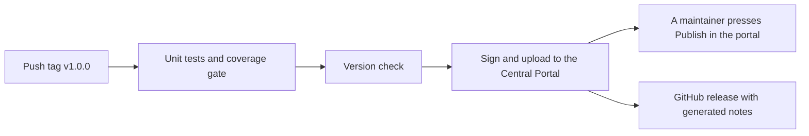

# Releasing

[Español](../es/releasing.md) · [Français](../fr/releasing.md) · [Português](../pt/releasing.md) · [Back to README](../../README.md)

This page explains how a maintainer publishes `mx.dev1.fintoc:fintoc-sdk` to [Maven Central](https://central.sonatype.com).
Nothing secret is in the repository: your credentials live in your own `~/.gradle/gradle.properties` or in environment
variables.

## One-time setup

1. Create an account on the [Central Portal](https://central.sonatype.com).
2. **Verify the namespace** `mx.dev1` in the portal (Namespaces). It proves that you own the domain `dev1.mx`, with a DNS
   record. The coordinates `mx.dev1.fintoc` live under it. A namespace such as `io.github.dev1-softworks` would not need a
   domain, but it would change the coordinates of the library, so decide before the first release.
3. **Generate a user token** in the portal (Account, then Generate User Token). It is a username and a password for the
   upload, not the ones you log in with.
4. **Create a GPG key** that signs the artifacts, and publish its public part to a keyserver that Maven Central reads,
   such as `keyserver.ubuntu.com`:

```bash
gpg --full-generate-key
gpg --keyserver keyserver.ubuntu.com --send-keys <key id>
gpg --export-secret-keys --armor <key id>    # prints the private key: keep it out of logs and chats
```

5. Give Gradle the credentials, in your user `gradle.properties`:

```properties
# ~/.gradle/gradle.properties, never in the repository
mavenCentralUsername=<token username>
mavenCentralPassword=<token password>
signingInMemoryKey=<armored secret key, on one line or with \n for the line breaks>
signingInMemoryKeyPassword=<password of the key>
```

On a CI server use the same names as environment variables with the prefix `ORG_GRADLE_PROJECT_`, for example
`ORG_GRADLE_PROJECT_mavenCentralUsername`.

## Versioning

The version is `VERSION_NAME` in `gradle.properties`. The project follows [Semantic Versioning](https://semver.org). Between
releases it ends in `-SNAPSHOT`. Maven Central never accepts the same version twice, so a mistake is fixed with a new
version. The first release is 1.0.0, so the public API is a commitment from the start: a change that breaks it raises the
major version, a new feature raises the minor version and a fix raises the patch version. Only what the API
documentation lists is public: everything marked `internal` is free to change. The [changelog](changelog.md) lists each
change.

## Release steps

They follow the Git flow of this project, where `master` is production.

1. Branch `release/<version>` from `develop`.
2. Set `VERSION_NAME` to the version, without `-SNAPSHOT`, and move the `Unreleased` notes of the four changelogs under
   the new version.
3. Run everything, with a phone connected and unlocked:
   `./gradlew testDebugUnitTest connectedDebugAndroidTest jacocoDebugCoverageReport jacocoDebugCoverageVerification lintDebug lintRelease assembleRelease`.
4. Do a [dry run](#dry-run) and fix whatever it shows.
5. Open a pull request from `release/<version>` to `master`, and merge it.
6. On `master`, tag the commit `v<version>` and push the tag: `git tag v<version> && git push origin v<version>`. This
   starts the [release workflow](#automatic-release), which tests, signs, uploads and creates the GitHub release.
7. When the workflow ends, open the [Central Portal](https://central.sonatype.com), go to Publish, then Deployments, wait
   for the validation to pass and press **Publish**. Nothing is public before that.
8. Merge `master` back into `develop` with a pull request that sets `VERSION_NAME` to the next `-SNAPSHOT`.
9. The workflow already created the GitHub release, with generated notes. Paste the notes of the changelog into it if you prefer them.

## Automatic release

`.github/workflows/cd.yml` publishes a release when a tag that starts with `v` is pushed. It can also be started by hand from
the Actions tab, to publish again the version in `gradle.properties` after a failure.



1. **Tests first.** The release is blocked unless the unit tests pass and the coverage is at least 80%.
2. **Version check.** The run fails if `VERSION_NAME` ends in `-SNAPSHOT`, or if the tag is not `v` plus `VERSION_NAME`, so a
   wrong tag cannot ship.
3. **Signed upload.** `./gradlew :fintoc-sdk:publishToMavenCentral` signs the files and uploads them to the Central Portal as
   a deployment. The build starts from scratch, without a Gradle cache.
4. **Manual confirmation.** Nothing becomes public by itself: a maintainer presses **Publish** on the validated deployment
   in the portal. The summary of the run reminds you.
5. **GitHub release.** The workflow creates the release of the tag with generated notes. A version with a suffix, such as
   `1.1.0-rc.1`, is marked as a pre-release.

The credentials are repository secrets (Settings, Secrets and variables, Actions), named like the ones of
[openpay-android](https://github.com/DEV1-Softworks/openpay-android):

| Secret | What it holds | Gradle property it becomes |
|---|---|---|
| `MAVEN_REPOSITORY_USERNAME` | The username of the Central Portal user token. | `mavenCentralUsername` |
| `MAVEN_REPOSITORY_PASSWORD` | The password of the Central Portal user token. | `mavenCentralPassword` |
| `SIGNING_KEY` | The armored private key: `gpg --export-secret-keys --armor <key id>`. | `signingInMemoryKey` |
| `SIGNING_PASSWORD` | The password of that key. | `signingInMemoryKeyPassword` |

If a run fails:

- **Before the upload** (the tests or the version check): nothing was published. Fix the cause and, if the commit changes,
  delete the tag (`git push --delete origin v<version>` and `git tag -d v<version>`), then tag again.
- **During or after the upload:** look at the deployment in the portal. A rejected one can be dropped there and the same
  version sent again. A version that was published can never be sent again: fix the problem with a new version.

## Publishing by hand

If the workflow is not available, publish from your machine with the credentials of your `gradle.properties`:

```bash
./gradlew :fintoc-sdk:publishAndReleaseToMavenCentral
```

This signs, uploads and releases without the manual confirmation. To look at the upload in the portal first, run
`publishToMavenCentral` instead and press Publish there.

## What is published

| File | What it is |
|---|---|
| `fintoc-sdk-<version>.aar` | The library. |
| `fintoc-sdk-<version>.pom` and `.module` | Metadata for Maven and for Gradle. The POM names the developers, the license and the repository, which Central requires, and the description says that the SDK is unofficial. |
| `fintoc-sdk-<version>-sources.jar` | The Kotlin sources. |
| `fintoc-sdk-<version>-javadoc.jar` | The API documentation, generated by Dokka from the KDoc. Only the public API appears. |
| `*.asc` | A GPG signature of each file above. |

## Dry run

Publishing to a local folder needs no credentials, so it is safe to try at any time. It shows exactly what would be
uploaded, except the signatures: the publishing plugin signs every release version and nothing else, so on a commit that
has the release version the dry run uses a SNAPSHOT name for it (without that, the build stops with "no configured
signatory"):

```bash
./gradlew :fintoc-sdk:publishToMavenLocal -PVERSION_NAME=<version>-SNAPSHOT -Dmaven.repo.local=/tmp/fintoc-m2
```

Then check what a consumer sees: create an empty app with `compileSdk 37`, point its repositories at that folder and
add the library. Three checks are worth the time:

- **It compiles and builds with R8**, using the public API you changed.
- **Its Kotlin is not forced up.** Look at the Kotlin standard library that Gradle resolves for the app. It must be the one
  of the app, not the one of this build.
- **The manifest merges.** The merged manifest of the app has the `INTERNET` permission and the SDK's Activity.

To check the signatures too, leave `VERSION_NAME` as it is, set `signingInMemoryKey` for a throwaway key in the same
command, and verify each `.asc` with `gpg --verify`.

## If the portal rejects the upload

The portal explains each failure. The usual ones are a namespace that is not verified, a public key that no keyserver has
yet, a missing signature, javadoc or sources jar, a POM without developers or a license, and a version that already
exists. Fix the cause, change the version if one was consumed, and publish again.
