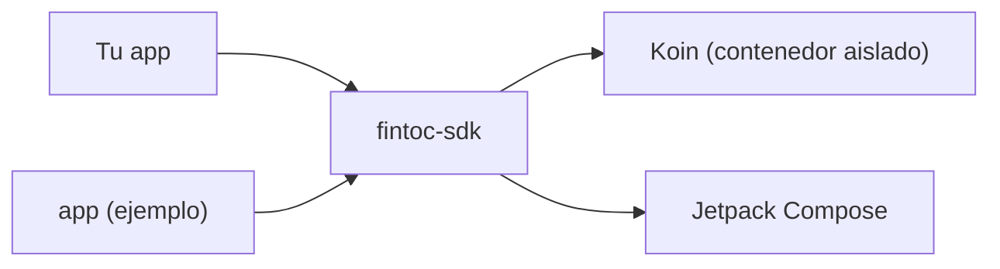

# SDK de Fintoc para Android

[English](../../README.md) · **Español** · [Français](../fr/README.md) · [Português](../pt/README.md)

SDK comunitario y **no oficial**, en Kotlin y Jetpack Compose, para agregar pagos de [Fintoc](https://fintoc.com)
(como SPEI en México) y conexiones bancarias a una app de Android. Envuelve el Widget de Fintoc, está construido con
Compose como primera opción y usa Koin para la inyección de dependencias.

> **Sin afiliación con Fintoc.** Es un proyecto de la comunidad. «Fintoc» es una marca de sus respectivos propietarios.

> **Estado: en desarrollo.** Ya están listos el build, el contenedor de inyección de dependencias, el pipeline de
> pruebas, la app de ejemplo y la configuración del Widget (validación de la llave pública, opciones por producto y
> constructor de la URL), el intérprete de eventos del Widget y el `FintocWidget` de Compose. El host con Activity para
> apps sin Compose, el cambio manual de idioma, el checkout alojado y la app de ejemplo completa llegan una función a
> la vez mediante pull requests.

## Módulos

| Módulo | Propósito |
|---|---|
| [`fintoc-sdk`](../../fintoc-sdk) | La librería publicada en Maven: `mx.dev1.fintoc:fintoc-sdk`. |
| [`app`](../../app) | Aplicación de ejemplo que consume el SDK. No se publica. |



## Requisitos

| Herramienta | Versión |
|---|---|
| JDK para lanzar Gradle | 11 o superior (el build aprovisiona automáticamente un toolchain con JDK 21) |
| Android SDK Platform | 37 (`compileSdk`) |
| Android Studio | Una versión estable reciente compatible con Android Gradle Plugin 9.4 |
| Dispositivo o emulador | Android 6.0 (API 23) o superior, solo para las pruebas instrumentadas |

Compatible con Android 6.0 (API 23) y superior. El SDK se compila con `compileSdk 37`; como depende de Jetpack Compose,
las apps que lo integren también deben compilar con `compileSdk 37`, o fijar un Compose BOM anterior.

## Inicio rápido

```bash
git clone git@github.com:DEV1-Softworks/fintoc-android.git
cd fintoc-android

./gradlew :app:assembleDebug          # compila la app de ejemplo
./gradlew testDebugUnitTest           # pruebas unitarias (JUnit, Robolectric, Mockito)
```

Uso del SDK desde una app:

```kotlin
class MyApplication : Application() {
    override fun onCreate() {
        super.onCreate()
        Fintoc.initialize(
            context = this,
            configuration = FintocConfiguration(publicKey = "pk_test_…"),
        )
    }
}
```

Describe qué mostrar con `FintocWidgetOptions`. Los tokens vienen de tu backend:

```kotlin
val options = FintocWidgetOptions.Payments(sessionToken = tokenFromYourBackend)
```

Muestra el Widget desde Compose con `FintocWidget`. Cuando el session token viene de tu backend, pasa un proveedor
`suspend`: el SDK lo llama una vez por intento y muestra un indicador de progreso mientras espera.

```kotlin
FintocWidget(
    sessionTokenProvider = { myBackend.createSessionToken(orderId) },
    onEvent = { event ->
        when (event) {
            is FintocWidgetEvent.Succeeded -> showReceipt()
            FintocWidgetEvent.Exited -> closeScreen()
            is FintocWidgetEvent.Occurred -> Unit
        }
    },
    modifier = Modifier.fillMaxSize(),
)
```

Si ya tienes las opciones, por ejemplo `Movements`, que no necesita token, pásalas directamente con
`FintocWidget(options = …, onEvent = …)`. El SDK declara por sí mismo el permiso `INTERNET`, así que tu app no tiene que hacerlo.

## Modelo de seguridad

- La app solo guarda la **llave pública** (`pk_test_` o `pk_live_`). El SDK rechaza las llaves secretas (`sk_…`).
- Tu backend crea la Checkout Session con su llave secreta y entrega a la app el `session_token` de corta duración; la
  app se lo pasa al SDK.
- Los tokens nunca se registran en logs: el `toString()` de cada opción los oculta.
- El Widget corre en un WebView endurecido: sin acceso a archivos ni a proveedores de contenido, sin subrecursos
  inseguros, con Safe Browsing activo, sin interfaz JavaScript y sin aceptar nunca errores de certificado. El SDK jamás
  activa la depuración del WebView.
- El WebView se queda en los hosts de Fintoc (`webview.fintoc.com`, `wizard.fintoc.com` y `js.fintoc.com`). Los demás
  enlaces `https`, como el comprobante de pago, se abren en el navegador, y todo lo demás se bloquea.
- Cuando la página no se puede cargar, el SDK muestra su propio mensaje. La página de error del WebView imprimiría la
  dirección, y la dirección contiene el session token.
- Lo que el Widget informa a la app no es prueba de pago. Confirma los pagos con los webhooks de Fintoc en tu backend.

## Documentación

| Tema | English | Español | Français | Português |
|---|---|---|---|---|
| Resumen | [en](../../README.md) | este archivo | [fr](../fr/README.md) | [pt](../pt/README.md) |
| Arquitectura | [en](../en/architecture.md) | [es](architecture.md) | [fr](../fr/architecture.md) | [pt](../pt/architecture.md) |
| Cómo contribuir | [en](../en/contributing.md) | [es](contributing.md) | [fr](../fr/contributing.md) | [pt](../pt/contributing.md) |

## Créditos y licencia

La integración del Widget sigue la [documentación pública de Fintoc](https://docs.fintoc.com) y el comportamiento
del [SDK de React Native](https://github.com/fintoc-com/fintoc-react-native) oficial. El aviso MIT del cliente Swift de
la comunidad [sergiocampama/Fintoc](https://github.com/sergiocampama/Fintoc) (© 2021 Sergio Campamá) se conserva en
[NOTICE](../../NOTICE) por si se agrega código derivado de él.

Este proyecto se distribuye bajo la [licencia Apache 2.0](../../LICENSE).
