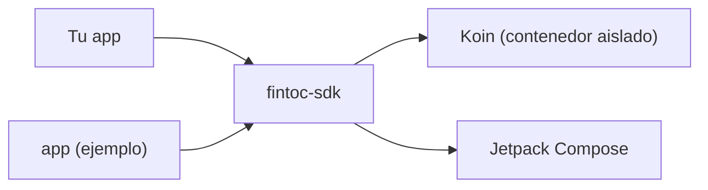

# SDK de Fintoc para Android

[English](../../README.md) · **Español** · [Français](../fr/README.md) · [Português](../pt/README.md)

SDK en Kotlin y Jetpack Compose para la API de [Fintoc](https://fintoc.com). Es el equivalente en Android de la
librería [Fintoc Swift](https://github.com/sergiocampama/Fintoc) y está construido con Compose como primera opción y
Koin para la inyección de dependencias.

> **Estado: base del proyecto.** Ya están listos el build, el contenedor de inyección de dependencias, el pipeline de
> pruebas y la app de ejemplo. Las funciones de la API (links, cuentas, movimientos) se agregan una a una mediante pull requests.

## Módulos

| Módulo | Propósito |
|---|---|
| [`fintoc-sdk`](../../fintoc-sdk) | La librería publicada en Maven: `mx.dev1.fintoc:fintoc-sdk`. |
| [`app`](../../app) | Aplicación de ejemplo que consume el SDK. No se publica. |



## Requisitos

| Herramienta | Versión |
|---|---|
| JDK para lanzar Gradle | 11 o superior (el build aprovisiona automáticamente un toolchain con JDK 21) |
| Android SDK Platform | 37 (`compileSdk`) |
| Android Studio | Una versión estable reciente compatible con Android Gradle Plugin 9.4 |
| Dispositivo o emulador | Android 9 (API 28) o superior, solo para las pruebas instrumentadas |

Compatible con Android 9 (API 28) y superior. El SDK se compila con `compileSdk 37`; como depende de Jetpack Compose,
las apps que lo integren también deben compilar con `compileSdk 37`, o fijar un Compose BOM anterior.

## Inicio rápido

```bash
git clone git@github.com:DEV1-Softworks/fintoc-android.git
cd fintoc-android

./gradlew :app:assembleDebug          # compila la app de ejemplo
./gradlew testDebugUnitTest           # pruebas unitarias (JUnit, Robolectric, Mockito)
```

Uso del SDK desde una app:

```kotlin
class MyApplication : Application() {
    override fun onCreate() {
        super.onCreate()
        Fintoc.initialize(
            context = this,
            configuration = FintocConfiguration(authToken = "<tu token>"),
        )
    }
}
```

## Documentación

| Tema | English | Español | Français | Português |
|---|---|---|---|---|
| Resumen | [en](../../README.md) | este archivo | [fr](../fr/README.md) | [pt](../pt/README.md) |
| Arquitectura | [en](../en/architecture.md) | [es](architecture.md) | [fr](../fr/architecture.md) | [pt](../pt/architecture.md) |
| Cómo contribuir | [en](../en/contributing.md) | [es](contributing.md) | [fr](../fr/contributing.md) | [pt](../pt/contributing.md) |

## Créditos y licencia

La API se está modelando a partir de [sergiocampama/Fintoc](https://github.com/sergiocampama/Fintoc), publicada bajo la
licencia MIT (© 2021 Sergio Campamá). Este repositorio todavía no declara una licencia propia.
