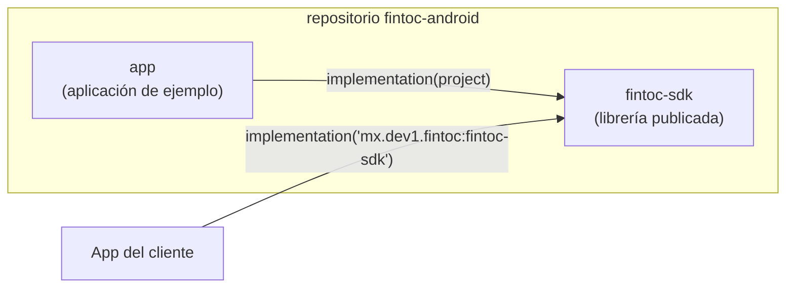
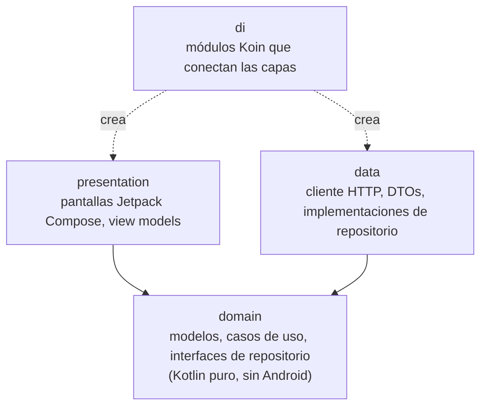
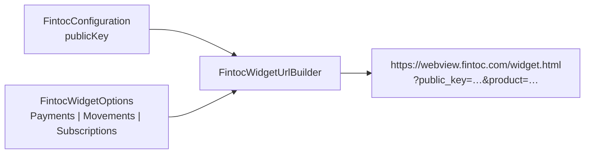
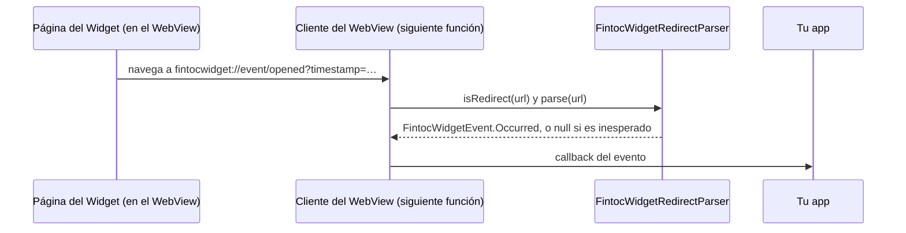
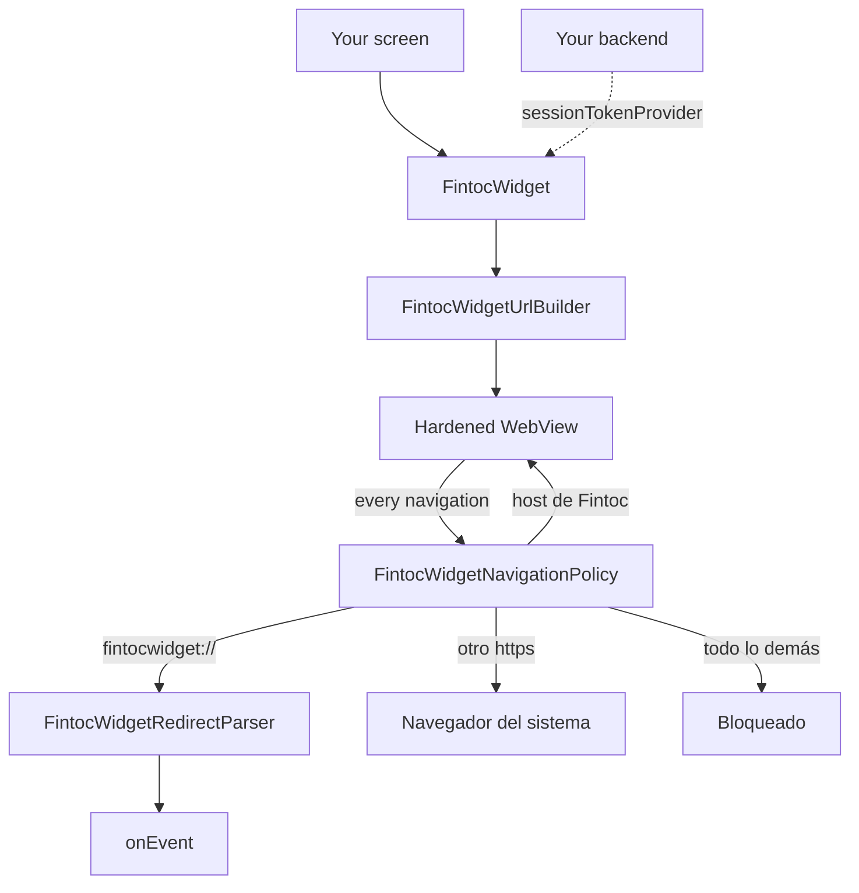
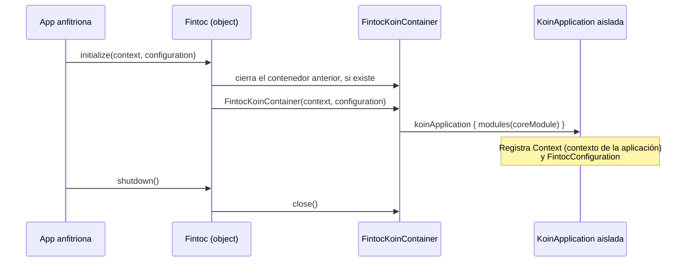

# Arquitectura

[English](../en/architecture.md) · [Français](../fr/architecture.md) · [Português](../pt/architecture.md) · [Volver al README](README.md)

Esta página explica cómo está organizado el proyecto. No necesitas experiencia previa en Android para seguirla.

## Visión general

El repositorio es un build de Gradle con dos módulos:

- **`fintoc-sdk`** es una *librería Android*: código que otras apps incluyen como dependencia. Es lo que se publica en Maven.
- **`app`** es una *aplicación Android* que usa el SDK como lo haría un cliente. También funciona como ejemplo vivo.

## Arquitectura limpia

Todos los módulos siguen las mismas tres capas. Las dependencias solo apuntan **hacia adentro**, hacia el dominio.

| Capa | Conoce | Nunca debe conocer |
|---|---|---|
| `domain` | Biblioteca estándar de Kotlin, corrutinas | Android, Koin, HTTP, Compose |
| `data` | `domain` | `presentation`, Compose |
| `presentation` | `domain` | `data` |
| `di` | todas las capas | — |

Hoy existen la capa `domain` (paquetes `domain.widget` y `domain.security`), la capa `presentation` (paquete
`presentation.widget`), el paquete `di` y el punto de entrada público. Las demás capas se crean conforme lleguen las funciones, bajo el paquete base `mx.dev1.fintoc.sdk`.

## API pública y modo de API explícita

El SDK activa el **modo de API explícita** de Kotlin. Toda declaración es `internal` salvo que se marque `public` a
propósito, así que la superficie pública de la librería siempre es intencional. Hoy es:

| Tipo | Función |
|---|---|
| `Fintoc` | Punto de entrada: `initialize`, `shutdown`, `isInitialized`. |
| `FintocConfiguration` | Ajustes: `publicKey` (solo `pk_test_` o `pk_live_`; las llaves secretas `sk_` se rechazan) y `environment`, deducido del prefijo. Su `toString()` oculta la llave. |
| `FintocEnvironment` | `TEST` o `LIVE`. |
| `FintocWidgetOptions` | Qué debe hacer el Widget: `Payments`, `Movements` o `Subscriptions`. Cada uno valida sus datos y oculta sus tokens en `toString()`. |
| `FintocCountry`, `FintocHolderType` | Valores admitidos para `country` y `holder_type`. |
| `FintocWidgetEvent` | Lo que reporta el Widget: `Succeeded`, `Exited` u `Occurred`. |
| `FintocWidgetEventType` | Los eventos que documenta Fintoc, como `OPENED` o `PAYMENT_ERROR`. |
| `FintocLinkIntentResult` | El `exchangeToken` de una cuenta bancaria conectada con `Movements`. Su `toString()` oculta el token. |
| `FintocWidget` | El composable que muestra el Widget. Una sobrecarga recibe `FintocWidgetOptions`; la otra, un proveedor `suspend` del session token para pagos. |

## Configuración del Widget

El Widget de Fintoc es una página web que el SDK muestra en un WebView. Lee sus ajustes de la query string de la URL,
así que el SDK convierte tu `FintocConfiguration` y tus `FintocWidgetOptions` en esa URL.

| Opciones | Producto | Parámetros enviados después de `public_key` y `product` |
|---|---|---|
| `Payments(sessionToken)` | `payments` (SPEI en México, transferencia bancaria en Chile) | `session_token` |
| `Movements(holderType, country, linkToken?, webhookUrl?)` | `movements` | `holder_type`, `country`, `link_token`, `webhook_url` |
| `Subscriptions(widgetToken, holderType, country)` | `subscriptions` | `holder_type`, `country`, `widget_token` |

Reglas de seguridad que se aplican al crear los objetos:

- Se rechazan los valores vacíos, con espacios o que empiecen con `sk_`. Los mensajes de error nunca repiten el valor
  rechazado.
- `webhookUrl` debe ser una URL `https` absoluta.
- Los valores se codifican con porcentaje (RFC 3986), así que un token no puede agregar ni reemplazar parámetros.
- `toString()` oculta los tokens.

La URL siempre termina con `_on_event=true`, que le pide al Widget reportar sus eventos a la app.

## Eventos del Widget

El Widget responde navegando el WebView hacia direcciones que empiezan con `fintocwidget://`. El SDK nunca deja que el
WebView abra esas direcciones: entrega cada una a `FintocWidgetRedirectParser`, que la convierte en un
`FintocWidgetEvent`.

| Redirección del Widget | Evento |
|---|---|
| `fintocwidget://succeeded` | `Succeeded`. Con `Movements` también trae `?object=link_intent&exchange_token=…&id=…`, que se convierte en `linkIntent`. |
| `fintocwidget://exit` | `Exited`: el usuario cerró el Widget sin terminar. |
| `fintocwidget://event/{name}?timestamp=…` | `Occurred(name, timestampMillis, metadata)`. `type` es el `FintocWidgetEventType` correspondiente, o `null` cuando Fintoc agregó un evento que este SDK aún no conoce. |

Reglas de seguridad del intérprete:

- Trabaja sobre el texto crudo y nunca lanza excepciones. Un esquema incorrecto, una acción desconocida o un nombre de
  evento extraño dan `null`, así que la página nunca puede hacer fallar tu app.
- Los nombres de evento solo pueden usar letras, dígitos, `_`, `.` y `-`, hasta 64 caracteres. Se ignoran las
  redirecciones de más de 8192 caracteres y los parámetros a partir del 65.
- El Widget no codifica lo que envía, así que la decodificación es tolerante: solo se decodifican las secuencias `%XX`
  bien formadas.
- Gana la primera aparición de una llave. Un `&` suelto dentro de un valor no puede reemplazar un `exchange_token`
  anterior.
- Se descartan los valores que el Widget escribió como `null`, `undefined` o `[object Object]`.
- `FintocLinkIntentResult.toString()` oculta el `exchangeToken`, y `Occurred.toString()` lista las llaves de los
  metadatos pero no sus valores.

> **Un evento no es prueba de pago.** Un usuario, o un dispositivo comprometido, puede falsificar lo que reporta un
> WebView. Envía el `exchangeToken` a **tu backend**, el único lugar que puede canjearlo, y confirma los pagos con los
> webhooks de Fintoc antes de entregar un pedido.

## Vista del Widget

`FintocWidget` es el composable que pone el Widget en pantalla. Arma la URL del Widget con la llave pública que diste a
`Fintoc.initialize`, la muestra en un WebView endurecido e informa los eventos mediante `onEvent`.

Cada dirección a la que navega la página pasa por `FintocWidgetNavigationPolicy`, así que una página que se porte mal
no puede convertir el WebView en un navegador de propósito general dentro de tu app:

| Dirección | Marco principal | Marcos dentro de la página |
|---|---|---|
| `fintocwidget://…` | Se informa a la app, nunca se abre | Igual |
| `https` en `webview.fintoc.com`, `wizard.fintoc.com` o `js.fintoc.com` | Se queda en el WebView | Se carga |
| Cualquier otra dirección `https`, como el comprobante de pago | Se abre en el navegador | Se carga |
| `http`, `intent:`, `javascript:`, `file:`, `data:`… | Bloqueada | Se carga |

La revisión es estricta: una dirección que esconde su host tras una barra invertida, un escape con porcentaje o una `@`
no cuenta como host de Fintoc.

Lo que ve el usuario:

- Un indicador de progreso cubre la página mientras carga.
- Si la página no se puede cargar, se quita el WebView y lo reemplaza un mensaje con un botón «Reintentar». Esto
  cubre los errores de red, los errores HTTP de la propia página, los problemas de certificado con un host de Fintoc y,
  desde Android 8.0, el fallo del proceso de renderizado del WebView, que de otro modo cerraría tu app. Al tocar el botón se crea un
  WebView nuevo.
- Los mensajes vienen en español, inglés, francés y portugués, según el idioma del dispositivo.

La sobrecarga con `sessionTokenProvider` es para pagos. Los session tokens de Fintoc pertenecen a un solo intento de
pago, así que el SDK llama al proveedor una vez cuando el composable entra a la composición y de nuevo cada vez que el
usuario toca «Reintentar» tras un fallo. Si el proveedor lanza una excepción, o devuelve un token vacío o una llave
secreta, el usuario ve el mismo mensaje. Los logs nunca incluyen el token ni el mensaje del error que lanzó tu proveedor.

Conviene saber:

- El SDK declara el permiso `INTERNET` en su propio manifiesto. Sin él, el WebView falla en cada carga con el críptico
  `net::ERR_CACHE_MISS`.
- El Widget se carga de nuevo desde el principio cuando se recrea la pantalla, porque un session token no es algo que
  el SDK pueda conservar con seguridad. Para mantener un pago en curso durante una rotación, haz que tu activity maneje
  el cambio con `android:configChanges="orientation|screenSize|keyboardHidden"`.
- La depuración del WebView es un ajuste de toda tu app. El SDK nunca la activa.
- Las descargas que ofrece el Widget, como el comprobante de pago, se entregan al navegador.

## Inyección de dependencias con un contenedor Koin aislado

Koin es el framework de inyección de dependencias. El SDK crea **su propio** contenedor en lugar de usar el global de
Koin. Así nunca puede chocar con una instancia de Koin que inicie la app anfitriona.

El código interno obtiene sus dependencias con `Fintoc.requireKoin()`. Si la app anfitriona olvidó llamar a `initialize`,
falla de inmediato con un mensaje que explica qué hacer.

## Decisiones de build

| Decisión | Valor | Motivo |
|---|---|---|
| Kotlin | 2.4.20 | Versión estable actual. Android Gradle Plugin 9 trae soporte de Kotlin integrado, por lo que no se aplica un plugin de Kotlin aparte. |
| Android Gradle Plugin | 9.4.1 (requiere Gradle 9.6.0) | Versión estable actual. |
| `minSdk` | 23 (Android 6.0) | El nivel más bajo que admite Jetpack Compose, para llegar a la mayor cantidad de dispositivos. No uses APIs posteriores al API 23 (como `java.time`) sin una guarda o desugaring. |
| `compileSdk` | 37 | Lo exige Compose BOM 2026.09.00. |
| `targetSdk` (app de ejemplo) | 36 | El nivel que Google Play exige actualmente. |
| Jetpack Compose | BOM 2026.09.00 | UI con Compose como primera opción. El XML solo se usa donde la plataforma lo requiere (manifest, tema de la ventana). |
| Bytecode de Java | 11 | Permite que la librería la consuma el mayor número posible de apps. |
| Espresso | 3.7.0, también fijado en `fintoc-sdk` | Las pruebas de UI de Compose usan un gancho de Espresso que falla en versiones recientes de Android cuando entra una versión antigua de forma indirecta. |
| Versiones | `gradle/libs.versions.toml` | Un único lugar para todas las versiones de dependencias. |

## Pruebas y cobertura

Existen tres tipos de pruebas, y el reporte de cobertura las combina todas:

| Tipo | Ubicación | Herramientas | Se ejecuta en |
|---|---|---|---|
| Unitarias | `src/test` | JUnit 4, Mockito, Robolectric | Tu computadora |
| Instrumentadas | `src/androidTest` | AndroidX Test, Espresso, pruebas de UI de Compose | Dispositivo o emulador |
| Cobertura | `gradle/jacoco-coverage.gradle.kts` | JaCoCo | Combina ambas |

El build falla cuando la cobertura de líneas o de instrucciones de un módulo baja de **80%**. Consulta
[Cómo contribuir](contributing.md) para ver los comandos exactos.
