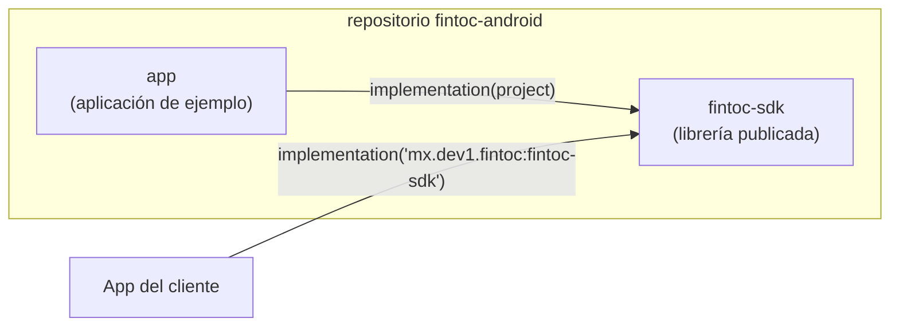
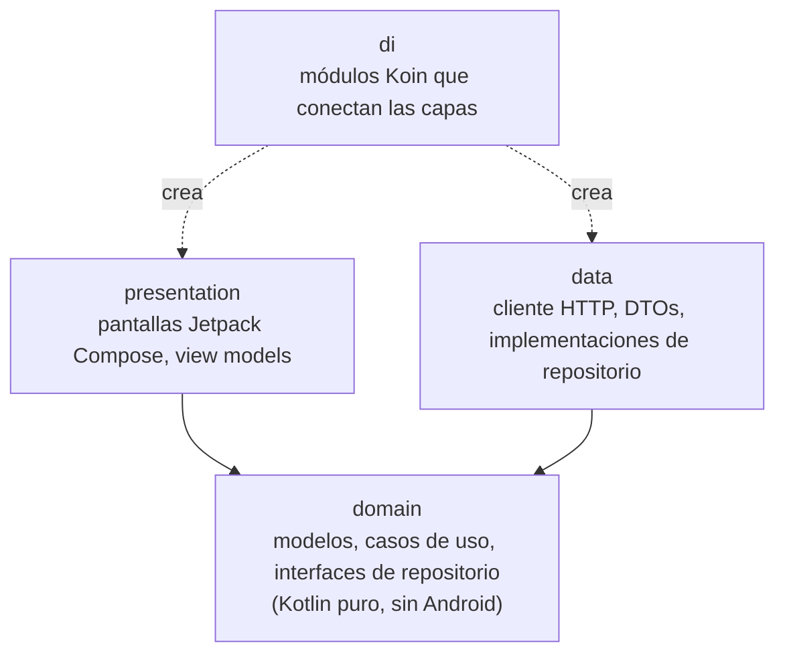
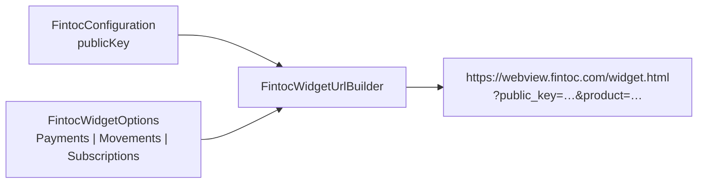
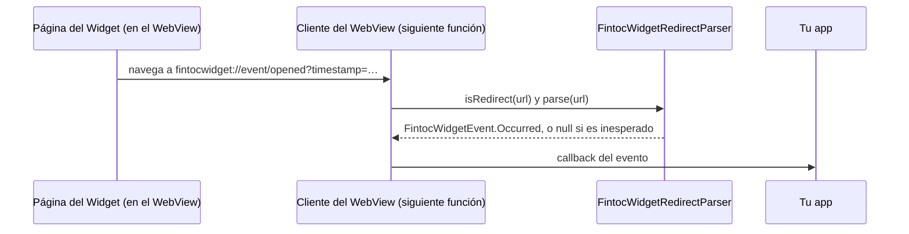
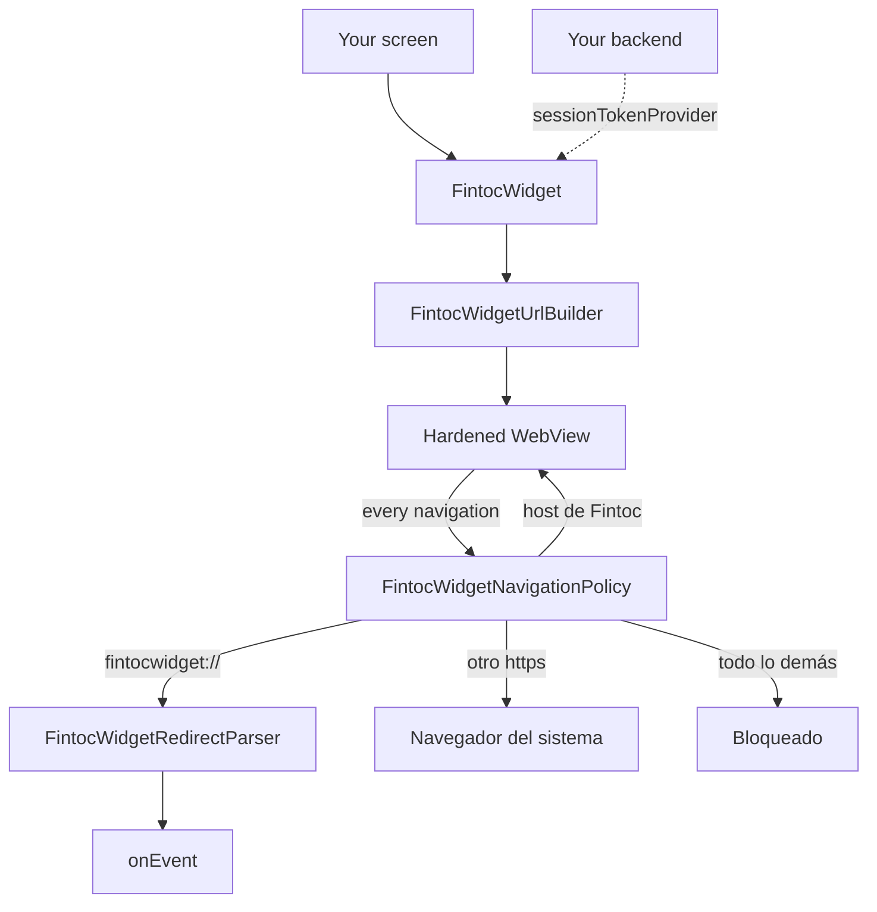
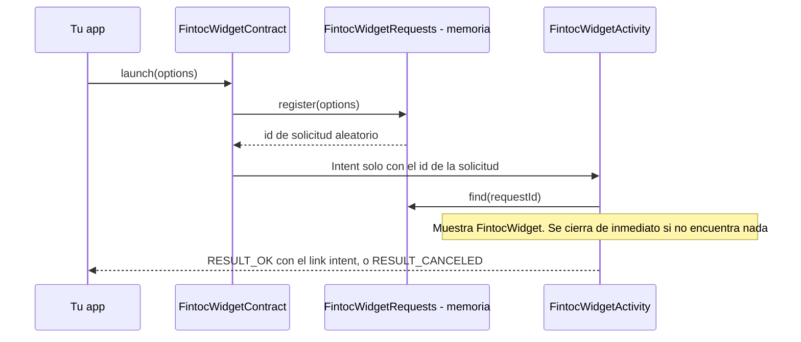
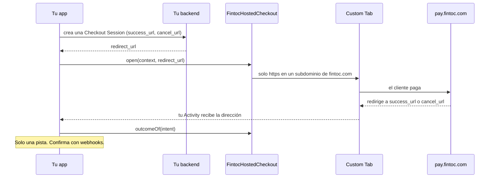
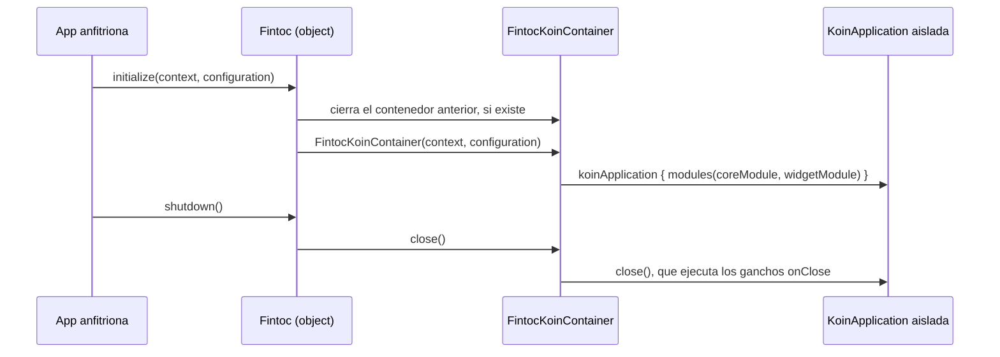

# Arquitectura

[English](../en/architecture.md) · [Français](../fr/architecture.md) · [Português](../pt/architecture.md) · [Volver al README](README.md)

Esta página explica cómo está organizado el proyecto. No necesitas experiencia previa en Android para seguirla.

## Visión general

El repositorio es un build de Gradle con dos módulos:

- **`fintoc-sdk`** es una *librería Android*: código que otras apps incluyen como dependencia. Es lo que se publica en Maven.
- **`app`** es una *aplicación Android* que usa el SDK como lo haría un cliente. También funciona como ejemplo vivo.



## Arquitectura limpia

Todos los módulos siguen las mismas tres capas. Las dependencias solo apuntan **hacia adentro**, hacia el dominio.



| Capa | Conoce | Nunca debe conocer |
|---|---|---|
| `domain` | Biblioteca estándar de Kotlin, corrutinas | Android, Koin, HTTP, Compose |
| `data` | `domain` | `presentation`, Compose |
| `presentation` | `domain` | `data` |
| `di` | todas las capas | — |

Hoy existen la capa `domain` (paquetes `domain.widget` y `domain.security`), la capa `presentation` (paquete
`presentation.widget`), el paquete `di` y el punto de entrada público. Las demás capas se crean conforme lleguen las funciones, bajo el paquete base `mx.dev1.fintoc.sdk`.

## API pública y modo de API explícita

El SDK activa el **modo de API explícita** de Kotlin. Toda declaración es `internal` salvo que se marque `public` a
propósito, así que la superficie pública de la librería siempre es intencional. Hoy es:

| Tipo | Función |
|---|---|
| `Fintoc` | Punto de entrada: `initialize`, `shutdown`, `isInitialized`. |
| `FintocConfiguration` | Ajustes: `publicKey` (solo `pk_test_` o `pk_live_`; las llaves secretas `sk_` se rechazan), `environment`, deducido del prefijo, y `language`, para forzar el idioma de los textos propios del SDK. Su `toString()` oculta la llave. |
| `FintocEnvironment` | `TEST` o `LIVE`. |
| `FintocWidgetOptions` | Qué debe hacer el Widget: `Payments`, `Movements` o `Subscriptions`. Cada uno valida sus datos y oculta sus tokens en `toString()`. |
| `FintocCountry`, `FintocHolderType` | Valores admitidos para `country` y `holder_type`. |
| `FintocWidgetEvent` | Lo que reporta el Widget: `Succeeded`, `Exited` u `Occurred`. |
| `FintocWidgetEventType` | Los eventos que documenta Fintoc, como `OPENED` o `PAYMENT_ERROR`. |
| `FintocLinkIntentResult` | El `exchangeToken` de una cuenta bancaria conectada con `Movements`. Su `toString()` oculta el token. |
| `FintocWidget` | El composable que muestra el Widget. Una sobrecarga recibe `FintocWidgetOptions`; la otra, un proveedor `suspend` del session token para pagos. |
| `FintocLanguage` | Idiomas de los textos propios del SDK: español, inglés, francés y portugués. |
| `FintocWidgetContract`, `FintocWidgetResult` | Abren el Widget en una pantalla propia, para apps sin Compose, y leen cómo terminó: `Succeeded` o `Exited`. |
| `FintocHostedCheckout`, `FintocHostedCheckoutOutcome` | Abren un checkout alojado por Fintoc en una Custom Tab, e indican si la dirección que volvió a tu app es tu dirección de éxito, tu dirección de cancelación o ninguna. |

## Configuración del Widget

El Widget de Fintoc es una página web que el SDK muestra en un WebView. Lee sus ajustes de la query string de la URL,
así que el SDK convierte tu `FintocConfiguration` y tus `FintocWidgetOptions` en esa URL.



| Opciones | Producto | Parámetros enviados después de `public_key` y `product` |
|---|---|---|
| `Payments(sessionToken)` | `payments` (SPEI en México, transferencia bancaria en Chile) | `session_token` |
| `Movements(holderType, country, linkToken?, webhookUrl?)` | `movements` | `holder_type`, `country`, `link_token`, `webhook_url` |
| `Subscriptions(widgetToken, holderType, country)` | `subscriptions` | `holder_type`, `country`, `widget_token` |

Reglas de seguridad que se aplican al crear los objetos:

- Se rechazan los valores vacíos, con espacios o que empiecen con `sk_`. Los mensajes de error nunca repiten el valor
  rechazado.
- `webhookUrl` debe ser una URL `https` absoluta.
- Los valores se codifican con porcentaje (RFC 3986), así que un token no puede agregar ni reemplazar parámetros.
- `toString()` oculta los tokens.

La URL siempre termina con `_on_event=true`, que le pide al Widget reportar sus eventos a la app.

## Eventos del Widget

El Widget responde navegando el WebView hacia direcciones que empiezan con `fintocwidget://`. El SDK nunca deja que el
WebView abra esas direcciones: entrega cada una a `FintocWidgetRedirectParser`, que la convierte en un
`FintocWidgetEvent`.



| Redirección del Widget | Evento |
|---|---|
| `fintocwidget://succeeded` | `Succeeded`. Con `Movements` también trae `?object=link_intent&exchange_token=…&id=…`, que se convierte en `linkIntent`. |
| `fintocwidget://exit` | `Exited`: el usuario cerró el Widget sin terminar. |
| `fintocwidget://event/{name}?timestamp=…` | `Occurred(name, timestampMillis, metadata)`. `type` es el `FintocWidgetEventType` correspondiente, o `null` cuando Fintoc agregó un evento que este SDK aún no conoce. |

Reglas de seguridad del intérprete:

- Trabaja sobre el texto crudo y nunca lanza excepciones. Un esquema incorrecto, una acción desconocida o un nombre de
  evento extraño dan `null`, así que la página nunca puede hacer fallar tu app.
- Los nombres de evento solo pueden usar letras, dígitos, `_`, `.` y `-`, hasta 64 caracteres. Se ignoran las
  redirecciones de más de 8192 caracteres y los parámetros a partir del 65.
- El Widget no codifica lo que envía, así que la decodificación es tolerante: solo se decodifican las secuencias `%XX`
  bien formadas.
- Gana la primera aparición de una llave. Un `&` suelto dentro de un valor no puede reemplazar un `exchange_token`
  anterior.
- Se descartan los valores que el Widget escribió como `null`, `undefined` o `[object Object]`.
- `FintocLinkIntentResult.toString()` oculta el `exchangeToken`, y `Occurred.toString()` lista las llaves de los
  metadatos pero no sus valores.

> **Un evento no es prueba de pago.** Un usuario, o un dispositivo comprometido, puede falsificar lo que reporta un
> WebView. Envía el `exchangeToken` a **tu backend**, el único lugar que puede canjearlo, y confirma los pagos con los
> webhooks de Fintoc antes de entregar un pedido.

## Vista del Widget

`FintocWidget` es el composable que pone el Widget en pantalla. Arma la URL del Widget con la llave pública que diste a
`Fintoc.initialize`, la muestra en un WebView endurecido e informa los eventos mediante `onEvent`.



Cada dirección a la que navega la página pasa por `FintocWidgetNavigationPolicy`, así que una página que se porte mal
no puede convertir el WebView en un navegador de propósito general dentro de tu app:

| Dirección | Marco principal | Marcos dentro de la página |
|---|---|---|
| `fintocwidget://…` | Se informa a la app, nunca se abre | Igual |
| `https` en `webview.fintoc.com`, `wizard.fintoc.com` o `js.fintoc.com` | Se queda en el WebView | Se carga |
| Cualquier otra dirección `https`, como el comprobante de pago | Se abre en el navegador | Se carga |
| `http`, `intent:`, `javascript:`, `file:`, `data:`… | Bloqueada | Se carga |

La revisión es estricta: una dirección que esconde su host tras una barra invertida, un escape con porcentaje o una `@`
no cuenta como host de Fintoc.

Lo que ve el usuario:

- Un indicador de progreso cubre la página mientras carga.
- Si la página no se puede cargar, se quita el WebView y lo reemplaza un mensaje con un botón «Reintentar». Esto
  cubre los errores de red, los errores HTTP de la propia página, los problemas de certificado con un host de Fintoc y,
  desde Android 8.0, el fallo del proceso de renderizado del WebView, que de otro modo cerraría tu app. Al tocar el botón se crea un
  WebView nuevo.
- Si el dispositivo no puede crear un WebView, lo que ocurre cuando Android System WebView no está instalado, está
  desactivado o se está actualizando, Android lanza una excepción desde el constructor y una app que lo llama sin
  protección se cierra. El SDK la captura, muestra un mensaje que dice qué falta y conserva el botón «Reintentar», porque
  la persona puede resolverlo y volver. Lo mismo vale para un WebView que falla mientras se configura: primero se libera.
- Los mensajes vienen en español, inglés, francés y portugués, según el idioma del dispositivo.

La sobrecarga con `sessionTokenProvider` es para pagos. Los session tokens de Fintoc pertenecen a un solo intento de
pago, así que el SDK llama al proveedor una vez cuando el composable entra a la composición y de nuevo cada vez que el
usuario toca «Reintentar» tras un fallo. Si el proveedor lanza una excepción, o devuelve un token vacío o una llave
secreta, el usuario ve el mismo mensaje. Los logs nunca incluyen el token ni el mensaje del error que lanzó tu proveedor.

Conviene saber:

- El SDK declara el permiso `INTERNET` en su propio manifiesto. Sin él, el WebView falla en cada carga con el críptico
  `net::ERR_CACHE_MISS`.
- El Widget se carga de nuevo desde el principio cuando se recrea la pantalla, porque un session token no es algo que
  el SDK pueda conservar con seguridad. Para mantener un pago en curso durante una rotación, haz que tu activity maneje
  el cambio con `android:configChanges="orientation|screenSize|keyboardHidden"`.
- La depuración del WebView es un ajuste de toda tu app. El SDK nunca la activa.
- Las descargas que ofrece el Widget, como el comprobante de pago, se entregan al navegador.

## Host con Activity

Las apps que no usan Compose abren el Widget con `FintocWidgetContract`, un `ActivityResultContract`. Este inicia
`FintocWidgetActivity`, que muestra el mismo `FintocWidget` bajo una barra de título.



Decisiones de diseño:

- Las opciones contienen session tokens, así que nunca viajan dentro del `Intent`. Este solo lleva un identificador
  aleatorio y las opciones se quedan en memoria. Si el sistema restaura la pantalla después de que el proceso murió, no
  se encuentra nada y la pantalla se cierra como cancelada.
- La pantalla no está exportada, así que ninguna otra app puede iniciarla, y `FLAG_SECURE` la oculta de las capturas de
  pantalla, las grabaciones y la lista de apps recientes, porque el Widget pide credenciales bancarias.
- Maneja por sí misma los cambios de configuración (rotación, tamaño de fuente, idioma, modo oscuro), así que un pago en
  curso no se reinicia.
- Tras un éxito la pantalla sigue abierta, porque la guía de Fintoc dice que el usuario puede necesitar descargar un
  comprobante de pago. El botón pasa de «Cerrar» a «Listo», y el resultado llega a tu app cuando el usuario lo toca o
  regresa. Una salida que el Widget informe después de un éxito no lo convierte en una cancelación.
- Solo vuelve el final del flujo, como `Succeeded` o `Exited`. Para seguir todos los eventos del Widget, usa el
  composable.
- Es de borde a borde y rellena su contenido para el teclado y las barras del sistema, así que ningún campo del Widget
  queda debajo de ellos.

## Checkout alojado

Además del Widget, Fintoc ofrece un **checkout alojado**. Tu backend crea una Checkout Session y Fintoc responde con un
`redirect_url`, como `https://pay.fintoc.com/checkout/cs_…`, donde el cliente paga. Al terminar, Fintoc lo envía de
vuelta al `success_url` o al `cancel_url` que diste. Los flujos `payment`, `setup` y `subscription` funcionan así.
`FintocHostedCheckout` abre esa página en una **Custom Tab**, una vista de navegador con la barra de direcciones visible,
y te dice qué volvió.



Qué se verifica:

| Qué | Regla |
|---|---|
| El `redirectUrl` que abres | `https`, en un subdominio de `fintoc.com`, sin credenciales y con el puerto por defecto. Cualquier otra cosa lanza `IllegalArgumentException` y no se abre nada. Se rechazan los parecidos, como `fintoc.com` mismo, `pay.fintoc.com.evil.example` o `evilfintoc.com`. |
| Tus `successUrl` y `cancelUrl` | Una dirección `https` absoluta, o un esquema personalizado de tu app. Se rechazan `http`, `javascript:`, `file:`, `intent:` y similares, y también dos direcciones que no se puedan distinguir. |
| Una dirección que llega a tu app | El mismo esquema, host, puerto y ruta que una de las tuyas (no importan las mayúsculas ni una barra final). Su query se ignora, salvo los parámetros que lleve tu propia dirección: cada uno debe volver con el mismo valor. Una dirección que encaje con las dos tuyas no se atiende. |

Para recibir al cliente de vuelta, declara la Activity que maneja tus direcciones de regreso, aquí un App Link, y lee el
resultado en `onCreate` y en `onNewIntent`:

```xml
<activity
    android:name=".PaymentReturnActivity"
    android:exported="true"
    android:launchMode="singleTask">
    <intent-filter android:autoVerify="true">
        <action android:name="android.intent.action.VIEW" />
        <category android:name="android.intent.category.DEFAULT" />
        <category android:name="android.intent.category.BROWSABLE" />
        <data android:scheme="https" android:host="merchant.com" android:pathPrefix="/pay" />
    </intent-filter>
</activity>
```

Conviene saber:

- **Una dirección que vuelve es una pista, nunca una prueba.** Cualquier app puede abrir tu deep link, y el cliente puede
  cerrar la pestaña y no volver. Fintoc dice lo mismo: usa webhooks. Cerrar la Custom Tab no le dice nada a tu app, así que
  actualiza el estado del pedido desde tu backend cuando tu pantalla se reanude.
- **Pon un valor impredecible en tus propias direcciones**, como la `n` del ejemplo. El SDK exige que cada parámetro de
  query de tus direcciones vuelva con el mismo valor. Comprobado en el sandbox de Fintoc: Fintoc acepta un query
  string en tu `success_url` y lo devuelve.
- **Prefiere App Links verificados a esquemas personalizados.** Cualquier otra app puede reclamar un esquema
  personalizado y recibiría la redirección, valor secreto incluido. Un App Link verificado no puede reclamarse.
- **Usa `launchMode="singleTask"`** en la Activity que recibe las direcciones de regreso. Comprobado en un Pixel 10 con
  Chrome: la Activity que ya está abierta recibe la dirección por `onNewIntent` y la Custom Tab se cierra. Con el modo de
  lanzamiento por defecto se crea una segunda copia de la Activity. En el mismo dispositivo, una redirección del servidor
  desde una Custom Tab hacia un esquema personalizado abrió la app sin un toque, pero otros navegadores y versiones
  pueden comportarse distinto.
- `open` devuelve `false` cuando ninguna app puede abrir la dirección, y necesita `Fintoc.initialize`. `outcomeOf` no
  necesita nada, así que también funciona cuando el sistema restaura tu Activity en un proceso nuevo.

## Idiomas

Los textos propios del SDK (mensaje de carga, mensaje de error, botones y título) existen en español, inglés, francés y
portugués.

| Tú configuras | El SDK usa |
|---|---|
| Nada (`language = null`) | El idioma del dispositivo y, desde Android 13, el idioma elegido para tu app en los ajustes del sistema. Las variantes regionales como `es-MX` o `pt-BR` usan su idioma. Cualquier otro idioma recurre al inglés. |
| Un `FintocLanguage` en `FintocConfiguration` | Ese idioma, diga lo que diga el dispositivo. El resto de la configuración del dispositivo, como el tamaño de fuente, se conserva. |

Conviene saber:

- El cambio manual solo afecta lo que dibuja el SDK. La página del Widget es la página web de Fintoc y conserva su
  propio idioma.
- Para cambiar el idioma más tarde, llama de nuevo a `Fintoc.initialize` antes de mostrar el Widget. Un Widget que ya
  está en pantalla conserva el idioma que tenía.
- Si publicas un Android App Bundle, desactiva la división por idioma con
  `android { bundle { language { enableSplit = false } } }`. Por defecto Google Play entrega solo los idiomas del
  dispositivo del usuario, así que un idioma que fuerces pero el dispositivo no use recurriría al inglés.
- Los recursos usan el prefijo `fintoc_`. Para agregar un texto, agrégalo en `values/` y también en `values-es`,
  `values-fr` y `values-pt`: lint informa como error una traducción faltante.

## Accesibilidad

Las pantallas propias del SDK siguen funcionando con las herramientas que Android ofrece a quienes las necesitan:

| Aspecto | Qué hace el SDK |
|---|---|
| Lectores de pantalla (TalkBack) | El indicador de carga tiene descripción y se anuncia con cortesía. El mensaje de falla se anuncia cuando aparece. El título del host con Activity es un encabezado. Los botones tienen texto visible, no solo íconos. La página del Widget es una página web, que TalkBack lee de forma nativa. |
| Fuentes grandes y tamaño de pantalla | Los textos usan `sp`. La vista de falla se desplaza, así que en los tamaños más grandes de una pantalla pequeña el mensaje y el botón siguen al alcance. El cambio manual de idioma conserva la escala de fuente. Nunca se impide el zoom del WebView. |
| Áreas táctiles | Los botones miden al menos 48 dp. |
| Teclado y barras del sistema | El host con Activity es de borde a borde y rellena su contenido para ambos. |
| Temas claro y oscuro | El host con Activity sigue el tema del dispositivo. |

Cómo se verifica: las pruebas instrumentadas ejecutan el Accessibility Test Framework de Google en un dispositivo real
sobre la vista de carga, la vista de falla y el host con Activity, con los ajustes por defecto y con fuente al 200 % y
pantalla al 150 %. Cualquier error rompe el build. La accesibilidad de la página del Widget es responsabilidad de
Fintoc.

## Inyección de dependencias con un contenedor Koin aislado

Koin es el framework de inyección de dependencias. El SDK crea **su propio** contenedor en lugar de usar el global de
Koin. Así nunca puede chocar con una instancia de Koin que inicie la app anfitriona.



Qué vive en el contenedor, y por qué:

| Módulo | Definición | Tipo | Por qué está en el contenedor |
|---|---|---|---|
| `coreModule` | `Context` | `single` | El contexto de la aplicación, nunca una Activity, así que nada se filtra. |
| `coreModule` | `FintocConfiguration` | `single` | Los ajustes dados a `Fintoc.initialize`. |
| `widgetModule` | `FintocWidgetRequests` | `single`, con `onClose` | Guarda los session tokens de las pantallas del host con Activity. Se vacía al cerrar el contenedor, así que `Fintoc.shutdown()`, o inicializar de nuevo, olvida todos los tokens. |
| `widgetModule` | `ExternalLinkLauncher` | `factory` | Necesita el contexto en el que se muestra el Widget, así que se crea con `parametersOf(context)`. |
| `widgetModule` | `FintocWebViewFactory` | `factory` | Crea el WebView. Android decide si un dispositivo puede tener uno, así que las pruebas reemplazan esta definición para que la creación falle. |

La regla: **el contenedor es dueño de lo que tiene estado o depende de Android.** Las funciones puras que no tienen nada
que liberar, como `FintocWidgetUrlBuilder`, `FintocWidgetNavigationPolicy` y `FintocWidgetRedirectParser`, siguen siendo
objetos simples de Kotlin: inyectarlas solo añadiría indirección.

El código interno obtiene sus dependencias con `Fintoc.requireKoin()`. Si la app anfitriona olvidó llamar a `initialize`,
falla de inmediato con un mensaje que explica qué hacer. El código que no debe fallar sin el SDK, como una Activity que
el sistema restaura después de que el proceso murió, usa `Fintoc.koinOrNull()` y se cierra.

El SDK no necesita reglas de consumidor adicionales para R8. Se comprobó en un dispositivo real una compilación release
minificada con reducción de recursos: el host con Activity se abrió y resolvió todo a través de Koin.

## Decisiones de build

| Decisión | Valor | Motivo |
|---|---|---|
| Kotlin | 2.4.20 | Versión estable actual. Android Gradle Plugin 9 trae soporte de Kotlin integrado, por lo que no se aplica un plugin de Kotlin aparte. |
| Android Gradle Plugin | 9.4.1 (requiere Gradle 9.6.0) | Versión estable actual. |
| `minSdk` | 23 (Android 6.0) | El nivel más bajo que admite Jetpack Compose, para llegar a la mayor cantidad de dispositivos. No uses APIs posteriores al API 23 (como `java.time`) sin una guarda o desugaring. |
| `compileSdk` | 37 | Lo exige Compose BOM 2026.09.00. |
| `targetSdk` (app de ejemplo) | 36 | El nivel que Google Play exige actualmente. |
| Jetpack Compose | BOM 2026.09.00 | UI con Compose como primera opción. El XML solo se usa donde la plataforma lo requiere (manifest, tema de la ventana). |
| Bytecode de Java | 11 | Permite que la librería la consuma el mayor número posible de apps. |
| Espresso | 3.7.0, también fijado en `fintoc-sdk` | Las pruebas de UI de Compose usan un gancho de Espresso que falla en versiones recientes de Android cuando entra una versión antigua de forma indirecta. |
| Publicación | `com.vanniktech.maven.publish` 0.37.0 | Publica en Maven Central con fuentes, documentación de la API y firmas GPG. Las coordenadas y los datos del POM están en `gradle.properties`. |
| Documentación de la API | Dokka 2.2.0 | Convierte el KDoc de la API pública en el jar de javadoc. El doclet de Java no lee Kotlin, así que sin Dokka el jar solo trae hojas de estilo. |
| Nivel de lenguaje de Kotlin | 2.2, biblioteca estándar 2.2.0 | Un compilador lee metadatos de hasta una versión más nueva que la suya, y Gradle entrega a una app la biblioteca estándar más nueva que pida cualquier dependencia. Compilar con el 2.4 de este build obligaría a todas las apps a usar un Kotlin más nuevo. Comprobado con una app consumidora en Kotlin 2.2.0. |
| Versiones | `gradle/libs.versions.toml` | Un único lugar para todas las versiones de dependencias. |

## Pruebas y cobertura

Existen tres tipos de pruebas, y el reporte de cobertura las combina todas:

| Tipo | Ubicación | Herramientas | Se ejecuta en |
|---|---|---|---|
| Unitarias | `src/test` | JUnit 4, Mockito, Robolectric | Tu computadora |
| Instrumentadas | `src/androidTest` | AndroidX Test, Espresso, pruebas de UI de Compose | Dispositivo o emulador |
| Cobertura | `gradle/jacoco-coverage.gradle.kts` | JaCoCo | Combina ambas |

El build falla cuando la cobertura de líneas o de instrucciones de un módulo baja de **80%**. Consulta
[Cómo contribuir](contributing.md) para ver los comandos exactos.
