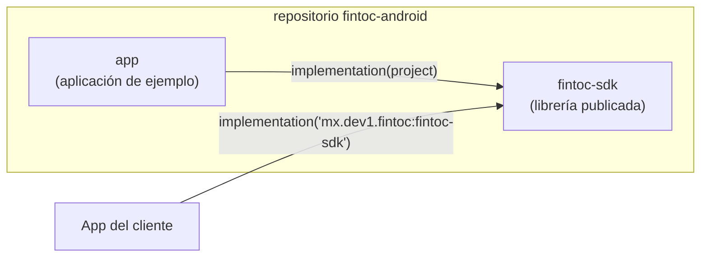
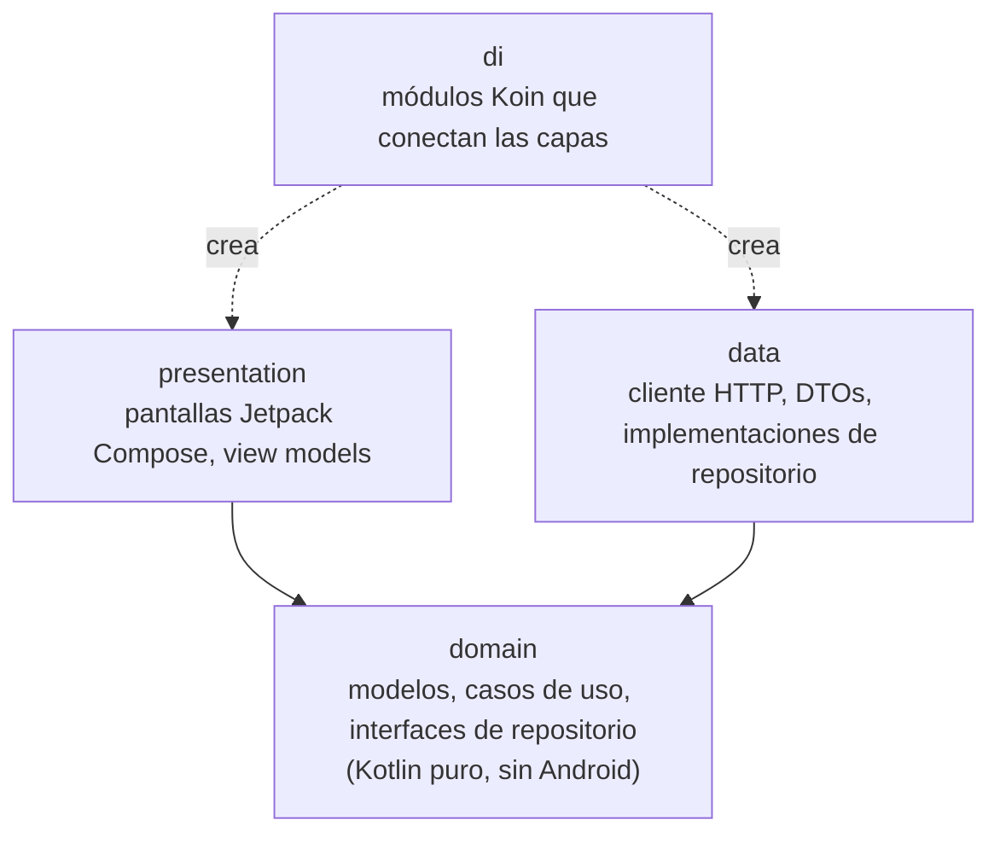
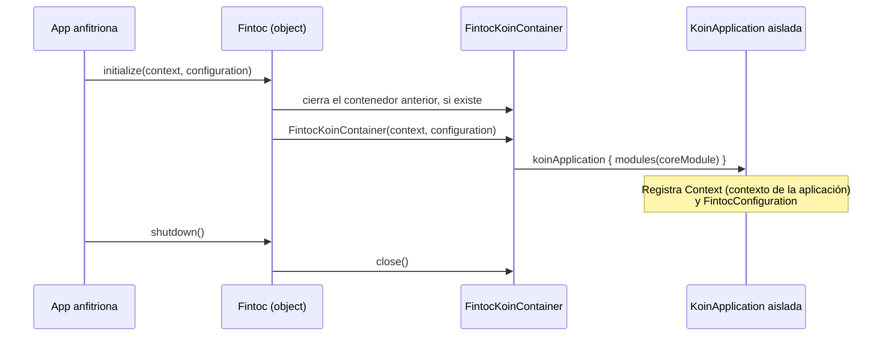

# Arquitectura

[English](../en/architecture.md) · [Français](../fr/architecture.md) · [Português](../pt/architecture.md) · [Volver al README](README.md)

Esta página explica cómo está organizado el proyecto. No necesitas experiencia previa en Android para seguirla.

## Visión general

El repositorio es un build de Gradle con dos módulos:

- **`fintoc-sdk`** es una *librería Android*: código que otras apps incluyen como dependencia. Es lo que se publica en Maven.
- **`app`** es una *aplicación Android* que usa el SDK como lo haría un cliente. También funciona como ejemplo vivo.

## Arquitectura limpia

Todos los módulos siguen las mismas tres capas. Las dependencias solo apuntan **hacia adentro**, hacia el dominio.

| Capa | Conoce | Nunca debe conocer |
|---|---|---|
| `domain` | Biblioteca estándar de Kotlin, corrutinas | Android, Koin, HTTP, Compose |
| `data` | `domain` | `presentation`, Compose |
| `presentation` | `domain` | `data` |
| `di` | todas las capas | — |

Hoy solo existen el paquete `di` y el punto de entrada público. Las demás capas se crean conforme lleguen las funciones,
bajo el paquete base `mx.dev1.fintoc.sdk`.

## API pública y modo de API explícita

El SDK activa el **modo de API explícita** de Kotlin. Toda declaración es `internal` salvo que se marque `public` a
propósito, así que la superficie pública de la librería siempre es intencional. Hoy es:

| Tipo | Función |
|---|---|
| `Fintoc` | Punto de entrada: `initialize`, `shutdown`, `isInitialized`. |
| `FintocConfiguration` | Ajustes: `authToken` y `baseUrl`. Su `toString()` oculta el token para que nunca llegue a los logs. |

## Inyección de dependencias con un contenedor Koin aislado

Koin es el framework de inyección de dependencias. El SDK crea **su propio** contenedor en lugar de usar el global de
Koin. Así nunca puede chocar con una instancia de Koin que inicie la app anfitriona.

El código interno obtiene sus dependencias con `Fintoc.requireKoin()`. Si la app anfitriona olvidó llamar a `initialize`,
falla de inmediato con un mensaje que explica qué hacer.

## Decisiones de build

| Decisión | Valor | Motivo |
|---|---|---|
| Kotlin | 2.4.20 | Versión estable actual. Android Gradle Plugin 9 trae soporte de Kotlin integrado, por lo que no se aplica un plugin de Kotlin aparte. |
| Android Gradle Plugin | 9.4.1 (requiere Gradle 9.6.0) | Versión estable actual. |
| `minSdk` | 28 (Android 9) | Se conserva de la plantilla del proyecto. Bajarlo es un cambio de una línea en cada módulo. |
| `compileSdk` | 37 | Lo exige Compose BOM 2026.09.00. |
| `targetSdk` (app de ejemplo) | 36 | El nivel que Google Play exige actualmente. |
| Jetpack Compose | BOM 2026.09.00 | UI con Compose como primera opción. El XML solo se usa donde la plataforma lo requiere (manifest, tema de la ventana). |
| Bytecode de Java | 11 | Permite que la librería la consuma el mayor número posible de apps. |
| Versiones | `gradle/libs.versions.toml` | Un único lugar para todas las versiones de dependencias. |

## Pruebas y cobertura

Existen tres tipos de pruebas, y el reporte de cobertura las combina todas:

| Tipo | Ubicación | Herramientas | Se ejecuta en |
|---|---|---|---|
| Unitarias | `src/test` | JUnit 4, Mockito, Robolectric | Tu computadora |
| Instrumentadas | `src/androidTest` | AndroidX Test, Espresso, pruebas de UI de Compose | Dispositivo o emulador |
| Cobertura | `gradle/jacoco-coverage.gradle.kts` | JaCoCo | Combina ambas |

El build falla cuando la cobertura de líneas o de instrucciones de un módulo baja de **80%**. Consulta
[Cómo contribuir](contributing.md) para ver los comandos exactos.
