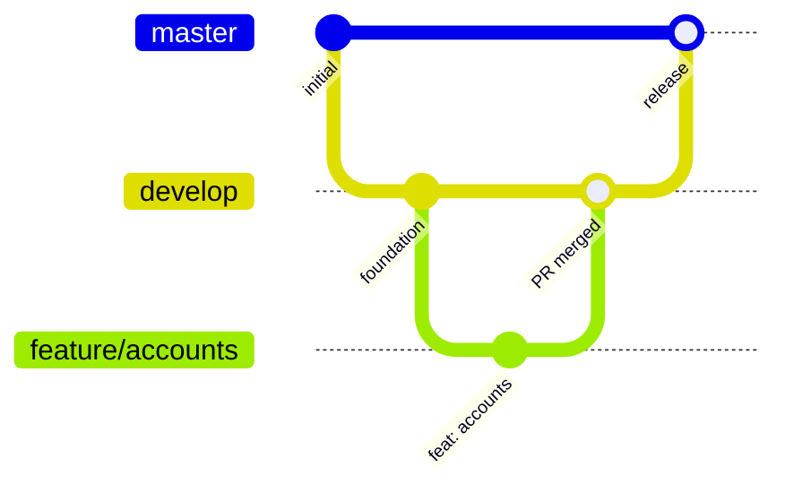

# Cómo contribuir

[English](../en/contributing.md) · [Français](../fr/contributing.md) · [Português](../pt/contributing.md) · [Volver al README](README.md)

Gracias por ayudar. Esta guía no supone experiencia previa en Android.

## 1. Prepara tu equipo

1. Instala una versión estable reciente de **Android Studio**. Incluye el administrador del SDK de Android.
2. En *SDK Manager*, instala **Android SDK Platform 37**.
3. Asegúrate de tener un JDK 11 o superior para lanzar Gradle. El build descarga por sí mismo el toolchain con JDK 21 que necesita.
4. Clona el repositorio y abre la carpeta en Android Studio, o trabaja desde la terminal con `./gradlew`.

```bash
git clone git@github.com:DEV1-Softworks/fintoc-android.git
cd fintoc-android
./gradlew :app:assembleDebug
```

## 2. Estructura del proyecto

```text
fintoc-android/
├── fintoc-sdk/                 # la librería publicada
│   └── src/
│       ├── main/kotlin/        # código fuente del SDK
│       ├── test/kotlin/        # pruebas unitarias (corren en tu computadora)
│       └── androidTest/kotlin/ # pruebas instrumentadas (corren en un dispositivo)
├── app/                        # aplicación de ejemplo (misma estructura de src)
├── gradle/
│   ├── libs.versions.toml      # aquí viven todas las versiones de dependencias
│   ├── jacoco-coverage.gradle.kts
│   └── robolectric.gradle.kts
└── docs/                       # documentación en en, es, fr y pt
```

## 3. Ejecuta las pruebas

| Objetivo | Comando |
|---|---|
| Pruebas unitarias | `./gradlew testDebugUnitTest` |
| Pruebas instrumentadas (con dispositivo conectado) | `./gradlew connectedDebugAndroidTest` |
| Reporte de cobertura | `./gradlew jacocoDebugCoverageReport` |
| Exigir la regla del 80% | `./gradlew jacocoDebugCoverageVerification` |
| Todo, en el orden correcto | `./gradlew clean testDebugUnitTest connectedDebugAndroidTest jacocoDebugCoverageReport jacocoDebugCoverageVerification` |

El reporte HTML se genera en `<módulo>/build/reports/jacoco/jacocoDebugCoverageReport/html/index.html`.

**Ejecuta todas las pruebas antes de cada commit.** Las tareas de cobertura no inician las pruebas por sí solas, porque las
instrumentadas necesitan un dispositivo. Si omites las tareas de pruebas, la verificación de cobertura solo verá datos
desactualizados o inexistentes.

### Consejos para las pruebas instrumentadas

- Usa un dispositivo físico con la depuración por USB activada, o un emulador con Android 9 o superior.
- **Mantén la pantalla encendida y desbloqueada** mientras corren las pruebas. Si la pantalla se apaga, las pruebas de
  Compose fallan con `No compose hierarchies found in the app`.
- Se requiere Espresso 3.7.0 o superior para ejecutar en Android 16 (ya está declarado en el catálogo de versiones).

## 4. Reglas de código

- Estilo oficial de Kotlin, con la indentación predeterminada de 4 espacios.
- Nombres descriptivos para variables, funciones y clases. Los nombres de una sola letra solo se aceptan como contadores de ciclo.
- Arquitectura limpia: respeta las reglas de capas de [Arquitectura](architecture.md).
- Todo en el SDK es `internal` salvo que deba ser público (el modo de API explícita lo hace cumplir).
- Compose primero: construye la UI con Jetpack Compose. Usa XML solo para necesidades heredadas, como el manifest.
- Toda versión de dependencia nueva va en `gradle/libs.versions.toml`, nunca directamente en un módulo.
- Todo cambio de comportamiento incluye pruebas unitarias y, si toca Android, pruebas instrumentadas. La cobertura de cada módulo debe mantenerse en 80% o más.

## 5. Git flow

| Rama | Propósito |
|---|---|
| `master` | Producción. Nunca se hace commit directo. |
| `develop` | Rama de integración. Cada funcionalidad se une aquí mediante un pull request. |
| `feature/<tema>` | Una rama por funcionalidad, creada desde un `develop` actualizado. |
| `fix/<tema>` | Una rama por corrección de errores, creada desde un `develop` actualizado. |

En este repositorio no existe la rama `main`.



Las ramas de funcionalidad parten de `develop` y regresan a ella mediante un pull request revisado. `develop` llega a `master` en cada release.

Pasos para un cambio:

1. `git checkout develop && git pull`.
2. `git checkout -b feature/<tema>`.
3. Haz commits pequeños con [Conventional Commits](https://www.conventionalcommits.org/es/): `feat: …`, `fix: …`, `docs: …`, `test: …`, `chore: …`.
4. Ejecuta todas las pruebas (sección 3).
5. Abre un pull request hacia `develop` con un resumen de los cambios y una referencia a la incidencia o tarea relacionada.
6. Espera la revisión y el merge. Solo entonces inicia la siguiente funcionalidad desde `develop`.

**Sin pull requests apilados.** Cada rama parte de `develop`, nunca de otra rama de funcionalidad.

## 6. Documentación

Todo cambio que afecte el comportamiento o la configuración actualiza la documentación. Los documentos viven en `docs/` y
deben existir en cuatro idiomas: inglés (`docs/en`), español (`docs/es`), francés (`docs/fr`) y portugués (`docs/pt`). El
`README.md` de la raíz es el punto de entrada.
