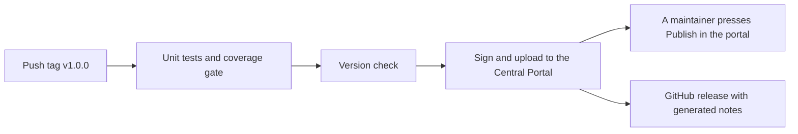

# Publicar una versión

[English](../en/releasing.md) · [Français](../fr/releasing.md) · [Português](../pt/releasing.md) · [Volver al README](../../README.md)

Esta página explica cómo una persona mantenedora publica `mx.dev1.fintoc:fintoc-sdk` en
[Maven Central](https://central.sonatype.com). Nada secreto está en el repositorio: tus credenciales viven en tu propio
`~/.gradle/gradle.properties` o en variables de entorno.

## Configuración inicial (una sola vez)

1. Crea una cuenta en el [Central Portal](https://central.sonatype.com).
2. **Verifica el namespace** `mx.dev1` en el portal (Namespaces). Demuestra, con un registro DNS, que eres dueño del dominio
   `dev1.mx`. Las coordenadas `mx.dev1.fintoc` viven bajo él. Un namespace como `io.github.dev1-softworks` no necesitaría
   dominio, pero cambiaría las coordenadas de la librería, así que decídelo antes de la primera versión.
3. **Genera un user token** en el portal (Account y luego Generate User Token). Es un usuario y una contraseña para la
   subida, no los que usas para iniciar sesión.
4. **Crea una llave GPG** que firme los artefactos, y publica su parte pública en un servidor de llaves que Maven Central
   lea, como `keyserver.ubuntu.com`:

```bash
gpg --full-generate-key
gpg --keyserver keyserver.ubuntu.com --send-keys <id de la llave>
gpg --export-secret-keys --armor <id de la llave>    # imprime la llave privada: no la dejes en logs ni chats
```

5. Dale a Gradle las credenciales, en tu `gradle.properties` de usuario:

```properties
# ~/.gradle/gradle.properties, never in the repository
mavenCentralUsername=<token username>
mavenCentralPassword=<token password>
signingInMemoryKey=<armored secret key, on one line or with \n for the line breaks>
signingInMemoryKeyPassword=<password of the key>
```

En un servidor de CI usa los mismos nombres como variables de entorno con el prefijo `ORG_GRADLE_PROJECT_`, por ejemplo
`ORG_GRADLE_PROJECT_mavenCentralUsername`.

## Versionado

La versión es `VERSION_NAME` en `gradle.properties`. El proyecto sigue el [Versionado Semántico](https://semver.org). Entre
versiones termina en `-SNAPSHOT`. Maven Central nunca acepta la misma versión dos veces, así que un error se corrige con
una versión nueva. La primera versión es la 1.0.0, así que la API pública es un compromiso desde el inicio: un cambio que
la rompa sube la versión mayor, una función nueva sube la versión menor y una corrección sube la versión de parche. Solo
es pública lo que lista la documentación de la API: todo lo marcado como `internal` puede cambiar libremente. El
[registro de cambios](changelog.md) lista cada cambio.

## Pasos de la publicación

Siguen el Git flow de este proyecto, donde `master` es producción.

1. Crea la rama `release/<versión>` desde `develop`.
2. Pon `VERSION_NAME` en la versión, sin `-SNAPSHOT`, y mueve las notas de `Unreleased` de los cuatro registros de cambios
   bajo la versión nueva.
3. Ejecuta todo, con un teléfono conectado y desbloqueado:
   `./gradlew testDebugUnitTest connectedDebugAndroidTest jacocoDebugCoverageReport jacocoDebugCoverageVerification lintDebug lintRelease assembleRelease`.
4. Haz una [prueba en seco](#prueba-en-seco) y corrige lo que muestre.
5. Abre un pull request de `release/<versión>` a `master`, y fusiónalo.
6. En `master`, etiqueta el commit `v<versión>` y sube la etiqueta: `git tag v<versión> && git push origin v<versión>`.
   Esto inicia el [flujo de publicación](#publicación-automática), que prueba, firma, sube y crea el release de GitHub.
7. Cuando el flujo termine, abre el [Central Portal](https://central.sonatype.com), ve a Publish y luego a Deployments,
   espera a que pase la validación y pulsa **Publish**. Nada es público antes de eso.
8. Fusiona `master` de vuelta en `develop` con un pull request que ponga `VERSION_NAME` en el siguiente `-SNAPSHOT`.
9. El flujo ya creó el release de GitHub, con notas generadas. Pega en él las notas del registro de cambios si las prefieres.

## Publicación automática

`.github/workflows/cd.yml` publica una versión cuando se sube una etiqueta que empieza con `v`. También se puede iniciar a
mano desde la pestaña Actions, para publicar de nuevo la versión de `gradle.properties` después de un fallo.



1. **Primero las pruebas.** La publicación se bloquea salvo que las pruebas unitarias pasen y la cobertura sea de al menos
   80 %.
2. **Verificación de la versión.** La ejecución falla si `VERSION_NAME` termina en `-SNAPSHOT`, o si la etiqueta no es `v`
   más `VERSION_NAME`, así que una etiqueta equivocada no puede salir.
3. **Subida firmada.** `./gradlew :fintoc-sdk:publishToMavenCentral` firma los archivos y los sube al Central Portal como
   un deployment. La compilación empieza desde cero, sin caché de Gradle.
4. **Confirmación manual.** Nada se hace público solo: una persona mantenedora pulsa **Publish** en el deployment validado
   del portal. El resumen de la ejecución te lo recuerda.
5. **Release de GitHub.** El flujo crea el release de la etiqueta con notas generadas. Una versión con sufijo, como
   `1.1.0-rc.1`, se marca como pre-release.

Las credenciales son secretos del repositorio (Settings, Secrets and variables, Actions), con los mismos nombres que los de
[openpay-android](https://github.com/DEV1-Softworks/openpay-android):

| Secreto | Qué contiene | Propiedad de Gradle en la que se convierte |
|---|---|---|
| `MAVEN_REPOSITORY_USERNAME` | El usuario del token de usuario del Central Portal. | `mavenCentralUsername` |
| `MAVEN_REPOSITORY_PASSWORD` | La contraseña del token de usuario del Central Portal. | `mavenCentralPassword` |
| `SIGNING_KEY` | La llave privada en formato armored: `gpg --export-secret-keys --armor <id de la llave>`. | `signingInMemoryKey` |
| `SIGNING_PASSWORD` | La contraseña de esa llave. | `signingInMemoryKeyPassword` |

Si una ejecución falla:

- **Antes de la subida** (las pruebas o la verificación de la versión): no se publicó nada. Corrige la causa y, si el
  commit cambia, borra la etiqueta (`git push --delete origin v<versión>` y `git tag -d v<versión>`) y etiqueta de nuevo.
- **Durante o después de la subida:** mira el deployment en el portal. Uno rechazado se puede descartar allí y enviar de
  nuevo la misma versión. Una versión que se publicó no se puede enviar nunca más: corrige el problema con una versión nueva.

## Publicación manual

Si el flujo no está disponible, publica desde tu máquina con las credenciales de tu `gradle.properties`:

```bash
./gradlew :fintoc-sdk:publishAndReleaseToMavenCentral
```

Esto firma, sube y libera sin la confirmación manual. Para ver antes la subida en el portal, ejecuta
`publishToMavenCentral` y pulsa Publish allí.

## Qué se publica

| Archivo | Qué es |
|---|---|
| `fintoc-sdk-<versión>.aar` | La librería. |
| `fintoc-sdk-<versión>.pom` y `.module` | Metadatos para Maven y para Gradle. El POM nombra a los desarrolladores, la licencia y el repositorio, que Central exige, y la descripción dice que el SDK no es oficial. |
| `fintoc-sdk-<versión>-sources.jar` | Las fuentes en Kotlin. |
| `fintoc-sdk-<versión>-javadoc.jar` | La documentación de la API, generada por Dokka a partir del KDoc. Solo aparece la API pública. |
| `*.asc` | Una firma GPG de cada archivo anterior. |

## Prueba en seco

Publicar en una carpeta local no necesita credenciales y no firma nada, así que es seguro hacerlo en cualquier momento.
Muestra exactamente qué se subiría:

```bash
./gradlew :fintoc-sdk:publishToMavenLocal -Dmaven.repo.local=/tmp/fintoc-m2
```

Después comprueba lo que ve un consumidor: crea una app vacía con `compileSdk 37`, apunta sus repositorios a esa carpeta y
agrega la librería. Vale la pena hacer tres comprobaciones:

- **Compila y construye con R8**, usando la API pública que cambiaste.
- **Su Kotlin no se fuerza hacia arriba.** Mira la biblioteca estándar de Kotlin que Gradle resuelve para la app. Debe ser la
  de la app, no la de este build.
- **El manifiesto se fusiona.** El manifiesto fusionado de la app tiene el permiso `INTERNET` y la Activity del SDK.

Para comprobar las firmas con una llave desechable, define `signingInMemoryKey` con una llave de prueba en el mismo comando,
y verifica cada `.asc` con `gpg --verify`.

## Si el portal rechaza la subida

El portal explica cada fallo. Los habituales son un namespace sin verificar, una llave pública que aún no tiene ningún
servidor de llaves, una firma, un jar de javadoc o de fuentes que falta, un POM sin desarrolladores o sin licencia, y una
versión que ya existe. Corrige la causa, cambia la versión si se consumió una, y publica de nuevo.
