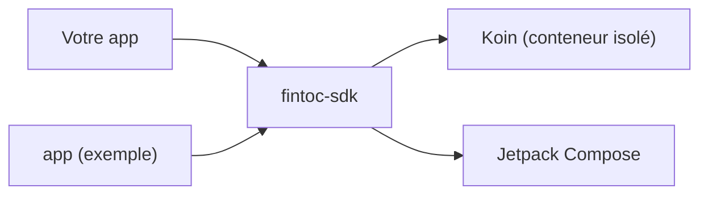

# SDK Fintoc pour Android

[English](../../README.md) · [Español](../es/README.md) · **Français** · [Português](../pt/README.md)

SDK Kotlin et Jetpack Compose, communautaire et **non officiel**, pour ajouter à une application Android les
paiements de [Fintoc](https://fintoc.com) (comme SPEI au Mexique) et les connexions bancaires. Il encapsule le Widget de
Fintoc, est conçu avec Compose en priorité et utilise Koin pour l'injection de dépendances.

> **Aucune affiliation avec Fintoc.** Il s'agit d'un projet communautaire. « Fintoc » est une marque appartenant à ses
> propriétaires respectifs.

> **État : en développement.** Le build, le conteneur d'injection de dépendances, la chaîne de tests, l'application
> d'exemple, la configuration du Widget (validation de la clé publique, options par produit et constructeur d'URL) et
> l'analyseur d'événements du Widget sont en place. La vue du Widget, les callbacks d'événements et le checkout hébergé
> arrivent fonctionnalité par fonctionnalité via des pull requests.

## Modules

| Module | Rôle |
|---|---|
| [`fintoc-sdk`](../../fintoc-sdk) | La bibliothèque publiée sur Maven : `mx.dev1.fintoc:fintoc-sdk`. |
| [`app`](../../app) | Application d'exemple qui utilise le SDK. Non publiée. |



## Prérequis

| Outil | Version |
|---|---|
| JDK pour lancer Gradle | 11 ou supérieur (le build provisionne automatiquement un toolchain JDK 21) |
| Android SDK Platform | 37 (`compileSdk`) |
| Android Studio | Une version stable récente compatible avec Android Gradle Plugin 9.4 |
| Appareil ou émulateur | Android 6.0 (API 23) ou supérieur, uniquement pour les tests instrumentés |

Compatible avec Android 6.0 (API 23) et supérieur. Le SDK est compilé avec `compileSdk 37` ; comme il dépend de
Jetpack Compose, les applications qui l'intègrent doivent aussi compiler avec `compileSdk 37`, ou figer un Compose BOM plus ancien.

## Démarrage rapide

```bash
git clone git@github.com:DEV1-Softworks/fintoc-android.git
cd fintoc-android

./gradlew :app:assembleDebug          # compile l'application d'exemple
./gradlew testDebugUnitTest           # tests unitaires (JUnit, Robolectric, Mockito)
```

Utiliser le SDK depuis une application :

```kotlin
class MyApplication : Application() {
    override fun onCreate() {
        super.onCreate()
        Fintoc.initialize(
            context = this,
            configuration = FintocConfiguration(publicKey = "pk_test_…"),
        )
    }
}
```

Décrivez ce qu'il faut afficher avec `FintocWidgetOptions`. Les jetons viennent de votre backend :

```kotlin
val options = FintocWidgetOptions.Payments(sessionToken = tokenFromYourBackend)
```

La vue du Widget qui affiche ces options arrive dans une prochaine pull request.

## Modèle de sécurité

- L'application ne conserve que la **clé publique** (`pk_test_` ou `pk_live_`). Le SDK refuse les clés secrètes
  (`sk_…`).
- Votre backend crée la Checkout Session avec sa clé secrète et remet à l'application le `session_token` de courte
  durée ; l'application le transmet au SDK.
- Les jetons ne sont jamais écrits dans les logs : le `toString()` de chaque option les masque.
- Ce que le Widget signale à l'application ne prouve pas un paiement. Confirmez les paiements avec les webhooks de
  Fintoc sur votre backend.

## Documentation

| Sujet | English | Español | Français | Português |
|---|---|---|---|---|
| Présentation | [en](../../README.md) | [es](../es/README.md) | ce fichier | [pt](../pt/README.md) |
| Architecture | [en](../en/architecture.md) | [es](../es/architecture.md) | [fr](architecture.md) | [pt](../pt/architecture.md) |
| Contribuer | [en](../en/contributing.md) | [es](../es/contributing.md) | [fr](contributing.md) | [pt](../pt/contributing.md) |

## Crédits et licence

L'intégration du Widget suit la [documentation publique de Fintoc](https://docs.fintoc.com) et le comportement du
[SDK React Native](https://github.com/fintoc-com/fintoc-react-native) officiel. La mention MIT du client Swift
communautaire [sergiocampama/Fintoc](https://github.com/sergiocampama/Fintoc) (© 2021 Sergio Campamá) est conservée dans
[NOTICE](../../NOTICE) au cas où du code qui en dérive serait ajouté.

Ce projet est distribué sous la [licence Apache 2.0](../../LICENSE).
