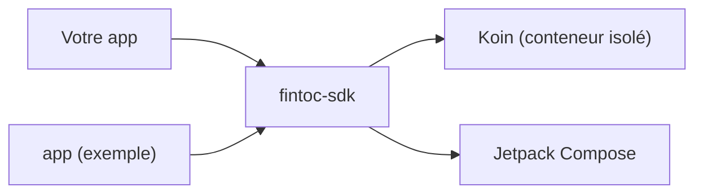

# SDK Fintoc pour Android

[English](../../README.md) · [Español](../es/README.md) · **Français** · [Português](../pt/README.md)

SDK Kotlin et Jetpack Compose, communautaire et **non officiel**, pour ajouter à une application Android les
paiements de [Fintoc](https://fintoc.com) (comme SPEI au Mexique) et les connexions bancaires. Il encapsule le Widget de
Fintoc, est conçu avec Compose en priorité et utilise Koin pour l'injection de dépendances.

> **Aucune affiliation avec Fintoc.** Il s'agit d'un projet communautaire. « Fintoc » est une marque appartenant à ses
> propriétaires respectifs.

> **État : en développement.** Le build, le conteneur d'injection de dépendances, la chaîne de tests, l'application
> d'exemple, la configuration du Widget (validation de la clé publique, options par produit et constructeur d'URL) et
> l'analyseur d'événements du Widget, le `FintocWidget` de Compose, l'hôte Activity pour les apps sans Compose, le
> changement manuel de langue, les contrôles d'accessibilité, le checkout hébergé et l'application d'exemple complète
> sont en place. La publication sur Maven arrive dans une pull request à part.

## Modules

| Module | Rôle |
|---|---|
| [`fintoc-sdk`](../../fintoc-sdk) | La bibliothèque publiée sur Maven : `mx.dev1.fintoc:fintoc-sdk`. |
| [`app`](../../app) | Application d'exemple qui utilise le SDK. Non publiée. |



## Prérequis

| Outil | Version |
|---|---|
| JDK pour lancer Gradle | 11 ou supérieur (le build provisionne automatiquement un toolchain JDK 21) |
| Android SDK Platform | 37 (`compileSdk`) |
| Android Studio | Une version stable récente compatible avec Android Gradle Plugin 9.4 |
| Appareil ou émulateur | Android 6.0 (API 23) ou supérieur, uniquement pour les tests instrumentés |

Compatible avec Android 6.0 (API 23) et supérieur. Le SDK est compilé avec `compileSdk 37` ; comme il dépend de
Jetpack Compose, les applications qui l'intègrent doivent aussi compiler avec `compileSdk 37`, ou figer un Compose BOM plus ancien.

## Démarrage rapide

```bash
git clone git@github.com:DEV1-Softworks/fintoc-android.git
cd fintoc-android

./gradlew :app:assembleDebug          # compile l'application d'exemple
./gradlew testDebugUnitTest           # tests unitaires (JUnit, Robolectric, Mockito)
```

Pour essayer le SDK contre le sandbox de Fintoc avec l'application d'exemple, suivez le [guide de l'application d'exemple](sample-app.md).

Utiliser le SDK depuis une application :

```kotlin
class MyApplication : Application() {
    override fun onCreate() {
        super.onCreate()
        Fintoc.initialize(
            context = this,
            configuration = FintocConfiguration(publicKey = "pk_test_…"),
        )
    }
}
```

Décrivez ce qu'il faut afficher avec `FintocWidgetOptions`. Les jetons viennent de votre backend :

```kotlin
val options = FintocWidgetOptions.Payments(sessionToken = tokenFromYourBackend)
```

Affichez le Widget depuis Compose avec `FintocWidget`. Quand le session token vient de votre backend, passez un
fournisseur `suspend` : le SDK l'appelle une fois par tentative et affiche un indicateur de progression pendant
l'attente.

```kotlin
FintocWidget(
    sessionTokenProvider = { myBackend.createSessionToken(orderId) },
    onEvent = { event ->
        when (event) {
            is FintocWidgetEvent.Succeeded -> showReceipt()
            FintocWidgetEvent.Exited -> closeScreen()
            is FintocWidgetEvent.Occurred -> Unit
        }
    },
    modifier = Modifier.fillMaxSize(),
)
```

Si vous avez déjà les options, par exemple `Movements`, qui n'a pas besoin de jeton, passez-les directement avec
`FintocWidget(options = …, onEvent = …)`. Le SDK déclare lui-même la permission `INTERNET` : votre application n'a pas à le faire.

Les apps sans Compose ouvrent le Widget dans un écran dédié, avec l'API Activity Result :

```kotlin
private val fintocWidget = registerForActivityResult(FintocWidgetContract()) { result ->
    when (result) {
        is FintocWidgetResult.Succeeded -> checkThePaymentOnYourBackend()
        FintocWidgetResult.Exited -> Unit
    }
}

fintocWidget.launch(FintocWidgetOptions.Payments(sessionToken = tokenFromYourBackend))
```

Sans cette API, appelez `FintocWidgetContract().createIntent(…)` et `parseResult(…)` depuis `startActivityForResult`.

Les textes propres au SDK (message de chargement, erreurs, boutons) existent en français, anglais, espagnol et
portugais, et suivent la langue de l'appareil. Pour en forcer une, par exemple parce que votre application a son propre
sélecteur de langue :

```kotlin
FintocConfiguration(publicKey = "pk_test_…", language = FintocLanguage.SPANISH)
```

La page du Widget appartient à Fintoc et garde sa propre langue.

Pour envoyer le client vers une page de checkout hébergée par Fintoc, ouvrez le `redirect_url` de votre Checkout Session
dans une Custom Tab et lisez ce qui revient à votre app :

```kotlin
val nonce = UUID.randomUUID().toString() // keep it with the order; send both addresses to your backend
val checkout = FintocHostedCheckout(
    successUrl = "https://merchant.com/pay/success?n=$nonce",
    cancelUrl = "https://merchant.com/pay/cancel?n=$nonce",
)

checkout.open(this, redirectUrlFromYourBackend)

// In the Activity that receives those addresses, in onCreate and onNewIntent:
when (checkout.outcomeOf(intent)) {
    FintocHostedCheckoutOutcome.Succeeded -> showThatTheOrderIsBeingConfirmed()
    FintocHostedCheckoutOutcome.Cancelled -> showThatThePaymentWasCancelled()
    FintocHostedCheckoutOutcome.Unrelated -> Unit
}
```

L'adresse qui revient n'est qu'un indice : confirmez les paiements avec les webhooks de Fintoc sur votre backend.

## Modèle de sécurité

- L'application ne conserve que la **clé publique** (`pk_test_` ou `pk_live_`). Le SDK refuse les clés secrètes
  (`sk_…`).
- Votre backend crée la Checkout Session avec sa clé secrète et remet à l'application le `session_token` de courte
  durée ; l'application le transmet au SDK.
- Les jetons ne sont jamais écrits dans les logs : le `toString()` de chaque option les masque.
- Le Widget s'exécute dans une WebView durcie : pas d'accès aux fichiers ni aux fournisseurs de contenu, pas de
  sous-ressources non sécurisées, Safe Browsing activé, aucune interface JavaScript, et les erreurs de certificat ne
  sont jamais acceptées. Le SDK n'active jamais le débogage de la WebView.
- La WebView reste sur les hôtes de Fintoc (`webview.fintoc.com`, `wizard.fintoc.com` et `js.fintoc.com`). Les autres
  liens `https`, comme le justificatif de paiement, s'ouvrent dans le navigateur, et tout le reste est bloqué.
- Quand la page ne peut pas être chargée, le SDK affiche son propre message. La page d'erreur de la WebView afficherait
  l'adresse, et l'adresse contient le session token.
- L'écran pour les apps sans Compose est privé à votre application et se masque des captures d'écran et de la liste des
  apps récentes. Les session tokens ne circulent jamais dans un `Intent`.
- Un checkout hébergé n'ouvre que des adresses `https` d'un sous-domaine de `fintoc.com`, dans une Custom Tab dont la
  barre d'adresse reste visible. L'adresse qui revient à votre app peut être falsifiée par n'importe quelle app de
  l'appareil : le SDK exige donc que la valeur secrète que vous avez mise dans votre propre adresse de retour revienne
  aussi.
- Ce que le Widget signale à l'application ne prouve pas un paiement. Confirmez les paiements avec les webhooks de
  Fintoc sur votre backend.

## Documentation

| Sujet | English | Español | Français | Português |
|---|---|---|---|---|
| Présentation | [en](../../README.md) | [es](../es/README.md) | ce fichier | [pt](../pt/README.md) |
| Architecture | [en](../en/architecture.md) | [es](../es/architecture.md) | [fr](architecture.md) | [pt](../pt/architecture.md) |
| Application d'exemple | [en](../en/sample-app.md) | [es](../es/sample-app.md) | [fr](sample-app.md) | [pt](../pt/sample-app.md) |
| Contribuer | [en](../en/contributing.md) | [es](../es/contributing.md) | [fr](contributing.md) | [pt](../pt/contributing.md) |

## Crédits et licence

L'intégration du Widget suit la [documentation publique de Fintoc](https://docs.fintoc.com) et le comportement du
[SDK React Native](https://github.com/fintoc-com/fintoc-react-native) officiel. La mention MIT du client Swift
communautaire [sergiocampama/Fintoc](https://github.com/sergiocampama/Fintoc) (© 2021 Sergio Campamá) est conservée dans
[NOTICE](../../NOTICE) au cas où du code qui en dérive serait ajouté.

Ce projet est distribué sous la [licence Apache 2.0](../../LICENSE).
