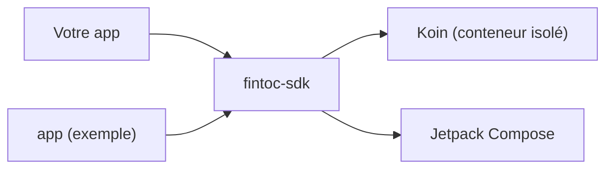

# SDK Fintoc pour Android

[English](../../README.md) · [Español](../es/README.md) · **Français** · [Português](../pt/README.md)

SDK Kotlin et Jetpack Compose pour l'API de [Fintoc](https://fintoc.com). C'est l'équivalent Android de la bibliothèque
[Fintoc Swift](https://github.com/sergiocampama/Fintoc), conçu avec Compose en priorité et Koin pour l'injection de
dépendances.

> **État : fondations.** Le build, le conteneur d'injection de dépendances, la chaîne de tests et l'application
> d'exemple sont en place. Les fonctionnalités de l'API (links, comptes, mouvements) sont ajoutées une par une via des pull requests.

## Modules

| Module | Rôle |
|---|---|
| [`fintoc-sdk`](../../fintoc-sdk) | La bibliothèque publiée sur Maven : `mx.dev1.fintoc:fintoc-sdk`. |
| [`app`](../../app) | Application d'exemple qui utilise le SDK. Non publiée. |



## Prérequis

| Outil | Version |
|---|---|
| JDK pour lancer Gradle | 11 ou supérieur (le build provisionne automatiquement un toolchain JDK 21) |
| Android SDK Platform | 37 (`compileSdk`) |
| Android Studio | Une version stable récente compatible avec Android Gradle Plugin 9.4 |
| Appareil ou émulateur | Android 9 (API 28) ou supérieur, uniquement pour les tests instrumentés |

Compatible avec Android 9 (API 28) et supérieur. Le SDK est compilé avec `compileSdk 37` ; comme il dépend de
Jetpack Compose, les applications qui l'intègrent doivent aussi compiler avec `compileSdk 37`, ou figer un Compose BOM plus ancien.

## Démarrage rapide

```bash
git clone git@github.com:DEV1-Softworks/fintoc-android.git
cd fintoc-android

./gradlew :app:assembleDebug          # compile l'application d'exemple
./gradlew testDebugUnitTest           # tests unitaires (JUnit, Robolectric, Mockito)
```

Utiliser le SDK depuis une application :

```kotlin
class MyApplication : Application() {
    override fun onCreate() {
        super.onCreate()
        Fintoc.initialize(
            context = this,
            configuration = FintocConfiguration(authToken = "<votre jeton>"),
        )
    }
}
```

## Documentation

| Sujet | English | Español | Français | Português |
|---|---|---|---|---|
| Présentation | [en](../../README.md) | [es](../es/README.md) | ce fichier | [pt](../pt/README.md) |
| Architecture | [en](../en/architecture.md) | [es](../es/architecture.md) | [fr](architecture.md) | [pt](../pt/architecture.md) |
| Contribuer | [en](../en/contributing.md) | [es](../es/contributing.md) | [fr](contributing.md) | [pt](../pt/contributing.md) |

## Crédits et licence

L'API est modélisée d'après [sergiocampama/Fintoc](https://github.com/sergiocampama/Fintoc), publiée sous licence MIT
(© 2021 Sergio Campamá). Cette mention est conservée dans [NOTICE](../../NOTICE).

Ce projet est distribué sous la [licence Apache 2.0](../../LICENSE).
