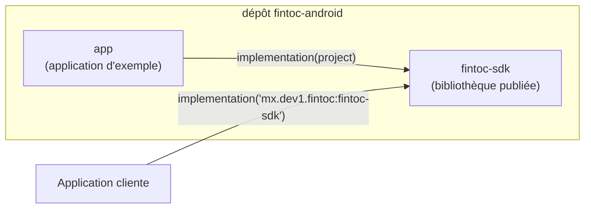
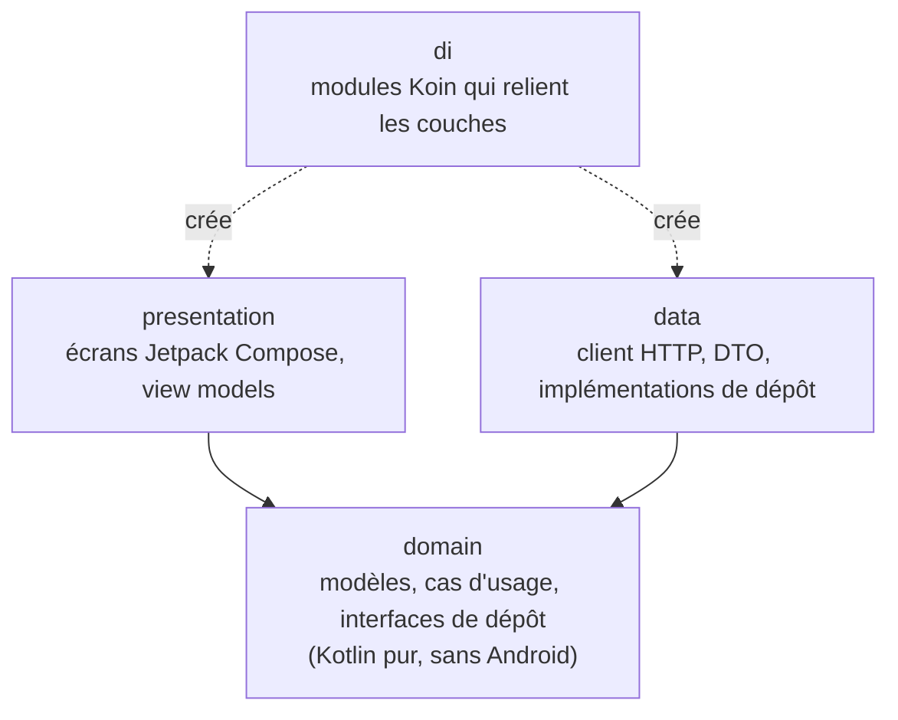
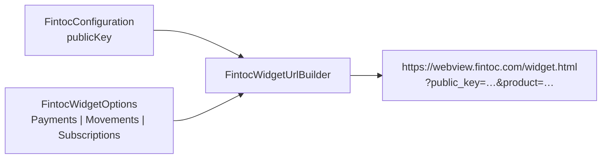
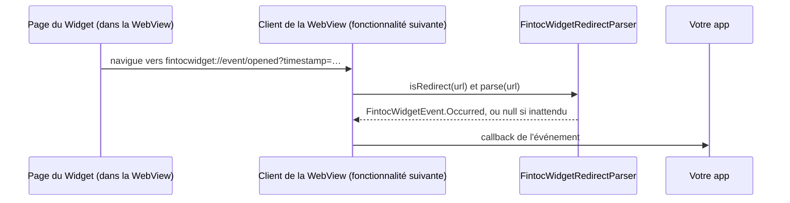
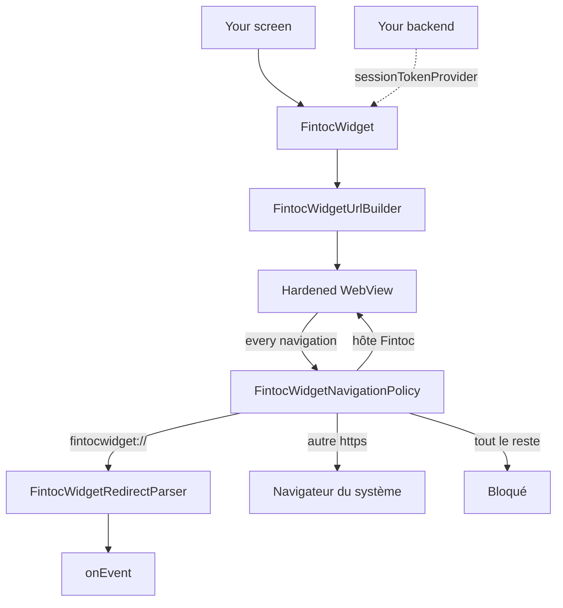
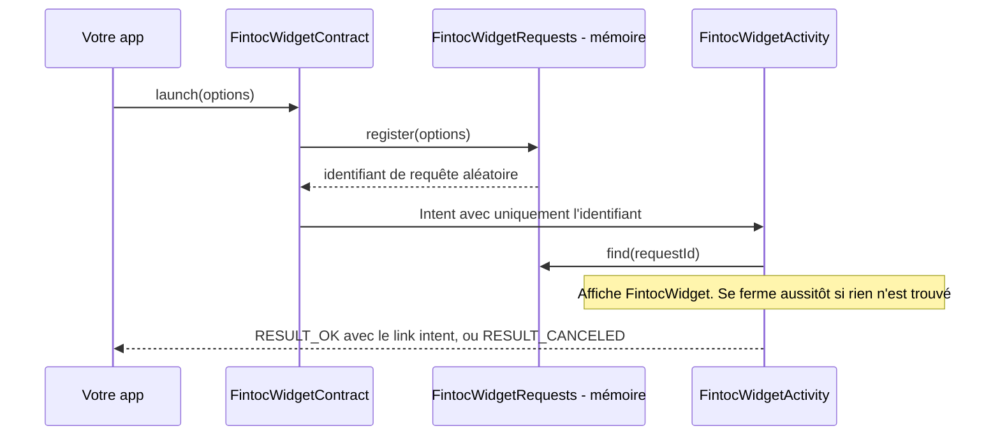
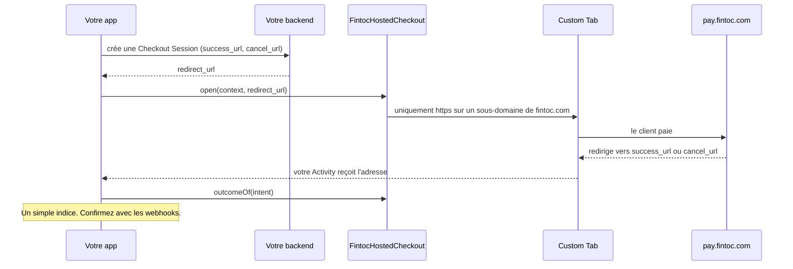
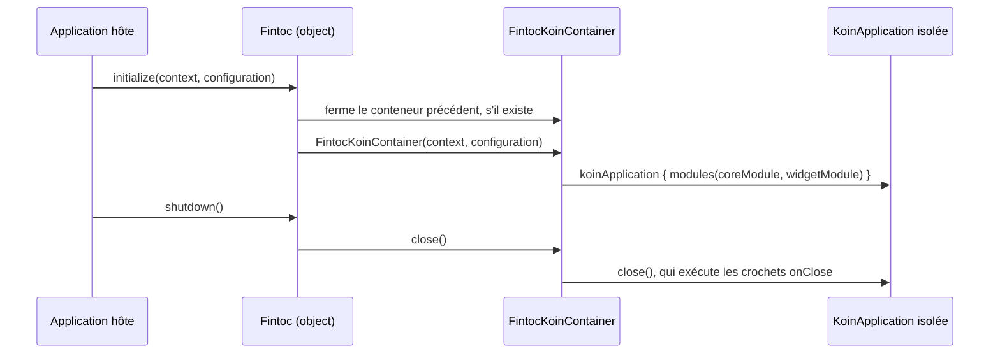

# Architecture

[English](../en/architecture.md) · [Español](../es/architecture.md) · [Português](../pt/architecture.md) · [Retour au README](README.md)

Cette page explique comment le projet est organisé. Aucune expérience préalable d'Android n'est nécessaire.

## Vue d'ensemble

Le dépôt est un build Gradle composé de deux modules :

- **`fintoc-sdk`** est une *bibliothèque Android* : du code que d'autres applications incluent comme dépendance. C'est ce qui est publié sur Maven.
- **`app`** est une *application Android* qui utilise le SDK comme le ferait un client. Elle sert aussi d'exemple vivant.



## Architecture propre (clean architecture)

Chaque module suit les mêmes trois couches. Les dépendances pointent uniquement **vers l'intérieur**, vers le domaine.



| Couche | Connaît | Ne doit jamais connaître |
|---|---|---|
| `domain` | Bibliothèque standard Kotlin, coroutines | Android, Koin, HTTP, Compose |
| `data` | `domain` | `presentation`, Compose |
| `presentation` | `domain` | `data` |
| `di` | toutes les couches | — |

Aujourd'hui, existent la couche `domain` (packages `domain.widget` et `domain.security`), la couche `presentation`
(package `presentation.widget`), le package `di` et le point d'entrée public. Les autres couches sont créées au fil des fonctionnalités, sous le package de base `mx.dev1.fintoc.sdk`.

## API publique et mode d'API explicite

Le SDK active le **mode d'API explicite** de Kotlin. Toute déclaration est `internal`, sauf si elle est volontairement
marquée `public` ; la surface publique de la bibliothèque est donc toujours intentionnelle. Aujourd'hui, elle est :

| Type | Rôle |
|---|---|
| `Fintoc` | Point d'entrée : `initialize`, `shutdown`, `isInitialized`. |
| `FintocConfiguration` | Paramètres : `publicKey` (uniquement `pk_test_` ou `pk_live_` ; les clés secrètes `sk_` sont refusées), `environment`, déduit du préfixe, et `language`, pour forcer la langue des textes propres au SDK. Son `toString()` masque la clé. |
| `FintocEnvironment` | `TEST` ou `LIVE`. |
| `FintocWidgetOptions` | Ce que le Widget doit faire : `Payments`, `Movements` ou `Subscriptions`. Chacun valide ses données et masque ses jetons dans `toString()`. |
| `FintocCountry`, `FintocHolderType` | Valeurs acceptées pour `country` et `holder_type`. |
| `FintocWidgetEvent` | Ce que signale le Widget : `Succeeded`, `Exited` ou `Occurred`. |
| `FintocWidgetEventType` | Les événements documentés par Fintoc, comme `OPENED` ou `PAYMENT_ERROR`. |
| `FintocLinkIntentResult` | L'`exchangeToken` d'un compte bancaire connecté avec `Movements`. Son `toString()` masque le jeton. |
| `FintocWidget` | Le composable qui affiche le Widget. Une surcharge prend `FintocWidgetOptions` ; l'autre, un fournisseur `suspend` du session token pour les paiements. |
| `FintocLanguage` | Langues des textes propres au SDK : français, anglais, espagnol et portugais. |
| `FintocWidgetContract`, `FintocWidgetResult` | Ouvrent le Widget dans un écran dédié, pour les apps sans Compose, et lisent comment il s'est terminé : `Succeeded` ou `Exited`. |
| `FintocHostedCheckout`, `FintocHostedCheckoutOutcome` | Ouvrent un checkout hébergé par Fintoc dans une Custom Tab, et indiquent si l'adresse revenue à votre app est votre adresse de succès, votre adresse d'annulation ou aucune des deux. |

## Configuration du Widget

Le Widget de Fintoc est une page web que le SDK affiche dans une WebView. Il lit ses réglages dans la query string de
l'URL ; le SDK transforme donc votre `FintocConfiguration` et vos `FintocWidgetOptions` en cette URL.



| Options | Produit | Paramètres envoyés après `public_key` et `product` |
|---|---|---|
| `Payments(sessionToken)` | `payments` (SPEI au Mexique, virement bancaire au Chili) | `session_token` |
| `Movements(holderType, country, linkToken?, webhookUrl?)` | `movements` | `holder_type`, `country`, `link_token`, `webhook_url` |
| `Subscriptions(widgetToken, holderType, country)` | `subscriptions` | `holder_type`, `country`, `widget_token` |

Règles de sécurité appliquées à la création des objets :

- Les valeurs vides, contenant des espaces ou commençant par `sk_` sont refusées. Les messages d'erreur ne répètent
  jamais la valeur refusée.
- `webhookUrl` doit être une URL `https` absolue.
- Les valeurs sont encodées en pourcentage (RFC 3986) : un jeton ne peut ni ajouter ni remplacer de paramètres.
- `toString()` masque les jetons.

L'URL se termine toujours par `_on_event=true`, qui demande au Widget de signaler ses événements à l'app.

## Événements du Widget

Le Widget répond en faisant naviguer la WebView vers des adresses commençant par `fintocwidget://`. Le SDK ne laisse
jamais la WebView ouvrir ces adresses : il confie chacune à `FintocWidgetRedirectParser`, qui la transforme en
`FintocWidgetEvent`.



| Redirection du Widget | Événement |
|---|---|
| `fintocwidget://succeeded` | `Succeeded`. Avec `Movements`, elle porte aussi `?object=link_intent&exchange_token=…&id=…`, qui devient `linkIntent`. |
| `fintocwidget://exit` | `Exited` : l'utilisateur a fermé le Widget sans terminer. |
| `fintocwidget://event/{name}?timestamp=…` | `Occurred(name, timestampMillis, metadata)`. `type` est le `FintocWidgetEventType` correspondant, ou `null` quand Fintoc a ajouté un événement que ce SDK ne connaît pas encore. |

Règles de sécurité de l'analyseur :

- Il travaille sur le texte brut et ne lève jamais d'exception. Un schéma incorrect, une action inconnue ou un nom
  d'événement étrange donnent `null` : la page ne peut donc jamais faire planter votre app.
- Les noms d'événement ne peuvent contenir que des lettres, des chiffres, `_`, `.` et `-`, sur 64 caractères au plus.
  Les redirections de plus de 8 192 caractères et les paramètres au-delà du 64e sont ignorés.
- Le Widget n'encode pas ce qu'il envoie : le décodage est donc tolérant, et seules les séquences `%XX` bien formées
  sont décodées.
- La première occurrence d'une clé l'emporte. Un `&` isolé dans une valeur ne peut pas remplacer un `exchange_token`
  précédent.
- Les valeurs que le Widget a écrites sous la forme `null`, `undefined` ou `[object Object]` sont écartées.
- `FintocLinkIntentResult.toString()` masque l'`exchangeToken`, et `Occurred.toString()` liste les clés des métadonnées
  sans leurs valeurs.

> **Un événement n'est pas une preuve de paiement.** Un utilisateur, ou un appareil compromis, peut falsifier ce que
> signale une WebView. Envoyez l'`exchangeToken` à **votre backend**, le seul endroit capable de l'échanger, et
> confirmez les paiements avec les webhooks de Fintoc avant de livrer une commande.

## Vue du Widget

`FintocWidget` est le composable qui place le Widget à l'écran. Il construit l'URL du Widget avec la clé publique donnée
à `Fintoc.initialize`, l'affiche dans une WebView durcie et signale les événements par `onEvent`.



Chaque adresse vers laquelle la page navigue passe par `FintocWidgetNavigationPolicy` : une page qui se comporte mal ne
peut donc pas transformer la WebView en navigateur généraliste dans votre application :

| Adresse | Cadre principal | Cadres dans la page |
|---|---|---|
| `fintocwidget://…` | Signalée à l'application, jamais ouverte | Idem |
| `https` sur `webview.fintoc.com`, `wizard.fintoc.com` ou `js.fintoc.com` | Reste dans la WebView | Se charge |
| Toute autre adresse `https`, comme le justificatif de paiement | S'ouvre dans le navigateur | Se charge |
| `http`, `intent:`, `javascript:`, `file:`, `data:`… | Bloquée | Se charge |

La vérification est stricte : une adresse qui cache son hôte derrière une barre oblique inverse, un échappement
pourcentage ou un `@` ne compte pas comme hôte Fintoc.

Ce que voit l'utilisateur :

- Un indicateur de progression recouvre la page pendant son chargement.
- Si la page ne peut pas être chargée, la WebView est retirée et un message avec un bouton « Réessayer » la remplace.
  Cela couvre les erreurs réseau, les erreurs HTTP de la page elle-même, les problèmes de certificat avec un hôte
  Fintoc et, à partir d'Android 8.0, le plantage du processus de rendu de la WebView, qui fermerait sinon votre
  application. Appuyer sur le
  bouton crée une nouvelle WebView.
- Si l'appareil ne peut pas créer de WebView, ce qui arrive quand Android System WebView n'est pas installé, est
  désactivé ou est en cours de mise à jour, Android lève une exception depuis le constructeur et une application qui
  l'appelle sans protection plante. Le SDK l'attrape, affiche un message qui dit ce qui manque et conserve le bouton
  « Réessayer », car la personne peut régler le problème et revenir. Il en va de même pour une WebView qui échoue pendant
  sa configuration : elle est d'abord libérée.
- Les messages existent en français, anglais, espagnol et portugais, selon la langue de l'appareil.

La surcharge avec `sessionTokenProvider` est destinée aux paiements. Les session tokens de Fintoc appartiennent à une
seule tentative de paiement : le SDK appelle donc le fournisseur une fois quand le composable entre dans la
composition, puis à chaque fois que l'utilisateur appuie sur « Réessayer » après un échec. Si le fournisseur lève une
exception, ou renvoie un jeton vide ou une clé secrète, l'utilisateur voit le même message. Les logs
n'incluent jamais le jeton ni le message de l'erreur levée par votre fournisseur.

À savoir :

- Le SDK déclare la permission `INTERNET` dans son propre manifeste. Sans elle, la WebView échoue à chaque chargement
  avec le cryptique `net::ERR_CACHE_MISS`.
- Le Widget se recharge depuis le début quand l'écran est recréé, car un session token n'est pas quelque chose que le
  SDK peut conserver en toute sécurité. Pour garder un paiement en cours lors d'une rotation, laissez votre activity
  gérer le changement avec `android:configChanges="orientation|screenSize|keyboardHidden"`.
- Le débogage de la WebView est un réglage de toute votre application. Le SDK ne l'active jamais.
- Les téléchargements proposés par le Widget, comme le justificatif de paiement, sont confiés au navigateur.

## Hôte Activity

Les apps qui n'utilisent pas Compose ouvrent le Widget avec `FintocWidgetContract`, un `ActivityResultContract`. Il
démarre `FintocWidgetActivity`, qui affiche le même `FintocWidget` sous une barre de titre.



Choix de conception :

- Les options contiennent des session tokens : elles ne circulent donc jamais dans l'`Intent`. Celui-ci ne porte qu'un
  identifiant aléatoire et les options restent en mémoire. Si le système restaure l'écran après la mort du processus,
  rien n'est trouvé et l'écran se ferme comme annulé.
- L'écran n'est pas exporté, donc aucune autre app ne peut le démarrer, et `FLAG_SECURE` le masque des captures
  d'écran, des enregistrements et de la liste des apps récentes, car le Widget demande des identifiants bancaires.
- Il gère lui-même les changements de configuration (rotation, taille de police, langue, mode sombre) : un paiement en
  cours n'est donc pas redémarré.
- Après un succès, l'écran reste ouvert, car le guide de Fintoc indique que l'utilisateur peut avoir besoin de
  télécharger un justificatif de paiement. Le bouton passe de « Fermer » à « Terminé », et le résultat parvient à votre
  app quand l'utilisateur appuie dessus ou revient en arrière. Une sortie signalée par le Widget après un succès ne le
  transforme pas en annulation.
- Seule la fin du flux revient, sous la forme `Succeeded` ou `Exited`. Pour suivre tous les événements du Widget,
  utilisez le composable.
- Il s'affiche bord à bord et ajoute des marges pour le clavier et les barres système : aucun champ du Widget ne se
  retrouve donc dessous.

## Checkout hébergé

En plus du Widget, Fintoc propose un **checkout hébergé**. Votre backend crée une Checkout Session et Fintoc répond avec
un `redirect_url`, tel que `https://pay.fintoc.com/checkout/cs_…`, où le client paie. Quand il a terminé, Fintoc le
renvoie vers le `success_url` ou le `cancel_url` que vous avez donné. Les flux `payment`, `setup` et `subscription`
fonctionnent tous ainsi. `FintocHostedCheckout` ouvre cette page dans une **Custom Tab**, une vue de navigateur à la
barre d'adresse visible, et vous dit ce qui est revenu.



Ce qui est vérifié :

| Quoi | Règle |
|---|---|
| Le `redirectUrl` que vous ouvrez | `https`, sur un sous-domaine de `fintoc.com`, sans identifiants et avec le port par défaut. Toute autre chose lève `IllegalArgumentException` et rien ne s'ouvre. Les imitations comme `fintoc.com` lui-même, `pay.fintoc.com.evil.example` ou `evilfintoc.com` sont refusées. |
| Vos `successUrl` et `cancelUrl` | Une adresse `https` absolue, ou un schéma personnalisé de votre app. `http`, `javascript:`, `file:`, `intent:` et similaires sont refusés, tout comme deux adresses impossibles à distinguer. |
| Une adresse qui arrive dans votre app | Les mêmes schéma, hôte, port et chemin que l'une des vôtres (la casse et une barre oblique finale n'importent pas). Sa query est ignorée, sauf les paramètres que porte votre propre adresse : chacun doit revenir avec la même valeur. Une adresse qui correspond aux deux vôtres n'est pas traitée. |

Pour recevoir le client à son retour, déclarez l'Activity qui gère vos adresses de retour, ici un App Link, et lisez le
résultat dans `onCreate` et dans `onNewIntent` :

```xml
<activity
    android:name=".PaymentReturnActivity"
    android:exported="true"
    android:launchMode="singleTask">
    <intent-filter android:autoVerify="true">
        <action android:name="android.intent.action.VIEW" />
        <category android:name="android.intent.category.DEFAULT" />
        <category android:name="android.intent.category.BROWSABLE" />
        <data android:scheme="https" android:host="merchant.com" android:pathPrefix="/pay" />
    </intent-filter>
</activity>
```

À savoir :

- **Une adresse qui revient est un indice, jamais une preuve.** N'importe quelle app peut ouvrir votre deep link, et le
  client peut fermer l'onglet sans jamais revenir. Fintoc dit la même chose : utilisez les webhooks. Fermer la Custom Tab
  n'apprend rien à votre app : actualisez donc l'état de la commande depuis votre backend quand votre écran reprend.
- **Mettez une valeur imprévisible dans vos propres adresses**, comme le `n` de l'exemple. Le SDK exige que chaque
  paramètre de query de vos adresses revienne avec la même valeur. Vérifié dans le sandbox de Fintoc : Fintoc accepte
  une query string dans votre `success_url` et la renvoie.
- **Préférez les App Links vérifiés aux schémas personnalisés.** N'importe quelle autre app peut revendiquer un schéma
  personnalisé et recevrait la redirection, valeur secrète comprise. Un App Link vérifié ne peut pas être revendiqué.
- **Utilisez `launchMode="singleTask"`** pour l'Activity qui reçoit les adresses de retour. Vérifié sur un Pixel 10 avec
  Chrome : l'Activity déjà ouverte reçoit l'adresse par `onNewIntent` et la Custom Tab se ferme. Avec le mode de
  lancement par défaut, une seconde copie de l'Activity est créée. Sur le même appareil, une redirection serveur depuis
  une Custom Tab vers un schéma personnalisé a ouvert l'app sans appui, mais d'autres navigateurs et versions peuvent se
  comporter autrement.
- `open` renvoie `false` quand aucune app ne peut ouvrir l'adresse, et nécessite `Fintoc.initialize`. `outcomeOf` ne
  nécessite rien : il fonctionne donc aussi quand le système restaure votre Activity dans un nouveau processus.

## Langues

Les textes propres au SDK (message de chargement, message d'erreur, boutons et titre) existent en français, anglais,
espagnol et portugais.

| Vous définissez | Le SDK utilise |
|---|---|
| Rien (`language = null`) | La langue de l'appareil et, à partir d'Android 13, la langue choisie pour votre app dans les réglages du système. Les variantes régionales comme `es-MX` ou `pt-BR` utilisent leur langue. Toute autre langue se rabat sur l'anglais. |
| Un `FintocLanguage` dans `FintocConfiguration` | Cette langue, quoi que dise l'appareil. Le reste de la configuration de l'appareil, comme la taille de police, est conservé. |

À savoir :

- Le changement manuel ne touche que ce que dessine le SDK. La page du Widget est la page web de Fintoc et garde sa
  propre langue.
- Pour changer la langue plus tard, appelez de nouveau `Fintoc.initialize` avant d'afficher le Widget. Un Widget déjà à
  l'écran garde la langue qu'il avait.
- Si vous publiez un Android App Bundle, désactivez la division par langue avec
  `android { bundle { language { enableSplit = false } } }`. Par défaut, Google Play ne livre que les langues de
  l'appareil de l'utilisateur : une langue que vous forcez mais que l'appareil n'utilise pas se rabattrait sur l'anglais.
- Les ressources utilisent le préfixe `fintoc_`. Pour ajouter un texte, ajoutez-le dans `values/` et aussi dans
  `values-es`, `values-fr` et `values-pt` : lint signale une traduction manquante comme une erreur.

## Accessibilité

Les écrans propres au SDK continuent de fonctionner avec les outils qu'Android offre aux personnes qui en ont besoin :

| Aspect | Ce que fait le SDK |
|---|---|
| Lecteurs d'écran (TalkBack) | L'indicateur de chargement a une description et est annoncé poliment. Le message d'échec est annoncé quand il apparaît. Le titre de l'hôte Activity est un titre de section. Les boutons ont un texte visible, pas seulement des icônes. La page du Widget est une page web, que TalkBack lit nativement. |
| Grandes polices et taille d'affichage | Les textes utilisent des `sp`. La vue d'échec défile : aux tailles les plus grandes sur un petit écran, le message et le bouton restent accessibles. Le changement manuel de langue conserve l'échelle de police. Le zoom de la WebView n'est jamais bloqué. |
| Zones tactiles | Les boutons mesurent au moins 48 dp. |
| Clavier et barres système | L'hôte Activity s'affiche bord à bord et ajoute des marges pour les deux. |
| Thèmes clair et sombre | L'hôte Activity suit le thème de l'appareil. |

Comment c'est vérifié : les tests instrumentés exécutent l'Accessibility Test Framework de Google sur un appareil réel,
sur la vue de chargement, la vue d'échec et l'hôte Activity, avec les réglages par défaut et avec une police à 200 % et
un affichage à 150 %. Toute erreur fait échouer le build. L'accessibilité de la page du Widget elle-même relève de
Fintoc.

## Injection de dépendances avec un conteneur Koin isolé

Koin est le framework d'injection de dépendances. Le SDK crée **son propre** conteneur au lieu d'utiliser celui, global,
de Koin. Ainsi, il ne peut jamais entrer en conflit avec une instance de Koin démarrée par l'application hôte.



Ce qui vit dans le conteneur, et pourquoi :

| Module | Définition | Type | Pourquoi dans le conteneur |
|---|---|---|---|
| `coreModule` | `Context` | `single` | Le contexte de l'application, jamais une Activity : rien ne fuit. |
| `coreModule` | `FintocConfiguration` | `single` | Les paramètres donnés à `Fintoc.initialize`. |
| `widgetModule` | `FintocWidgetRequests` | `single`, avec `onClose` | Conserve les session tokens des écrans de l'hôte Activity. Il est vidé à la fermeture du conteneur : `Fintoc.shutdown()`, ou une nouvelle initialisation, oublie donc tous les jetons. |
| `widgetModule` | `ExternalLinkLauncher` | `factory` | A besoin du contexte dans lequel le Widget est affiché : il est donc créé avec `parametersOf(context)`. |
| `widgetModule` | `FintocWebViewFactory` | `factory` | Crée la WebView. Android décide si un appareil peut en avoir une : les tests remplacent donc cette définition pour faire échouer la création. |

La règle : **le conteneur possède ce qui a un état ou dépend d'Android.** Les fonctions pures, sans rien à libérer,
comme `FintocWidgetUrlBuilder`, `FintocWidgetNavigationPolicy` et `FintocWidgetRedirectParser`, restent de simples objets
Kotlin : les injecter n'ajouterait que de l'indirection.

Le code interne obtient ses dépendances via `Fintoc.requireKoin()`. Si l'application hôte a oublié d'appeler `initialize`,
l'appel échoue immédiatement avec un message expliquant quoi faire. Le code qui ne doit pas planter sans le SDK, comme
une Activity que le système restaure après la mort du processus, utilise `Fintoc.koinOrNull()` et se ferme.

Le SDK n'a besoin d'aucune règle consommateur supplémentaire pour R8. Un build release minifié avec réduction des
ressources a été vérifié sur un appareil réel : l'hôte Activity s'est ouvert et a tout résolu via Koin.

## Choix de build

| Choix | Valeur | Raison |
|---|---|---|
| Kotlin | 2.4.20 | Version stable actuelle. Android Gradle Plugin 9 intègre le support de Kotlin ; aucun plugin Kotlin séparé n'est donc appliqué. |
| Android Gradle Plugin | 9.4.1 (nécessite Gradle 9.6.0) | Version stable actuelle. |
| `minSdk` | 23 (Android 6.0) | Niveau le plus bas pris en charge par Jetpack Compose, pour atteindre un maximum d'appareils. N'appelez pas d'API postérieures à l'API 23 (comme `java.time`) sans garde ni desugaring. |
| `compileSdk` | 37 | Exigé par Compose BOM 2026.09.00. |
| `targetSdk` (application d'exemple) | 36 | Le niveau actuellement exigé par Google Play. |
| Jetpack Compose | BOM 2026.09.00 | Interface Compose en priorité. Le XML n'est utilisé que là où la plateforme l'impose (manifeste, thème de fenêtre). |
| Bytecode Java | 11 | Permet à un maximum d'applications hôtes d'utiliser la bibliothèque. |
| Espresso | 3.7.0, aussi épinglé dans `fintoc-sdk` | Les tests d'UI Compose utilisent un point d'accroche d'Espresso qui échoue sur les versions récentes d'Android quand une ancienne version est tirée indirectement. |
| Publication | `com.vanniktech.maven.publish` 0.37.0 | Publie sur Maven Central avec les sources, la documentation de l'API et des signatures GPG. Les coordonnées et les données du POM sont dans `gradle.properties`. |
| Documentation de l'API | Dokka 2.2.0 | Transforme le KDoc de l'API publique en jar javadoc. Le doclet Java ne lit pas Kotlin : sans Dokka, le jar ne contient que des feuilles de style. |
| Niveau de langage Kotlin | 2.2, bibliothèque standard 2.2.0 | Un compilateur lit les métadonnées jusqu'à une version plus récente que la sienne, et Gradle donne à une app la bibliothèque standard la plus récente que demande une dépendance. Compiler avec le 2.4 de ce build forcerait un Kotlin plus récent sur toutes les apps. Vérifié avec une app consommatrice en Kotlin 2.2.0. |
| Versions | `gradle/libs.versions.toml` | Un seul endroit pour toutes les versions de dépendances. |

## Tests et couverture

Trois types de tests existent, et le rapport de couverture les combine tous :

| Type | Emplacement | Outils | S'exécute sur |
|---|---|---|---|
| Unitaires | `src/test` | JUnit 4, Mockito, Robolectric | Votre ordinateur |
| Instrumentés | `src/androidTest` | AndroidX Test, Espresso, tests d'interface Compose | Appareil ou émulateur |
| Couverture | `gradle/jacoco-coverage.gradle.kts` | JaCoCo | Combine les deux |

Le build échoue lorsque la couverture des lignes ou des instructions d'un module passe sous **80 %**. Voir
[Contribuer](contributing.md) pour les commandes exactes.
