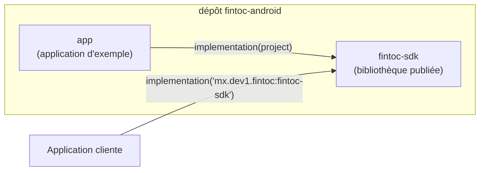
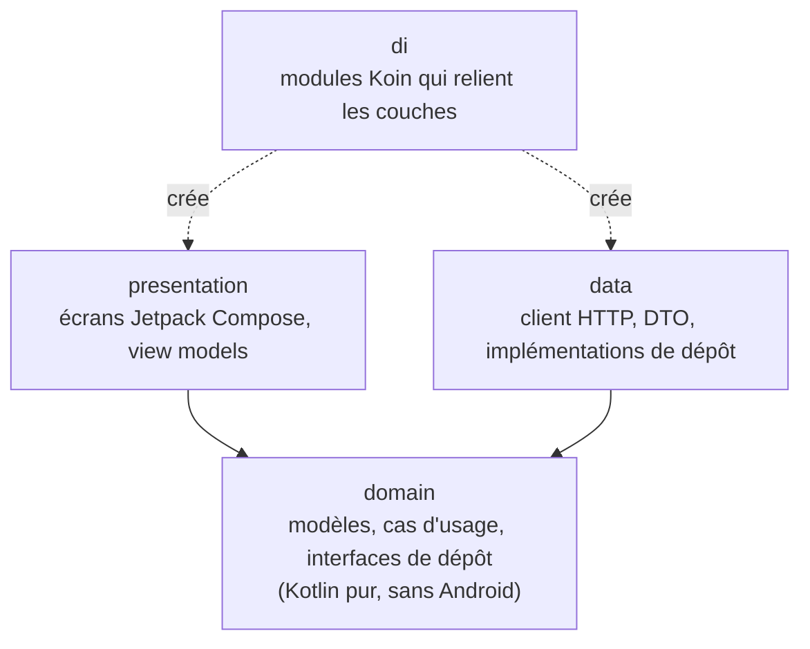
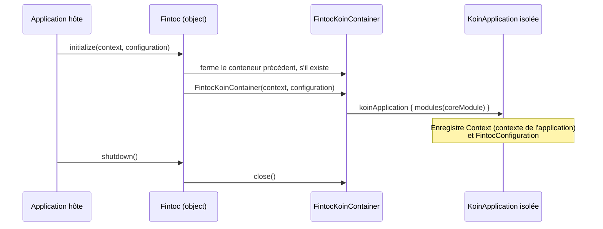

# Architecture

[English](../en/architecture.md) · [Español](../es/architecture.md) · [Português](../pt/architecture.md) · [Retour au README](README.md)

Cette page explique comment le projet est organisé. Aucune expérience préalable d'Android n'est nécessaire.

## Vue d'ensemble

Le dépôt est un build Gradle composé de deux modules :

- **`fintoc-sdk`** est une *bibliothèque Android* : du code que d'autres applications incluent comme dépendance. C'est ce qui est publié sur Maven.
- **`app`** est une *application Android* qui utilise le SDK comme le ferait un client. Elle sert aussi d'exemple vivant.

## Architecture propre (clean architecture)

Chaque module suit les mêmes trois couches. Les dépendances pointent uniquement **vers l'intérieur**, vers le domaine.

| Couche | Connaît | Ne doit jamais connaître |
|---|---|---|
| `domain` | Bibliothèque standard Kotlin, coroutines | Android, Koin, HTTP, Compose |
| `data` | `domain` | `presentation`, Compose |
| `presentation` | `domain` | `data` |
| `di` | toutes les couches | — |

Aujourd'hui, seuls le package `di` et le point d'entrée public existent. Les autres couches sont créées au fil des
fonctionnalités, sous le package de base `mx.dev1.fintoc.sdk`.

## API publique et mode d'API explicite

Le SDK active le **mode d'API explicite** de Kotlin. Toute déclaration est `internal`, sauf si elle est volontairement
marquée `public` ; la surface publique de la bibliothèque est donc toujours intentionnelle. Aujourd'hui, elle est :

| Type | Rôle |
|---|---|
| `Fintoc` | Point d'entrée : `initialize`, `shutdown`, `isInitialized`. |
| `FintocConfiguration` | Paramètres : `authToken` et `baseUrl`. Son `toString()` masque le jeton pour qu'il n'apparaisse jamais dans les logs. |

## Injection de dépendances avec un conteneur Koin isolé

Koin est le framework d'injection de dépendances. Le SDK crée **son propre** conteneur au lieu d'utiliser celui, global,
de Koin. Ainsi, il ne peut jamais entrer en conflit avec une instance de Koin démarrée par l'application hôte.

Le code interne obtient ses dépendances via `Fintoc.requireKoin()`. Si l'application hôte a oublié d'appeler `initialize`,
l'appel échoue immédiatement avec un message expliquant quoi faire.

## Choix de build

| Choix | Valeur | Raison |
|---|---|---|
| Kotlin | 2.4.20 | Version stable actuelle. Android Gradle Plugin 9 intègre le support de Kotlin ; aucun plugin Kotlin séparé n'est donc appliqué. |
| Android Gradle Plugin | 9.4.1 (nécessite Gradle 9.6.0) | Version stable actuelle. |
| `minSdk` | 23 (Android 6.0) | Niveau le plus bas pris en charge par Jetpack Compose, pour atteindre un maximum d'appareils. N'appelez pas d'API postérieures à l'API 23 (comme `java.time`) sans garde ni desugaring. |
| `compileSdk` | 37 | Exigé par Compose BOM 2026.09.00. |
| `targetSdk` (application d'exemple) | 36 | Le niveau actuellement exigé par Google Play. |
| Jetpack Compose | BOM 2026.09.00 | Interface Compose en priorité. Le XML n'est utilisé que là où la plateforme l'impose (manifeste, thème de fenêtre). |
| Bytecode Java | 11 | Permet à un maximum d'applications hôtes d'utiliser la bibliothèque. |
| Versions | `gradle/libs.versions.toml` | Un seul endroit pour toutes les versions de dépendances. |

## Tests et couverture

Trois types de tests existent, et le rapport de couverture les combine tous :

| Type | Emplacement | Outils | S'exécute sur |
|---|---|---|---|
| Unitaires | `src/test` | JUnit 4, Mockito, Robolectric | Votre ordinateur |
| Instrumentés | `src/androidTest` | AndroidX Test, Espresso, tests d'interface Compose | Appareil ou émulateur |
| Couverture | `gradle/jacoco-coverage.gradle.kts` | JaCoCo | Combine les deux |

Le build échoue lorsque la couverture des lignes ou des instructions d'un module passe sous **80 %**. Voir
[Contribuer](contributing.md) pour les commandes exactes.
