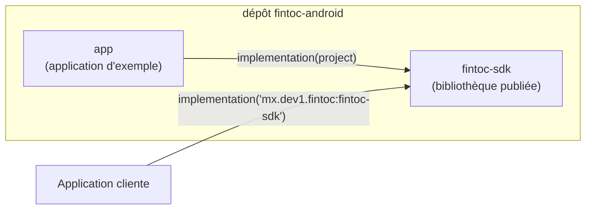
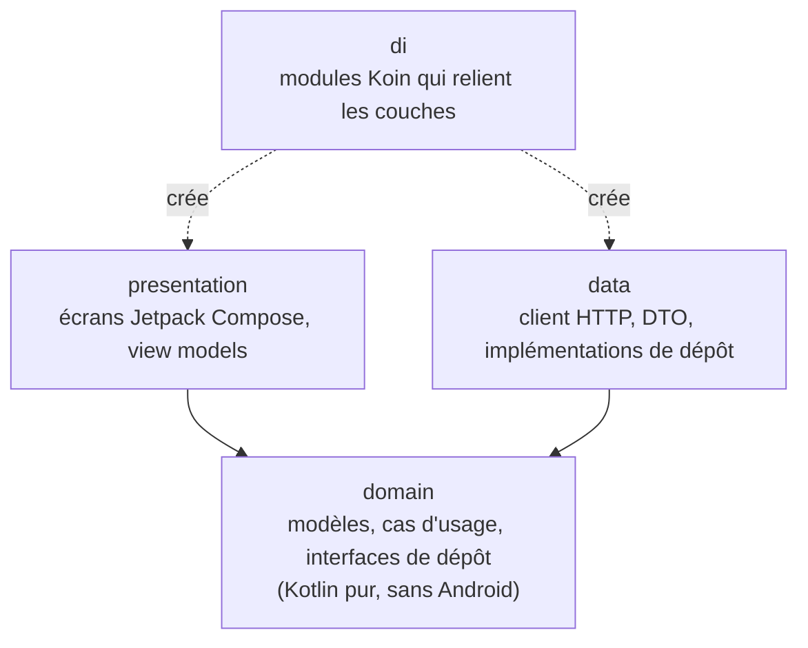
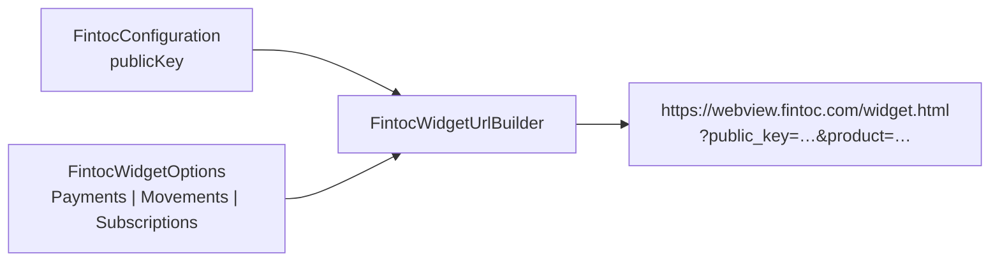
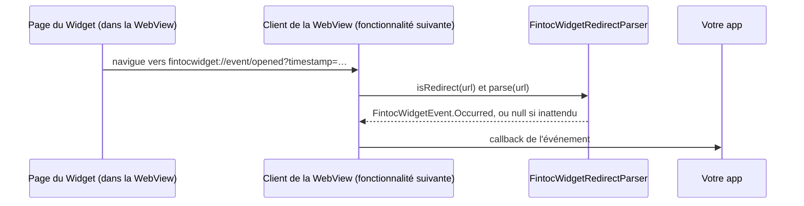
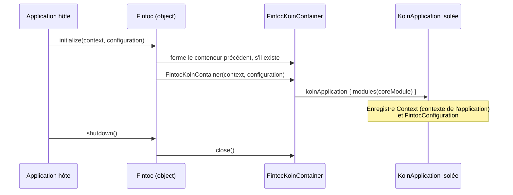

# Architecture

[English](../en/architecture.md) · [Español](../es/architecture.md) · [Português](../pt/architecture.md) · [Retour au README](README.md)

Cette page explique comment le projet est organisé. Aucune expérience préalable d'Android n'est nécessaire.

## Vue d'ensemble

Le dépôt est un build Gradle composé de deux modules :

- **`fintoc-sdk`** est une *bibliothèque Android* : du code que d'autres applications incluent comme dépendance. C'est ce qui est publié sur Maven.
- **`app`** est une *application Android* qui utilise le SDK comme le ferait un client. Elle sert aussi d'exemple vivant.

## Architecture propre (clean architecture)

Chaque module suit les mêmes trois couches. Les dépendances pointent uniquement **vers l'intérieur**, vers le domaine.

| Couche | Connaît | Ne doit jamais connaître |
|---|---|---|
| `domain` | Bibliothèque standard Kotlin, coroutines | Android, Koin, HTTP, Compose |
| `data` | `domain` | `presentation`, Compose |
| `presentation` | `domain` | `data` |
| `di` | toutes les couches | — |

Aujourd'hui, existent la couche `domain` (packages `domain.widget` et `domain.security`), le package `di` et le point
d'entrée public. Les autres couches sont créées au fil des fonctionnalités, sous le package de base `mx.dev1.fintoc.sdk`.

## API publique et mode d'API explicite

Le SDK active le **mode d'API explicite** de Kotlin. Toute déclaration est `internal`, sauf si elle est volontairement
marquée `public` ; la surface publique de la bibliothèque est donc toujours intentionnelle. Aujourd'hui, elle est :

| Type | Rôle |
|---|---|
| `Fintoc` | Point d'entrée : `initialize`, `shutdown`, `isInitialized`. |
| `FintocConfiguration` | Paramètres : `publicKey` (uniquement `pk_test_` ou `pk_live_` ; les clés secrètes `sk_` sont refusées) et `environment`, déduit du préfixe. Son `toString()` masque la clé. |
| `FintocEnvironment` | `TEST` ou `LIVE`. |
| `FintocWidgetOptions` | Ce que le Widget doit faire : `Payments`, `Movements` ou `Subscriptions`. Chacun valide ses données et masque ses jetons dans `toString()`. |
| `FintocCountry`, `FintocHolderType` | Valeurs acceptées pour `country` et `holder_type`. |
| `FintocWidgetEvent` | Ce que signale le Widget : `Succeeded`, `Exited` ou `Occurred`. |
| `FintocWidgetEventType` | Les événements documentés par Fintoc, comme `OPENED` ou `PAYMENT_ERROR`. |
| `FintocLinkIntentResult` | L'`exchangeToken` d'un compte bancaire connecté avec `Movements`. Son `toString()` masque le jeton. |

## Configuration du Widget

Le Widget de Fintoc est une page web que le SDK affiche dans une WebView. Il lit ses réglages dans la query string de
l'URL ; le SDK transforme donc votre `FintocConfiguration` et vos `FintocWidgetOptions` en cette URL.

| Options | Produit | Paramètres envoyés après `public_key` et `product` |
|---|---|---|
| `Payments(sessionToken)` | `payments` (SPEI au Mexique, virement bancaire au Chili) | `session_token` |
| `Movements(holderType, country, linkToken?, webhookUrl?)` | `movements` | `holder_type`, `country`, `link_token`, `webhook_url` |
| `Subscriptions(widgetToken, holderType, country)` | `subscriptions` | `holder_type`, `country`, `widget_token` |

Règles de sécurité appliquées à la création des objets :

- Les valeurs vides, contenant des espaces ou commençant par `sk_` sont refusées. Les messages d'erreur ne répètent
  jamais la valeur refusée.
- `webhookUrl` doit être une URL `https` absolue.
- Les valeurs sont encodées en pourcentage (RFC 3986) : un jeton ne peut ni ajouter ni remplacer de paramètres.
- `toString()` masque les jetons.

L'URL se termine toujours par `_on_event=true`, qui demande au Widget de signaler ses événements à l'app.

## Événements du Widget

Le Widget répond en faisant naviguer la WebView vers des adresses commençant par `fintocwidget://`. Le SDK ne laisse
jamais la WebView ouvrir ces adresses : il confie chacune à `FintocWidgetRedirectParser`, qui la transforme en
`FintocWidgetEvent`.

| Redirection du Widget | Événement |
|---|---|
| `fintocwidget://succeeded` | `Succeeded`. Avec `Movements`, elle porte aussi `?object=link_intent&exchange_token=…&id=…`, qui devient `linkIntent`. |
| `fintocwidget://exit` | `Exited` : l'utilisateur a fermé le Widget sans terminer. |
| `fintocwidget://event/{name}?timestamp=…` | `Occurred(name, timestampMillis, metadata)`. `type` est le `FintocWidgetEventType` correspondant, ou `null` quand Fintoc a ajouté un événement que ce SDK ne connaît pas encore. |

Règles de sécurité de l'analyseur :

- Il travaille sur le texte brut et ne lève jamais d'exception. Un schéma incorrect, une action inconnue ou un nom
  d'événement étrange donnent `null` : la page ne peut donc jamais faire planter votre app.
- Les noms d'événement ne peuvent contenir que des lettres, des chiffres, `_`, `.` et `-`, sur 64 caractères au plus.
  Les redirections de plus de 8 192 caractères et les paramètres au-delà du 64e sont ignorés.
- Le Widget n'encode pas ce qu'il envoie : le décodage est donc tolérant, et seules les séquences `%XX` bien formées
  sont décodées.
- La première occurrence d'une clé l'emporte. Un `&` isolé dans une valeur ne peut pas remplacer un `exchange_token`
  précédent.
- Les valeurs que le Widget a écrites sous la forme `null`, `undefined` ou `[object Object]` sont écartées.
- `FintocLinkIntentResult.toString()` masque l'`exchangeToken`, et `Occurred.toString()` liste les clés des métadonnées
  sans leurs valeurs.

> **Un événement n'est pas une preuve de paiement.** Un utilisateur, ou un appareil compromis, peut falsifier ce que
> signale une WebView. Envoyez l'`exchangeToken` à **votre backend**, le seul endroit capable de l'échanger, et
> confirmez les paiements avec les webhooks de Fintoc avant de livrer une commande.

## Injection de dépendances avec un conteneur Koin isolé

Koin est le framework d'injection de dépendances. Le SDK crée **son propre** conteneur au lieu d'utiliser celui, global,
de Koin. Ainsi, il ne peut jamais entrer en conflit avec une instance de Koin démarrée par l'application hôte.

Le code interne obtient ses dépendances via `Fintoc.requireKoin()`. Si l'application hôte a oublié d'appeler `initialize`,
l'appel échoue immédiatement avec un message expliquant quoi faire.

## Choix de build

| Choix | Valeur | Raison |
|---|---|---|
| Kotlin | 2.4.20 | Version stable actuelle. Android Gradle Plugin 9 intègre le support de Kotlin ; aucun plugin Kotlin séparé n'est donc appliqué. |
| Android Gradle Plugin | 9.4.1 (nécessite Gradle 9.6.0) | Version stable actuelle. |
| `minSdk` | 23 (Android 6.0) | Niveau le plus bas pris en charge par Jetpack Compose, pour atteindre un maximum d'appareils. N'appelez pas d'API postérieures à l'API 23 (comme `java.time`) sans garde ni desugaring. |
| `compileSdk` | 37 | Exigé par Compose BOM 2026.09.00. |
| `targetSdk` (application d'exemple) | 36 | Le niveau actuellement exigé par Google Play. |
| Jetpack Compose | BOM 2026.09.00 | Interface Compose en priorité. Le XML n'est utilisé que là où la plateforme l'impose (manifeste, thème de fenêtre). |
| Bytecode Java | 11 | Permet à un maximum d'applications hôtes d'utiliser la bibliothèque. |
| Versions | `gradle/libs.versions.toml` | Un seul endroit pour toutes les versions de dépendances. |

## Tests et couverture

Trois types de tests existent, et le rapport de couverture les combine tous :

| Type | Emplacement | Outils | S'exécute sur |
|---|---|---|---|
| Unitaires | `src/test` | JUnit 4, Mockito, Robolectric | Votre ordinateur |
| Instrumentés | `src/androidTest` | AndroidX Test, Espresso, tests d'interface Compose | Appareil ou émulateur |
| Couverture | `gradle/jacoco-coverage.gradle.kts` | JaCoCo | Combine les deux |

Le build échoue lorsque la couverture des lignes ou des instructions d'un module passe sous **80 %**. Voir
[Contribuer](contributing.md) pour les commandes exactes.
