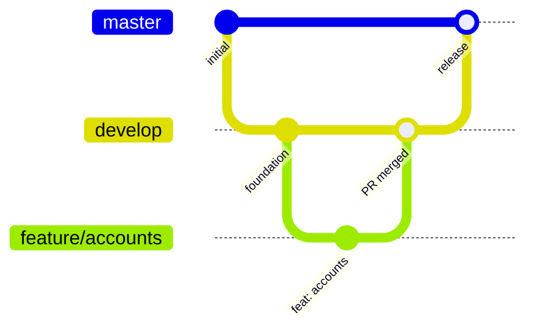

# Contribuer

[English](../en/contributing.md) · [Español](../es/contributing.md) · [Português](../pt/contributing.md) · [Retour au README](README.md)

Merci de votre aide. Ce guide ne suppose aucune expérience préalable d'Android.

## 1. Préparer votre machine

1. Installez une version stable récente d'**Android Studio**. Il inclut le gestionnaire du SDK Android.
2. Dans *SDK Manager*, installez **Android SDK Platform 37**.
3. Vérifiez qu'un JDK 11 ou supérieur est disponible pour lancer Gradle. Le build télécharge lui-même le toolchain JDK 21 dont il a besoin.
4. Clonez le dépôt et ouvrez le dossier dans Android Studio, ou travaillez depuis le terminal avec `./gradlew`.

```bash
git clone git@github.com:DEV1-Softworks/fintoc-android.git
cd fintoc-android
./gradlew :app:assembleDebug
```

## 2. Structure du projet

```text
fintoc-android/
├── fintoc-sdk/                 # la bibliothèque publiée
│   └── src/
│       ├── main/kotlin/        # code source du SDK
│       ├── test/kotlin/        # tests unitaires (exécutés sur votre ordinateur)
│       └── androidTest/kotlin/ # tests instrumentés (exécutés sur un appareil)
├── app/                        # application d'exemple (même structure src)
├── .github/workflows/          # intégration continue (chaque pull request) et publication (étiquettes)
├── gradle/
│   ├── libs.versions.toml      # toutes les versions de dépendances sont ici
│   ├── jacoco-coverage.gradle.kts
│   └── robolectric.gradle.kts
└── docs/                       # documentation en en, es, fr et pt
```

## 3. Exécuter les tests

| Objectif | Commande |
|---|---|
| Tests unitaires | `./gradlew testDebugUnitTest` |
| Tests instrumentés (appareil connecté) | `./gradlew connectedDebugAndroidTest` |
| Rapport de couverture | `./gradlew jacocoDebugCoverageReport` |
| Appliquer la règle des 80 % | `./gradlew jacocoDebugCoverageVerification` |
| Tout, dans le bon ordre | `./gradlew clean testDebugUnitTest connectedDebugAndroidTest jacocoDebugCoverageReport jacocoDebugCoverageVerification` |

Le rapport HTML est généré dans `<module>/build/reports/jacoco/jacocoDebugCoverageReport/html/index.html`.

**Exécutez tous les tests avant chaque commit.** Les tâches de couverture ne lancent pas les tests elles-mêmes, car les
tests instrumentés nécessitent un appareil. Si vous omettez les tâches de test, la vérification de couverture ne voit que
des données périmées ou absentes.

### Conseils pour les tests instrumentés

- Utilisez un appareil physique avec le débogage USB activé, ou un émulateur sous Android 6.0 (API 23) ou supérieur.
- **Gardez l'écran allumé et déverrouillé** pendant l'exécution des tests. Si l'écran s'éteint, les tests Compose échouent
  avec `No compose hierarchies found in the app`.
- Espresso 3.7.0 ou supérieur est nécessaire pour fonctionner sur Android 16 (déjà déclaré dans le catalogue de versions).
- Les tests de l'hôte Activity démarrent le vrai écran du SDK et font pivoter l'appareil une fois. L'écran charge la page
  publique du Widget de Fintoc, mais les tests réussissent qu'elle parvienne à se charger ou non.
- Le test du checkout hébergé ouvre une Custom Tab du navigateur de l'appareil, sur une session inventée de
  `pay.fintoc.com`, et envoie la touche Retour pour revenir. Gardez l'écran déverrouillé et attendez-vous à voir le
  navigateur apparaître un instant.

## 4. Règles de code

- Style de code officiel de Kotlin, indentation par défaut de 4 espaces.
- Noms descriptifs pour les variables, fonctions et classes. Les noms d'une seule lettre ne sont acceptés que comme compteurs de boucle.
- Architecture propre : respectez les règles de couches de [Architecture](architecture.md).
- Tout dans le SDK est `internal`, sauf si cela doit être public (le mode d'API explicite l'impose).
- Compose d'abord : construisez l'interface avec Jetpack Compose. N'utilisez le XML que pour des besoins hérités, comme le manifeste.
- Toute nouvelle version de dépendance va dans `gradle/libs.versions.toml`, jamais directement dans un module.
- Tout changement de comportement s'accompagne de tests unitaires et, s'il touche à Android, de tests instrumentés. La couverture de chaque module doit rester à 80 % ou plus.

## 5. Git flow

| Branche | Rôle |
|---|---|
| `master` | Production. Aucun commit direct. |
| `develop` | Branche d'intégration. Chaque fonctionnalité y est fusionnée via une pull request. |
| `feature/<sujet>` | Une branche par fonctionnalité, créée depuis un `develop` à jour. |
| `fix/<sujet>` | Une branche par correction de bug, créée depuis un `develop` à jour. |

Il n'y a pas de branche `main` dans ce dépôt.



Les branches de fonctionnalité partent de `develop` et y reviennent via une pull request relue. `develop` rejoint `master` à chaque release.

Étapes pour une modification :

1. `git checkout develop && git pull`.
2. `git checkout -b feature/<sujet>`.
3. Faites de petits commits avec les [Conventional Commits](https://www.conventionalcommits.org/fr/) : `feat: …`, `fix: …`, `docs: …`, `test: …`, `chore: …`.
4. Exécutez tous les tests (section 3).
5. Ouvrez une pull request vers `develop` avec un résumé des changements et une référence à l'issue ou à la tâche concernée.
6. Attendez la relecture et la fusion. Ce n'est qu'ensuite que vous démarrez la fonctionnalité suivante depuis `develop`.

**Pas de pull requests empilées.** Chaque branche part de `develop`, jamais d'une autre branche de fonctionnalité.

### Vérifications sur chaque pull request

GitHub Actions exécute `.github/workflows/ci.yml` pour chaque pull request vers `develop` ou `master`, et pour chaque push
sur ces branches. Trois jobs s'exécutent en parallèle, et une pull request est prête à être fusionnée seulement quand les
trois sont verts :

| Job | Ce qu'il vérifie | La même chose sur votre machine |
|---|---|---|
| Unit tests and coverage | Exécute les tests unitaires et échoue sous 80 % de couverture. Il ne compte que les tests unitaires, ce qui est plus strict que la couverture combinée de la section 3 : réussir ici signifie réussir là-bas. Les pull requests de ce dépôt reçoivent aussi un commentaire avec la couverture. | `./gradlew testDebugUnitTest jacocoDebugCoverageReport jacocoDebugCoverageVerification` |
| Lint and release build | Exécute lint, compile les variantes release et publie dans un dossier local, ce qui ne demande aucun identifiant. Les versions de publication doivent être signées : le job publie donc sous un nom SNAPSHOT ; faites de même avec `-PVERSION_NAME=<version>-SNAPSHOT` sur un commit qui porte une version de publication. Les fichiers de la bibliothèque sont joints à l'exécution. | `./gradlew lintDebug lintRelease assembleRelease :fintoc-sdk:publishToMavenLocal -Dmaven.repo.local=/tmp/fintoc-m2` |
| Instrumented tests | Exécute les tests instrumentés sur un émulateur du runner (Android 14, API 34). Votre machine n'en a pas besoin : vous exécutez ces tests sur un appareil physique. | `./gradlew connectedDebugAndroidTest` |

Les rapports de chaque exécution sont joints comme artefacts, ce qui aide quand un job échoue et que la cause n'est pas dans le journal.

## 6. Documentation

Tout changement qui affecte le comportement ou la configuration met à jour la documentation. Les documents se trouvent dans
`docs/` et doivent exister en quatre langues : anglais (`docs/en`), espagnol (`docs/es`), français (`docs/fr`) et portugais
(`docs/pt`). Le `README.md` à la racine est le point d'entrée.
