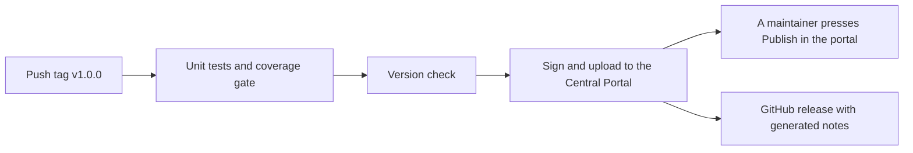

# Publier une version

[English](../en/releasing.md) · [Español](../es/releasing.md) · [Português](../pt/releasing.md) · [Retour au README](../../README.md)

Cette page explique comment une personne mainteneuse publie `mx.dev1.fintoc:fintoc-sdk` sur
[Maven Central](https://central.sonatype.com). Rien de secret n'est dans le dépôt : vos identifiants vivent dans votre propre
`~/.gradle/gradle.properties` ou dans des variables d'environnement.

## Configuration initiale (une seule fois)

1. Créez un compte sur le [Central Portal](https://central.sonatype.com).
2. **Vérifiez le namespace** `mx.dev1` dans le portail (Namespaces). Il prouve, avec un enregistrement DNS, que vous
   possédez le domaine `dev1.mx`. Les coordonnées `mx.dev1.fintoc` vivent sous lui. Un namespace comme
   `io.github.dev1-softworks` n'aurait pas besoin de domaine, mais il changerait les coordonnées de la bibliothèque :
   décidez donc avant la première version.
3. **Générez un user token** dans le portail (Account, puis Generate User Token). C'est un nom d'utilisateur et un mot de
   passe pour l'envoi, pas ceux avec lesquels vous vous connectez.
4. **Créez une clé GPG** qui signe les artefacts, et publiez sa partie publique sur un serveur de clés que Maven Central
   lit, comme `keyserver.ubuntu.com` :

```bash
gpg --full-generate-key
gpg --keyserver keyserver.ubuntu.com --send-keys <id de la clé>
gpg --export-secret-keys --armor <id de la clé>    # affiche la clé privée : ne la laissez ni dans des logs ni dans un chat
```

5. Donnez à Gradle les identifiants, dans votre `gradle.properties` utilisateur :

```properties
# ~/.gradle/gradle.properties, never in the repository
mavenCentralUsername=<token username>
mavenCentralPassword=<token password>
signingInMemoryKey=<armored secret key, on one line or with \n for the line breaks>
signingInMemoryKeyPassword=<password of the key>
```

Sur un serveur de CI, utilisez les mêmes noms comme variables d'environnement avec le préfixe `ORG_GRADLE_PROJECT_`, par
exemple `ORG_GRADLE_PROJECT_mavenCentralUsername`.

## Versionnement

La version est `VERSION_NAME` dans `gradle.properties`. Le projet suit le [Versionnage sémantique](https://semver.org).
Entre deux versions, elle se termine par `-SNAPSHOT`. Maven Central n'accepte jamais deux fois la même version : une
erreur se corrige donc par une nouvelle version. La première version est la 1.0.0 : l'API publique est donc un engagement
dès le départ. Un changement qui la casse augmente la version majeure, une nouvelle fonctionnalité augmente la version
mineure et un correctif augmente la version de correctif. Seul ce que liste la documentation de l'API est public : tout ce
qui est marqué `internal` peut changer librement. Le [journal des modifications](changelog.md) liste chaque changement.

## Étapes de la publication

Elles suivent le Git flow de ce projet, où `master` est la production.

1. Créez la branche `release/<version>` depuis `develop`.
2. Mettez `VERSION_NAME` à la version, sans `-SNAPSHOT`, et déplacez les notes `Unreleased` des quatre journaux sous la
   nouvelle version.
3. Exécutez tout, avec un téléphone branché et déverrouillé :
   `./gradlew testDebugUnitTest connectedDebugAndroidTest jacocoDebugCoverageReport jacocoDebugCoverageVerification lintDebug lintRelease assembleRelease`.
4. Faites un [essai à blanc](#essai-à-blanc) et corrigez ce qu'il montre.
5. Ouvrez une pull request de `release/<version>` vers `master`, et fusionnez-la.
6. Sur `master`, étiquetez le commit `v<version>` et poussez l'étiquette : `git tag v<version> && git push origin v<version>`.
   Cela lance le [workflow de publication](#publication-automatique), qui teste, signe, envoie et crée la release GitHub.
7. Quand le workflow se termine, ouvrez le [Central Portal](https://central.sonatype.com), allez dans Publish puis
   Deployments, attendez que la validation passe et appuyez sur **Publish**. Rien n'est public avant cela.
8. Fusionnez `master` dans `develop` avec une pull request qui met `VERSION_NAME` au prochain `-SNAPSHOT`.
9. Le workflow a déjà créé la release GitHub, avec des notes générées. Collez-y les notes du journal des modifications si vous les préférez.

## Publication automatique

`.github/workflows/cd.yml` publie une version quand une étiquette qui commence par `v` est poussée. Il peut aussi être lancé
à la main depuis l'onglet Actions, pour publier de nouveau la version de `gradle.properties` après un échec.



1. **D'abord les tests.** La publication est bloquée sauf si les tests unitaires passent et si la couverture est d'au moins
   80 %.
2. **Vérification de la version.** L'exécution échoue si `VERSION_NAME` se termine par `-SNAPSHOT`, ou si l'étiquette n'est
   pas `v` plus `VERSION_NAME` : une mauvaise étiquette ne peut donc pas partir.
3. **Envoi signé.** `./gradlew :fintoc-sdk:publishToMavenCentral` signe les fichiers et les envoie au Central Portal comme
   un deployment. La compilation repart de zéro, sans cache Gradle.
4. **Confirmation manuelle.** Rien ne devient public tout seul : une personne mainteneuse appuie sur **Publish** sur le
   deployment validé dans le portail. Le résumé de l'exécution vous le rappelle.
5. **Release GitHub.** Le workflow crée la release de l'étiquette avec des notes générées. Une version avec un suffixe,
   comme `1.1.0-rc.1`, est marquée comme pré-release.

Les identifiants sont des secrets du dépôt (Settings, Secrets and variables, Actions), nommés comme ceux d'
[openpay-android](https://github.com/DEV1-Softworks/openpay-android) :

| Secret | Ce qu'il contient | Propriété Gradle qu'il devient |
|---|---|---|
| `MAVEN_REPOSITORY_USERNAME` | Le nom d'utilisateur du jeton utilisateur du Central Portal. | `mavenCentralUsername` |
| `MAVEN_REPOSITORY_PASSWORD` | Le mot de passe du jeton utilisateur du Central Portal. | `mavenCentralPassword` |
| `SIGNING_KEY` | La clé privée au format armored : `gpg --export-secret-keys --armor <id de la clé>`. | `signingInMemoryKey` |
| `SIGNING_PASSWORD` | Le mot de passe de cette clé. | `signingInMemoryKeyPassword` |

Si une exécution échoue :

- **Avant l'envoi** (les tests ou la vérification de la version) : rien n'a été publié. Corrigez la cause et, si le commit
  change, supprimez l'étiquette (`git push --delete origin v<version>` et `git tag -d v<version>`), puis étiquetez de nouveau.
- **Pendant ou après l'envoi :** regardez le deployment dans le portail. Un deployment refusé peut y être abandonné et la
  même version renvoyée. Une version publiée ne peut plus jamais être renvoyée : corrigez le problème avec une nouvelle
  version.

## Publication à la main

Si le workflow n'est pas disponible, publiez depuis votre machine avec les identifiants de votre `gradle.properties` :

```bash
./gradlew :fintoc-sdk:publishAndReleaseToMavenCentral
```

Cela signe, envoie et publie sans la confirmation manuelle. Pour regarder d'abord l'envoi dans le portail, lancez plutôt
`publishToMavenCentral` et appuyez sur Publish là-bas.

## Ce qui est publié

| Fichier | Ce que c'est |
|---|---|
| `fintoc-sdk-<version>.aar` | La bibliothèque. |
| `fintoc-sdk-<version>.pom` et `.module` | Métadonnées pour Maven et pour Gradle. Le POM nomme les développeurs, la licence et le dépôt, ce que Central exige, et la description dit que le SDK n'est pas officiel. |
| `fintoc-sdk-<version>-sources.jar` | Les sources Kotlin. |
| `fintoc-sdk-<version>-javadoc.jar` | La documentation de l'API, générée par Dokka à partir du KDoc. Seule l'API publique apparaît. |
| `*.asc` | Une signature GPG de chaque fichier ci-dessus. |

## Essai à blanc

Publier dans un dossier local ne demande aucun identifiant et ne signe rien : on peut donc l'essayer à tout moment. Cela
montre exactement ce qui serait envoyé :

```bash
./gradlew :fintoc-sdk:publishToMavenLocal -Dmaven.repo.local=/tmp/fintoc-m2
```

Vérifiez ensuite ce que voit un consommateur : créez une app vide avec `compileSdk 37`, faites pointer ses dépôts vers ce
dossier et ajoutez la bibliothèque. Trois vérifications valent le coup :

- **Elle compile et se construit avec R8**, en utilisant l'API publique que vous avez modifiée.
- **Son Kotlin n'est pas poussé vers le haut.** Regardez la bibliothèque standard Kotlin que Gradle résout pour l'app. Ce doit
  être celle de l'app, pas celle de ce build.
- **Le manifeste fusionne.** Le manifeste fusionné de l'app contient la permission `INTERNET` et l'Activity du SDK.

Pour vérifier les signatures avec une clé jetable, définissez `signingInMemoryKey` avec une clé de test dans la même
commande, et vérifiez chaque `.asc` avec `gpg --verify`.

## Si le portail refuse l'envoi

Le portail explique chaque échec. Les plus courants sont un namespace non vérifié, une clé publique qu'aucun serveur de clés
n'a encore, une signature, un jar javadoc ou sources manquant, un POM sans développeurs ou sans licence, et une version qui
existe déjà. Corrigez la cause, changez la version si une a été consommée, et publiez de nouveau.
