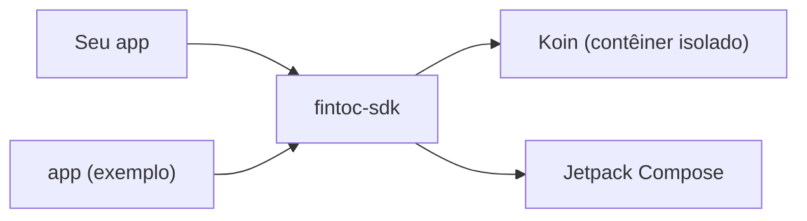

# SDK da Fintoc para Android

[English](../../README.md) · [Español](../es/README.md) · [Français](../fr/README.md) · **Português**

SDK em Kotlin e Jetpack Compose para a API da [Fintoc](https://fintoc.com). É o equivalente Android da biblioteca
[Fintoc Swift](https://github.com/sergiocampama/Fintoc) e foi construído com Compose como primeira opção e Koin para
injeção de dependências.

> **Status: fundação.** O build, o contêiner de injeção de dependências, o pipeline de testes e o app de exemplo já
> estão prontos. As funcionalidades da API (links, contas, movimentações) são adicionadas uma a uma por meio de pull requests.

## Módulos

| Módulo | Finalidade |
|---|---|
| [`fintoc-sdk`](../../fintoc-sdk) | A biblioteca publicada no Maven: `mx.dev1.fintoc:fintoc-sdk`. |
| [`app`](../../app) | Aplicativo de exemplo que consome o SDK. Não é publicado. |



## Requisitos

| Ferramenta | Versão |
|---|---|
| JDK para iniciar o Gradle | 11 ou superior (o build provisiona automaticamente um toolchain com JDK 21) |
| Android SDK Platform | 37 (`compileSdk`) |
| Android Studio | Uma versão estável recente compatível com o Android Gradle Plugin 9.4 |
| Dispositivo ou emulador | Android 6.0 (API 23) ou superior, apenas para os testes instrumentados |

Compatível com Android 6.0 (API 23) e superior. O SDK é compilado com `compileSdk 37`; como depende do Jetpack Compose,
os apps que o integram também precisam compilar com `compileSdk 37`, ou fixar um Compose BOM mais antigo.

## Início rápido

```bash
git clone git@github.com:DEV1-Softworks/fintoc-android.git
cd fintoc-android

./gradlew :app:assembleDebug          # compila o app de exemplo
./gradlew testDebugUnitTest           # testes unitários (JUnit, Robolectric, Mockito)
```

Usando o SDK a partir de um app:

```kotlin
class MyApplication : Application() {
    override fun onCreate() {
        super.onCreate()
        Fintoc.initialize(
            context = this,
            configuration = FintocConfiguration(authToken = "<seu token>"),
        )
    }
}
```

## Documentação

| Tema | English | Español | Français | Português |
|---|---|---|---|---|
| Visão geral | [en](../../README.md) | [es](../es/README.md) | [fr](../fr/README.md) | este arquivo |
| Arquitetura | [en](../en/architecture.md) | [es](../es/architecture.md) | [fr](../fr/architecture.md) | [pt](architecture.md) |
| Como contribuir | [en](../en/contributing.md) | [es](../es/contributing.md) | [fr](../fr/contributing.md) | [pt](contributing.md) |

## Créditos e licença

A API está sendo modelada a partir de [sergiocampama/Fintoc](https://github.com/sergiocampama/Fintoc), publicada sob a
licença MIT (© 2021 Sergio Campamá). Esse aviso é mantido em [NOTICE](../../NOTICE).

Este projeto é distribuído sob a [licença Apache 2.0](../../LICENSE).
