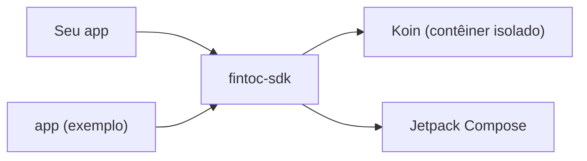

# SDK da Fintoc para Android

[English](../../README.md) · [Español](../es/README.md) · [Français](../fr/README.md) · **Português**

SDK em Kotlin e Jetpack Compose, comunitário e **não oficial**, para adicionar a um app Android os pagamentos da
[Fintoc](https://fintoc.com) (como o SPEI no México) e conexões bancárias. Ele encapsula o Widget da Fintoc, foi
construído com Compose como primeira opção e usa Koin para injeção de dependências.

> **Sem afiliação com a Fintoc.** É um projeto da comunidade. «Fintoc» é uma marca de seus respectivos proprietários.

> **Status: pronta para a 1.0.0.** Tudo o que estava previsto para a primeira versão está pronto: o Widget para Compose
> e um host com Activity para apps sem Compose, o checkout hospedado, quatro idiomas com troca manual, verificações de
> acessibilidade, um app de exemplo e a publicação no Maven Central. A primeira versão é a `1.0.0` e ainda não está
> publicada: veja [Instalação](#instalação).

## Módulos

| Módulo | Finalidade |
|---|---|
| [`fintoc-sdk`](../../fintoc-sdk) | A biblioteca publicada no Maven: `mx.dev1.fintoc:fintoc-sdk`. |
| [`app`](../../app) | Aplicativo de exemplo que consome o SDK. Não é publicado. |



## Requisitos

| Ferramenta | Versão |
|---|---|
| JDK para iniciar o Gradle | 11 ou superior (o build provisiona automaticamente um toolchain com JDK 21) |
| Android SDK Platform | 37 (`compileSdk`) |
| Android Studio | Uma versão estável recente compatível com o Android Gradle Plugin 9.4 |
| Dispositivo ou emulador | Android 6.0 (API 23) ou superior, apenas para os testes instrumentados |

Compatível com Android 6.0 (API 23) e superior. As bibliotecas Jetpack Compose e AndroidX em que o SDK se apoia exigem
`compileSdk 37`, e o SDK declara isso em seus próprios metadados: um app que compile contra uma API mais antiga é
interrompido com uma mensagem clara. [Instalação](#instalação) lista o que o seu app precisa.

## Instalação

> **Ainda não publicada.** A primeira versão não chegou ao Maven Central. Enquanto isso, compile a biblioteca a partir do
> código-fonte: execute `./gradlew :fintoc-sdk:publishToMavenLocal`, adicione `mavenLocal()` aos repositórios do seu app e
> use o `VERSION_NAME` do `gradle.properties`.

```kotlin
dependencies {
    implementation("mx.dev1.fintoc:fintoc-sdk:<version>")
}
```

O que o seu app precisa:

| | Requisito | Por quê |
|---|---|---|
| `compileSdk` | 37 ou superior | As bibliotecas Compose e AndroidX em que o SDK se apoia exigem. O Gradle é interrompido com uma mensagem clara se o seu for menor, e fixar um Compose BOM mais antigo não ajuda. |
| Android Gradle Plugin | Um que suporte `compileSdk 37` | Este projeto usa o 9.4.1. |
| `minSdk` | 23 | Android 6.0. |
| Kotlin | 2.2 ou superior | Verificado com compiladores 2.2.0 e 2.4.20. A biblioteca é compilada no nível de linguagem 2.2 e só pede uma biblioteca padrão 2.2, então não empurra o seu app para um Kotlin mais novo. |
| Jetpack Compose | Só para o composable `FintocWidget` | Um app sem Compose usa o `FintocWidgetContract`, sem plugin do Compose nem código próprio de Compose. As bibliotecas do Compose ainda entram no seu app, porque o SDK depende delas. |
| Permissões e Activities | Nada a declarar | O SDK adiciona ao seu manifesto a permissão `INTERNET` e a sua própria Activity privada. |

Se você publica um Android App Bundle e quer forçar o idioma dos textos próprios do SDK, desative a divisão por idioma:
veja [Idiomas](architecture.md#idiomas).

## Início rápido

```bash
git clone git@github.com:DEV1-Softworks/fintoc-android.git
cd fintoc-android

./gradlew :app:assembleDebug          # compila o app de exemplo
./gradlew testDebugUnitTest           # testes unitários (JUnit, Robolectric, Mockito)
```

Para experimentar o SDK contra o sandbox da Fintoc com o app de exemplo, siga o [guia do app de exemplo](sample-app.md).

Usando o SDK a partir de um app:

```kotlin
class MyApplication : Application() {
    override fun onCreate() {
        super.onCreate()
        Fintoc.initialize(
            context = this,
            configuration = FintocConfiguration(publicKey = "pk_test_…"),
        )
    }
}
```

Descreva o que exibir com `FintocWidgetOptions`. Os tokens vêm do seu backend:

```kotlin
val options = FintocWidgetOptions.Payments(sessionToken = tokenFromYourBackend)
```

Mostre o Widget a partir do Compose com `FintocWidget`. Quando o session token vem do seu backend, passe um provedor
`suspend`: o SDK o chama uma vez por tentativa e mostra um indicador de progresso enquanto espera.

```kotlin
FintocWidget(
    sessionTokenProvider = { myBackend.createSessionToken(orderId) },
    onEvent = { event ->
        when (event) {
            is FintocWidgetEvent.Succeeded -> showReceipt()
            FintocWidgetEvent.Exited -> closeScreen()
            is FintocWidgetEvent.Occurred -> Unit
        }
    },
    modifier = Modifier.fillMaxSize(),
)
```

Se você já tem as opções, por exemplo `Movements`, que não precisa de token, passe-as diretamente com
`FintocWidget(options = …, onEvent = …)`. O SDK declara por conta própria a permissão `INTERNET`, então seu app não precisa fazê-lo.

Apps sem Compose abrem o Widget em uma tela própria, com a API Activity Result:

```kotlin
private val fintocWidget = registerForActivityResult(FintocWidgetContract()) { result ->
    when (result) {
        is FintocWidgetResult.Succeeded -> checkThePaymentOnYourBackend()
        FintocWidgetResult.Exited -> Unit
    }
}

fintocWidget.launch(FintocWidgetOptions.Payments(sessionToken = tokenFromYourBackend))
```

Sem essa API, chame `FintocWidgetContract().createIntent(…)` e `parseResult(…)` a partir de `startActivityForResult`.

Os textos próprios do SDK (mensagem de carregamento, erros, botões) vêm em português, inglês, espanhol e francês, e
seguem o idioma do dispositivo. Para forçar um, por exemplo porque seu app tem seu próprio seletor de idioma:

```kotlin
FintocConfiguration(publicKey = "pk_test_…", language = FintocLanguage.SPANISH)
```

A página do Widget é da Fintoc e mantém seu próprio idioma.

Para enviar o cliente a uma página de checkout hospedada pela Fintoc, abra o `redirect_url` da sua Checkout Session em
uma Custom Tab e leia o que volta ao seu app:

```kotlin
val nonce = UUID.randomUUID().toString() // keep it with the order; send both addresses to your backend
val checkout = FintocHostedCheckout(
    successUrl = "https://merchant.com/pay/success?n=$nonce",
    cancelUrl = "https://merchant.com/pay/cancel?n=$nonce",
)

checkout.open(this, redirectUrlFromYourBackend)

// In the Activity that receives those addresses, in onCreate and onNewIntent:
when (checkout.outcomeOf(intent)) {
    FintocHostedCheckoutOutcome.Succeeded -> showThatTheOrderIsBeingConfirmed()
    FintocHostedCheckoutOutcome.Cancelled -> showThatThePaymentWasCancelled()
    FintocHostedCheckoutOutcome.Unrelated -> Unit
}
```

O endereço que volta é apenas uma pista: confirme os pagamentos com os webhooks da Fintoc no seu backend.

## Modelo de segurança

- O app guarda apenas a **chave pública** (`pk_test_` ou `pk_live_`). O SDK recusa chaves secretas (`sk_…`).
- Seu backend cria a Checkout Session com a chave secreta e entrega ao app o `session_token` de curta duração; o app o
  repassa ao SDK.
- Os tokens nunca são gravados em logs: o `toString()` de cada opção os oculta.
- O Widget roda em uma WebView reforçada: sem acesso a arquivos nem a provedores de conteúdo, sem subrecursos
  inseguros, com Safe Browsing ativo, sem interface JavaScript e sem nunca aceitar erros de certificado. O SDK jamais
  ativa a depuração da WebView.
- A WebView fica nos hosts da Fintoc (`webview.fintoc.com`, `wizard.fintoc.com` e `js.fintoc.com`). Os demais links
  `https`, como o comprovante de pagamento, abrem no navegador, e todo o resto é bloqueado.
- Quando a página não pode ser carregada, o SDK mostra sua própria mensagem. A página de erro da WebView imprimiria o
  endereço, e o endereço contém o session token.
- A tela para apps sem Compose é privada do seu app e se oculta das capturas de tela e da lista de apps recentes. Os
  session tokens nunca viajam dentro de um `Intent`.
- Um checkout hospedado só abre endereços `https` de um subdomínio de `fintoc.com`, em uma Custom Tab cuja barra de
  endereço fica sempre visível. O endereço que volta ao seu app pode ser falsificado por qualquer app do dispositivo,
  então o SDK exige que o valor secreto que você pôs no seu próprio endereço de retorno volte também.
- O que o Widget informa ao app não é prova de pagamento. Confirme os pagamentos com os webhooks da Fintoc no seu
  backend.

## Documentação

| Tema | English | Español | Français | Português |
|---|---|---|---|---|
| Visão geral | [en](../../README.md) | [es](../es/README.md) | [fr](../fr/README.md) | este arquivo |
| Arquitetura | [en](../en/architecture.md) | [es](../es/architecture.md) | [fr](../fr/architecture.md) | [pt](architecture.md) |
| App de exemplo | [en](../en/sample-app.md) | [es](../es/sample-app.md) | [fr](../fr/sample-app.md) | [pt](sample-app.md) |
| Publicar uma versão | [en](../en/releasing.md) | [es](../es/releasing.md) | [fr](../fr/releasing.md) | [pt](releasing.md) |
| Registro de mudanças | [en](../en/changelog.md) | [es](../es/changelog.md) | [fr](../fr/changelog.md) | [pt](changelog.md) |
| Como contribuir | [en](../en/contributing.md) | [es](../es/contributing.md) | [fr](../fr/contributing.md) | [pt](contributing.md) |

## Créditos e licença

A integração do Widget segue a [documentação pública da Fintoc](https://docs.fintoc.com) e o comportamento do
[SDK React Native](https://github.com/fintoc-com/fintoc-react-native) oficial. O aviso MIT do cliente Swift comunitário
[sergiocampama/Fintoc](https://github.com/sergiocampama/Fintoc) (© 2021 Sergio Campamá) é mantido em
[NOTICE](../../NOTICE) caso código derivado dele seja adicionado.

Este projeto é distribuído sob a [licença Apache 2.0](../../LICENSE).
