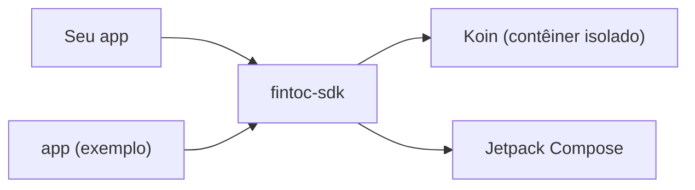

# SDK da Fintoc para Android

[English](../../README.md) · [Español](../es/README.md) · [Français](../fr/README.md) · **Português**

SDK em Kotlin e Jetpack Compose, comunitário e **não oficial**, para adicionar a um app Android os pagamentos da
[Fintoc](https://fintoc.com) (como o SPEI no México) e conexões bancárias. Ele encapsula o Widget da Fintoc, foi
construído com Compose como primeira opção e usa Koin para injeção de dependências.

> **Sem afiliação com a Fintoc.** É um projeto da comunidade. «Fintoc» é uma marca de seus respectivos proprietários.

> **Status: em desenvolvimento.** O build, o contêiner de injeção de dependências, o pipeline de testes, o app de
> exemplo e a configuração do Widget (validação da chave pública, opções por produto e construtor de URL) já estão
> prontos. A tela do Widget, o tratamento de eventos e o checkout hospedado chegam uma funcionalidade por vez por meio
> de pull requests.

## Módulos

| Módulo | Finalidade |
|---|---|
| [`fintoc-sdk`](../../fintoc-sdk) | A biblioteca publicada no Maven: `mx.dev1.fintoc:fintoc-sdk`. |
| [`app`](../../app) | Aplicativo de exemplo que consome o SDK. Não é publicado. |



## Requisitos

| Ferramenta | Versão |
|---|---|
| JDK para iniciar o Gradle | 11 ou superior (o build provisiona automaticamente um toolchain com JDK 21) |
| Android SDK Platform | 37 (`compileSdk`) |
| Android Studio | Uma versão estável recente compatível com o Android Gradle Plugin 9.4 |
| Dispositivo ou emulador | Android 6.0 (API 23) ou superior, apenas para os testes instrumentados |

Compatível com Android 6.0 (API 23) e superior. O SDK é compilado com `compileSdk 37`; como depende do Jetpack Compose,
os apps que o integram também precisam compilar com `compileSdk 37`, ou fixar um Compose BOM mais antigo.

## Início rápido

```bash
git clone git@github.com:DEV1-Softworks/fintoc-android.git
cd fintoc-android

./gradlew :app:assembleDebug          # compila o app de exemplo
./gradlew testDebugUnitTest           # testes unitários (JUnit, Robolectric, Mockito)
```

Usando o SDK a partir de um app:

```kotlin
class MyApplication : Application() {
    override fun onCreate() {
        super.onCreate()
        Fintoc.initialize(
            context = this,
            configuration = FintocConfiguration(publicKey = "pk_test_…"),
        )
    }
}
```

Descreva o que exibir com `FintocWidgetOptions`. Os tokens vêm do seu backend:

```kotlin
val options = FintocWidgetOptions.Payments(sessionToken = tokenFromYourBackend)
```

A tela do Widget que exibe essas opções chega em um próximo pull request.

## Modelo de segurança

- O app guarda apenas a **chave pública** (`pk_test_` ou `pk_live_`). O SDK recusa chaves secretas (`sk_…`).
- Seu backend cria a Checkout Session com a chave secreta e entrega ao app o `session_token` de curta duração; o app o
  repassa ao SDK.
- Os tokens nunca são gravados em logs: o `toString()` de cada opção os oculta.
- O que o Widget informa ao app não é prova de pagamento. Confirme os pagamentos com os webhooks da Fintoc no seu
  backend.

## Documentação

| Tema | English | Español | Français | Português |
|---|---|---|---|---|
| Visão geral | [en](../../README.md) | [es](../es/README.md) | [fr](../fr/README.md) | este arquivo |
| Arquitetura | [en](../en/architecture.md) | [es](../es/architecture.md) | [fr](../fr/architecture.md) | [pt](architecture.md) |
| Como contribuir | [en](../en/contributing.md) | [es](../es/contributing.md) | [fr](../fr/contributing.md) | [pt](contributing.md) |

## Créditos e licença

A integração do Widget segue a [documentação pública da Fintoc](https://docs.fintoc.com) e o comportamento do
[SDK React Native](https://github.com/fintoc-com/fintoc-react-native) oficial. O aviso MIT do cliente Swift comunitário
[sergiocampama/Fintoc](https://github.com/sergiocampama/Fintoc) (© 2021 Sergio Campamá) é mantido em
[NOTICE](../../NOTICE) caso código derivado dele seja adicionado.

Este projeto é distribuído sob a [licença Apache 2.0](../../LICENSE).
