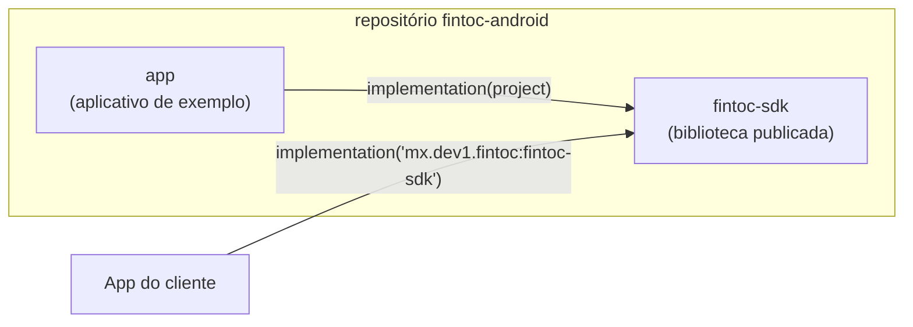
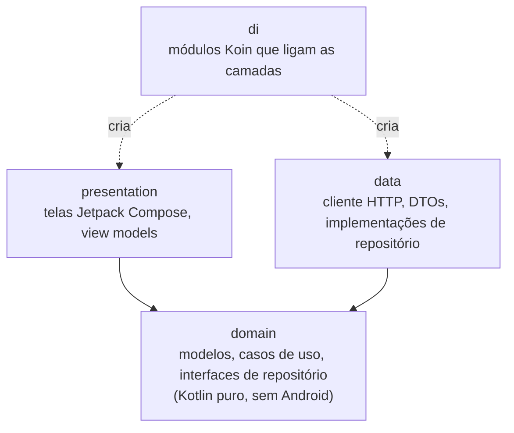
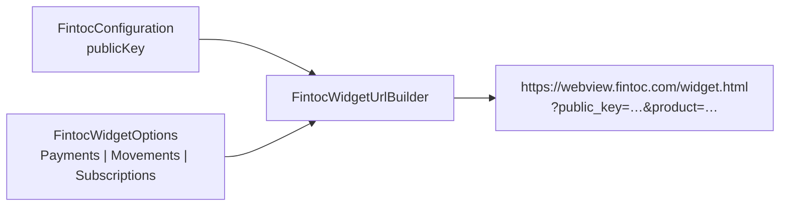
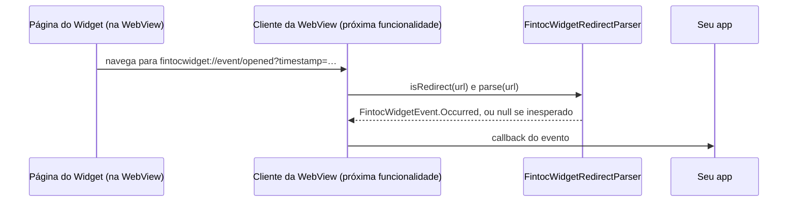
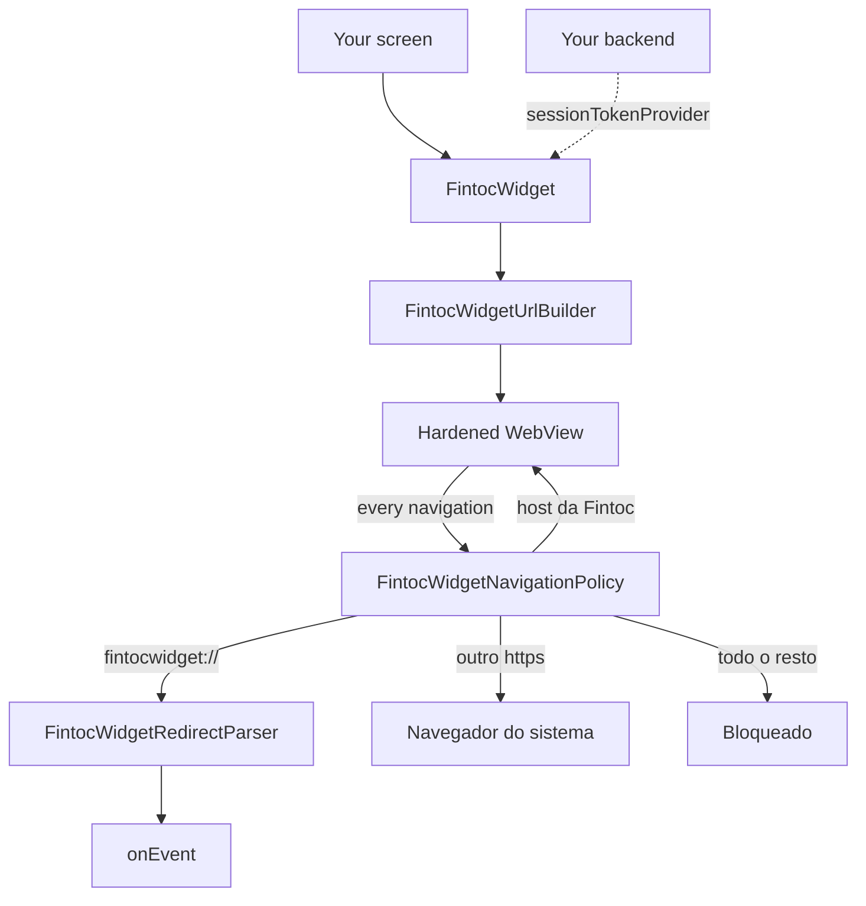
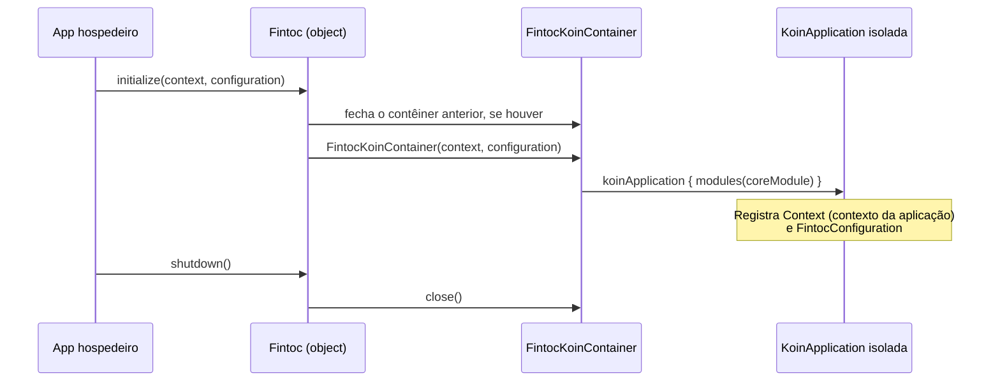

# Arquitetura

[English](../en/architecture.md) · [Español](../es/architecture.md) · [Français](../fr/architecture.md) · [Voltar ao README](README.md)

Esta página explica como o projeto está organizado. Você não precisa de experiência prévia em Android para acompanhá-la.

## Visão geral

O repositório é um build do Gradle com dois módulos:

- **`fintoc-sdk`** é uma *biblioteca Android*: código que outros apps incluem como dependência. É o que é publicado no Maven.
- **`app`** é um *aplicativo Android* que usa o SDK como um cliente faria. Também serve como exemplo vivo.

## Arquitetura limpa

Todos os módulos seguem as mesmas três camadas. As dependências apontam apenas **para dentro**, em direção ao domínio.

| Camada | Conhece | Nunca deve conhecer |
|---|---|---|
| `domain` | Biblioteca padrão do Kotlin, corrotinas | Android, Koin, HTTP, Compose |
| `data` | `domain` | `presentation`, Compose |
| `presentation` | `domain` | `data` |
| `di` | todas as camadas | — |

Hoje existem a camada `domain` (pacotes `domain.widget` e `domain.security`), a camada `presentation` (pacote
`presentation.widget`), o pacote `di` e o ponto de entrada público. As demais camadas são criadas conforme as funcionalidades chegam, sob o pacote base `mx.dev1.fintoc.sdk`.

## API pública e modo de API explícita

O SDK ativa o **modo de API explícita** do Kotlin. Toda declaração é `internal`, a menos que seja marcada como `public`
de propósito, então a superfície pública da biblioteca é sempre intencional. Hoje ela é:

| Tipo | Função |
|---|---|
| `Fintoc` | Ponto de entrada: `initialize`, `shutdown`, `isInitialized`. |
| `FintocConfiguration` | Configurações: `publicKey` (somente `pk_test_` ou `pk_live_`; chaves secretas `sk_` são recusadas) e `environment`, deduzido do prefixo. Seu `toString()` oculta a chave. |
| `FintocEnvironment` | `TEST` ou `LIVE`. |
| `FintocWidgetOptions` | O que o Widget deve fazer: `Payments`, `Movements` ou `Subscriptions`. Cada um valida seus dados e oculta seus tokens no `toString()`. |
| `FintocCountry`, `FintocHolderType` | Valores aceitos para `country` e `holder_type`. |
| `FintocWidgetEvent` | O que o Widget informa: `Succeeded`, `Exited` ou `Occurred`. |
| `FintocWidgetEventType` | Os eventos que a Fintoc documenta, como `OPENED` ou `PAYMENT_ERROR`. |
| `FintocLinkIntentResult` | O `exchangeToken` de uma conta bancária conectada com `Movements`. Seu `toString()` oculta o token. |
| `FintocWidget` | O composable que mostra o Widget. Uma sobrecarga recebe `FintocWidgetOptions`; a outra, um provedor `suspend` do session token para pagamentos. |

## Configuração do Widget

O Widget da Fintoc é uma página web que o SDK exibe em um WebView. Ele lê suas configurações da query string da URL,
então o SDK transforma seu `FintocConfiguration` e seus `FintocWidgetOptions` nessa URL.

| Opções | Produto | Parâmetros enviados depois de `public_key` e `product` |
|---|---|---|
| `Payments(sessionToken)` | `payments` (SPEI no México, transferência bancária no Chile) | `session_token` |
| `Movements(holderType, country, linkToken?, webhookUrl?)` | `movements` | `holder_type`, `country`, `link_token`, `webhook_url` |
| `Subscriptions(widgetToken, holderType, country)` | `subscriptions` | `holder_type`, `country`, `widget_token` |

Regras de segurança aplicadas ao criar os objetos:

- Valores vazios, com espaços ou que comecem com `sk_` são recusados. As mensagens de erro nunca repetem o valor
  recusado.
- `webhookUrl` deve ser uma URL `https` absoluta.
- Os valores são codificados com porcentagem (RFC 3986), então um token não pode adicionar nem substituir parâmetros.
- `toString()` oculta os tokens.

A URL sempre termina com `_on_event=true`, que pede ao Widget que informe seus eventos ao app.

## Eventos do Widget

O Widget responde navegando a WebView para endereços que começam com `fintocwidget://`. O SDK nunca deixa a WebView
abrir esses endereços: entrega cada um ao `FintocWidgetRedirectParser`, que o transforma em um `FintocWidgetEvent`.

| Redirecionamento do Widget | Evento |
|---|---|
| `fintocwidget://succeeded` | `Succeeded`. Com `Movements` também traz `?object=link_intent&exchange_token=…&id=…`, que vira `linkIntent`. |
| `fintocwidget://exit` | `Exited`: o usuário fechou o Widget sem concluir. |
| `fintocwidget://event/{name}?timestamp=…` | `Occurred(name, timestampMillis, metadata)`. `type` é o `FintocWidgetEventType` correspondente, ou `null` quando a Fintoc adicionou um evento que este SDK ainda não conhece. |

Regras de segurança do interpretador:

- Ele trabalha sobre o texto bruto e nunca lança exceções. Um esquema incorreto, uma ação desconhecida ou um nome de
  evento estranho resultam em `null`, então a página nunca pode derrubar seu app.
- Os nomes de evento só podem usar letras, dígitos, `_`, `.` e `-`, com até 64 caracteres. Redirecionamentos com mais
  de 8.192 caracteres e parâmetros a partir do 65º são ignorados.
- O Widget não codifica o que envia, então a decodificação é tolerante: só as sequências `%XX` bem formadas são
  decodificadas.
- A primeira ocorrência de uma chave vence. Um `&` solto dentro de um valor não pode substituir um `exchange_token`
  anterior.
- Valores que o Widget escreveu como `null`, `undefined` ou `[object Object]` são descartados.
- `FintocLinkIntentResult.toString()` oculta o `exchangeToken`, e `Occurred.toString()` lista as chaves dos metadados,
  mas não os valores.

> **Um evento não é prova de pagamento.** Um usuário, ou um dispositivo comprometido, pode falsificar o que uma WebView
> informa. Envie o `exchangeToken` ao **seu backend**, o único lugar que pode trocá-lo, e confirme os pagamentos com os
> webhooks da Fintoc antes de entregar um pedido.

## Tela do Widget

`FintocWidget` é o composable que coloca o Widget na tela. Ele monta a URL do Widget com a chave pública que você deu a
`Fintoc.initialize`, a exibe em uma WebView reforçada e informa os eventos por meio de `onEvent`.

Cada endereço para o qual a página navega passa por `FintocWidgetNavigationPolicy`, então uma página que se comporte
mal não consegue transformar a WebView em um navegador de uso geral dentro do seu app:

| Endereço | Quadro principal | Quadros dentro da página |
|---|---|---|
| `fintocwidget://…` | Informado ao app, nunca aberto | Igual |
| `https` em `webview.fintoc.com`, `wizard.fintoc.com` ou `js.fintoc.com` | Fica na WebView | Carrega |
| Qualquer outro endereço `https`, como o comprovante de pagamento | Abre no navegador | Carrega |
| `http`, `intent:`, `javascript:`, `file:`, `data:`… | Bloqueado | Carrega |

A verificação é rigorosa: um endereço que esconde seu host atrás de uma barra invertida, um escape com porcentagem ou
um `@` não conta como host da Fintoc.

O que o usuário vê:

- Um indicador de progresso cobre a página enquanto ela carrega.
- Se a página não puder ser carregada, a WebView é removida e uma mensagem com um botão «Tentar novamente» a substitui.
  Isso cobre erros de rede, erros HTTP da própria página, problemas de certificado com um host da Fintoc e, a partir do
  Android 8.0, a queda do processo de renderização da WebView, que de outra forma fecharia seu app. Tocar no botão cria uma nova WebView.
- As mensagens vêm em português, inglês, espanhol e francês, conforme o idioma do dispositivo.

A sobrecarga com `sessionTokenProvider` é para pagamentos. Os session tokens da Fintoc pertencem a uma única tentativa
de pagamento, então o SDK chama o provedor uma vez quando o composable entra na composição e de novo cada vez que o
usuário toca em «Tentar novamente» após uma falha. Se o provedor lançar uma exceção, ou devolver um token em branco ou
uma chave secreta, o usuário vê a mesma mensagem. Os logs
nunca incluem o token nem a mensagem do erro lançado pelo seu provedor.

Bom saber:

- O SDK declara a permissão `INTERNET` em seu próprio manifesto. Sem ela, a WebView falha em todo carregamento com o
  enigmático `net::ERR_CACHE_MISS`.
- O Widget carrega de novo desde o início quando a tela é recriada, porque um session token não é algo que o SDK possa
  guardar com segurança. Para manter um pagamento em andamento durante uma rotação, faça sua activity tratar a mudança
  com `android:configChanges="orientation|screenSize|keyboardHidden"`.
- A depuração da WebView é uma configuração de todo o seu app. O SDK nunca a ativa.
- Os downloads que o Widget oferece, como o comprovante de pagamento, são entregues ao navegador.

## Injeção de dependências com um contêiner Koin isolado

O Koin é o framework de injeção de dependências. O SDK cria o **seu próprio** contêiner em vez de usar o global do
Koin. Assim, ele nunca colide com uma instância do Koin iniciada pelo app hospedeiro.

O código interno obtém suas dependências com `Fintoc.requireKoin()`. Se o app hospedeiro esquecer de chamar `initialize`,
a chamada falha imediatamente com uma mensagem explicando o que fazer.

## Decisões de build

| Decisão | Valor | Motivo |
|---|---|---|
| Kotlin | 2.4.20 | Versão estável atual. O Android Gradle Plugin 9 traz suporte a Kotlin integrado, então nenhum plugin de Kotlin separado é aplicado. |
| Android Gradle Plugin | 9.4.1 (exige Gradle 9.6.0) | Versão estável atual. |
| `minSdk` | 23 (Android 6.0) | O nível mais baixo que o Jetpack Compose suporta, para alcançar o maior número de dispositivos. Não chame APIs posteriores à API 23 (como `java.time`) sem uma guarda ou desugaring. |
| `compileSdk` | 37 | Exigido pelo Compose BOM 2026.09.00. |
| `targetSdk` (app de exemplo) | 36 | O nível atualmente exigido pelo Google Play. |
| Jetpack Compose | BOM 2026.09.00 | UI com Compose como primeira opção. O XML só é usado onde a plataforma exige (manifest, tema da janela). |
| Bytecode Java | 11 | Permite que o maior número possível de apps hospedeiros consuma a biblioteca. |
| Espresso | 3.7.0, também fixado em `fintoc-sdk` | Os testes de UI do Compose usam um gancho do Espresso que falha em versões recentes do Android quando uma versão antiga entra de forma indireta. |
| Versões | `gradle/libs.versions.toml` | Um único lugar para todas as versões de dependências. |

## Testes e cobertura

Existem três tipos de testes, e o relatório de cobertura combina todos eles:

| Tipo | Local | Ferramentas | Executa em |
|---|---|---|---|
| Unitários | `src/test` | JUnit 4, Mockito, Robolectric | Seu computador |
| Instrumentados | `src/androidTest` | AndroidX Test, Espresso, testes de UI do Compose | Dispositivo ou emulador |
| Cobertura | `gradle/jacoco-coverage.gradle.kts` | JaCoCo | Combina ambos |

O build falha quando a cobertura de linhas ou de instruções de um módulo cai abaixo de **80%**. Veja
[Como contribuir](contributing.md) para os comandos exatos.
