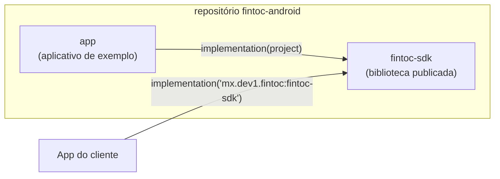
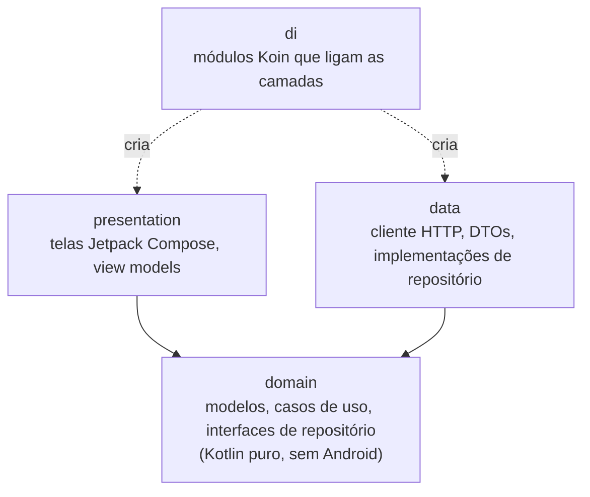
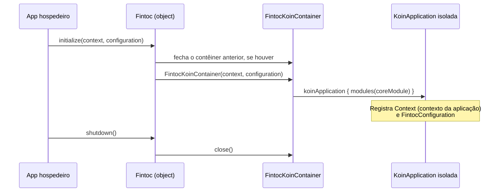

# Arquitetura

[English](../en/architecture.md) · [Español](../es/architecture.md) · [Français](../fr/architecture.md) · [Voltar ao README](README.md)

Esta página explica como o projeto está organizado. Você não precisa de experiência prévia em Android para acompanhá-la.

## Visão geral

O repositório é um build do Gradle com dois módulos:

- **`fintoc-sdk`** é uma *biblioteca Android*: código que outros apps incluem como dependência. É o que é publicado no Maven.
- **`app`** é um *aplicativo Android* que usa o SDK como um cliente faria. Também serve como exemplo vivo.

## Arquitetura limpa

Todos os módulos seguem as mesmas três camadas. As dependências apontam apenas **para dentro**, em direção ao domínio.

| Camada | Conhece | Nunca deve conhecer |
|---|---|---|
| `domain` | Biblioteca padrão do Kotlin, corrotinas | Android, Koin, HTTP, Compose |
| `data` | `domain` | `presentation`, Compose |
| `presentation` | `domain` | `data` |
| `di` | todas as camadas | — |

Hoje existem apenas o pacote `di` e o ponto de entrada público. As demais camadas são criadas conforme as
funcionalidades chegam, sob o pacote base `mx.dev1.fintoc.sdk`.

## API pública e modo de API explícita

O SDK ativa o **modo de API explícita** do Kotlin. Toda declaração é `internal`, a menos que seja marcada como `public`
de propósito, então a superfície pública da biblioteca é sempre intencional. Hoje ela é:

| Tipo | Função |
|---|---|
| `Fintoc` | Ponto de entrada: `initialize`, `shutdown`, `isInitialized`. |
| `FintocConfiguration` | Configurações: `authToken` e `baseUrl`. Seu `toString()` oculta o token para que ele nunca apareça em logs. |

## Injeção de dependências com um contêiner Koin isolado

O Koin é o framework de injeção de dependências. O SDK cria o **seu próprio** contêiner em vez de usar o global do
Koin. Assim, ele nunca colide com uma instância do Koin iniciada pelo app hospedeiro.

O código interno obtém suas dependências com `Fintoc.requireKoin()`. Se o app hospedeiro esquecer de chamar `initialize`,
a chamada falha imediatamente com uma mensagem explicando o que fazer.

## Decisões de build

| Decisão | Valor | Motivo |
|---|---|---|
| Kotlin | 2.4.20 | Versão estável atual. O Android Gradle Plugin 9 traz suporte a Kotlin integrado, então nenhum plugin de Kotlin separado é aplicado. |
| Android Gradle Plugin | 9.4.1 (exige Gradle 9.6.0) | Versão estável atual. |
| `minSdk` | 28 (Android 9) | Mantido do modelo do projeto. Reduzi-lo é uma mudança de uma linha em cada módulo. |
| `compileSdk` | 37 | Exigido pelo Compose BOM 2026.09.00. |
| `targetSdk` (app de exemplo) | 36 | O nível atualmente exigido pelo Google Play. |
| Jetpack Compose | BOM 2026.09.00 | UI com Compose como primeira opção. O XML só é usado onde a plataforma exige (manifest, tema da janela). |
| Bytecode Java | 11 | Permite que o maior número possível de apps hospedeiros consuma a biblioteca. |
| Versões | `gradle/libs.versions.toml` | Um único lugar para todas as versões de dependências. |

## Testes e cobertura

Existem três tipos de testes, e o relatório de cobertura combina todos eles:

| Tipo | Local | Ferramentas | Executa em |
|---|---|---|---|
| Unitários | `src/test` | JUnit 4, Mockito, Robolectric | Seu computador |
| Instrumentados | `src/androidTest` | AndroidX Test, Espresso, testes de UI do Compose | Dispositivo ou emulador |
| Cobertura | `gradle/jacoco-coverage.gradle.kts` | JaCoCo | Combina ambos |

O build falha quando a cobertura de linhas ou de instruções de um módulo cai abaixo de **80%**. Veja
[Como contribuir](contributing.md) para os comandos exatos.
