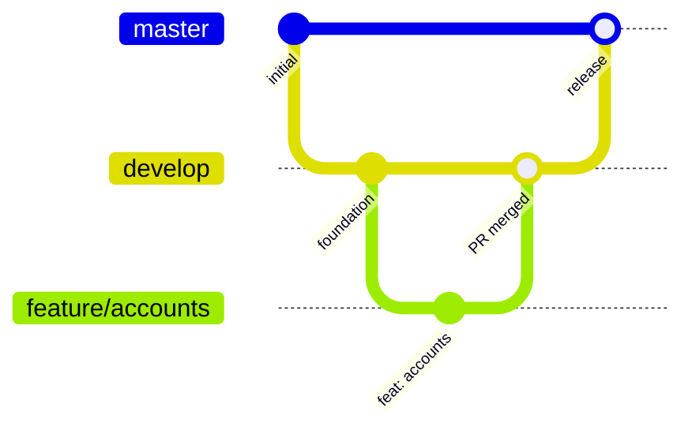

# Como contribuir

[English](../en/contributing.md) · [Español](../es/contributing.md) · [Français](../fr/contributing.md) · [Voltar ao README](README.md)

Obrigado por ajudar. Este guia não pressupõe experiência prévia em Android.

## 1. Prepare sua máquina

1. Instale uma versão estável recente do **Android Studio**. Ele inclui o gerenciador do SDK do Android.
2. No *SDK Manager*, instale o **Android SDK Platform 37**.
3. Garanta que haja um JDK 11 ou superior disponível para iniciar o Gradle. O build baixa sozinho o toolchain com JDK 21 de que precisa.
4. Clone o repositório e abra a pasta no Android Studio, ou trabalhe pelo terminal com `./gradlew`.

```bash
git clone git@github.com:DEV1-Softworks/fintoc-android.git
cd fintoc-android
./gradlew :app:assembleDebug
```

## 2. Estrutura do projeto

```text
fintoc-android/
├── fintoc-sdk/                 # a biblioteca publicada
│   └── src/
│       ├── main/kotlin/        # código-fonte do SDK
│       ├── test/kotlin/        # testes unitários (rodam no seu computador)
│       └── androidTest/kotlin/ # testes instrumentados (rodam em um dispositivo)
├── app/                        # aplicativo de exemplo (mesma estrutura de src)
├── .github/workflows/          # integração contínua, executada em cada pull request
├── gradle/
│   ├── libs.versions.toml      # todas as versões de dependências ficam aqui
│   ├── jacoco-coverage.gradle.kts
│   └── robolectric.gradle.kts
└── docs/                       # documentação em en, es, fr e pt
```

## 3. Execute os testes

| Objetivo | Comando |
|---|---|
| Testes unitários | `./gradlew testDebugUnitTest` |
| Testes instrumentados (com dispositivo conectado) | `./gradlew connectedDebugAndroidTest` |
| Relatório de cobertura | `./gradlew jacocoDebugCoverageReport` |
| Exigir a regra dos 80% | `./gradlew jacocoDebugCoverageVerification` |
| Tudo, na ordem certa | `./gradlew clean testDebugUnitTest connectedDebugAndroidTest jacocoDebugCoverageReport jacocoDebugCoverageVerification` |

O relatório HTML é gerado em `<módulo>/build/reports/jacoco/jacocoDebugCoverageReport/html/index.html`.

**Execute todos os testes antes de cada commit.** As tarefas de cobertura não iniciam os testes sozinhas, porque os
instrumentados precisam de um dispositivo. Se você pular as tarefas de teste, a verificação de cobertura só enxerga dados
desatualizados ou inexistentes.

### Dicas para os testes instrumentados

- Use um dispositivo físico com a depuração USB ativada, ou um emulador com Android 6.0 (API 23) ou superior.
- **Mantenha a tela ligada e desbloqueada** enquanto os testes rodam. Se a tela apagar, os testes de Compose falham com
  `No compose hierarchies found in the app`.
- O Espresso 3.7.0 ou superior é necessário para rodar no Android 16 (já está declarado no catálogo de versões).
- Os testes do host com Activity iniciam a tela real do SDK e giram o dispositivo uma vez. A tela carrega a página
  pública do Widget da Fintoc, mas os testes passam quer ela consiga carregar ou não.
- O teste do checkout hospedado abre uma Custom Tab do navegador do dispositivo, sobre uma sessão inventada do
  `pay.fintoc.com`, e envia a tecla Voltar para retornar. Mantenha a tela desbloqueada e espere o navegador aparecer por
  um instante.

## 4. Regras de código

- Estilo oficial do Kotlin, com a indentação padrão de 4 espaços.
- Nomes descritivos para variáveis, funções e classes. Nomes de uma única letra só são aceitos como contadores de laço.
- Arquitetura limpa: respeite as regras de camadas de [Arquitetura](architecture.md).
- Tudo no SDK é `internal`, a menos que precise ser público (o modo de API explícita garante isso).
- Compose primeiro: construa a UI com Jetpack Compose. Use XML apenas para necessidades legadas, como o manifest.
- Toda nova versão de dependência vai em `gradle/libs.versions.toml`, nunca direto em um módulo.
- Toda mudança de comportamento vem com testes unitários e, se tocar o Android, testes instrumentados. A cobertura de cada módulo deve permanecer em 80% ou mais.

## 5. Git flow

| Branch | Finalidade |
|---|---|
| `master` | Produção. Nunca se faz commit direto nela. |
| `develop` | Branch de integração. Cada funcionalidade é mesclada aqui por meio de um pull request. |
| `feature/<tema>` | Uma branch por funcionalidade, criada a partir de um `develop` atualizado. |
| `fix/<tema>` | Uma branch por correção de bug, criada a partir de um `develop` atualizado. |

Este repositório não tem branch `main`.



As branches de funcionalidade partem do `develop` e voltam a ele por meio de um pull request revisado. O `develop` chega à `master` a cada release.

Passos para uma mudança:

1. `git checkout develop && git pull`.
2. `git checkout -b feature/<tema>`.
3. Faça commits pequenos usando [Conventional Commits](https://www.conventionalcommits.org/pt-br/): `feat: …`, `fix: …`, `docs: …`, `test: …`, `chore: …`.
4. Execute todos os testes (seção 3).
5. Abra um pull request para `develop` com um resumo das mudanças e uma referência à issue ou tarefa relacionada.
6. Aguarde a revisão e o merge. Só então inicie a próxima funcionalidade a partir do `develop`.

**Sem pull requests empilhados.** Cada branch parte do `develop`, nunca de outra branch de funcionalidade.

### Verificações em cada pull request

O GitHub Actions executa `.github/workflows/ci.yml` em cada pull request para `develop` ou `master`, e em cada push nessas
branches. Três jobs rodam em paralelo, e um pull request está pronto para ser mesclado somente quando os três estão
verdes:

| Job | O que verifica | O mesmo na sua máquina |
|---|---|---|
| Unit tests and coverage | Executa os testes unitários e falha abaixo de 80 % de cobertura. Conta apenas os testes unitários, o que é mais rigoroso que a cobertura combinada da seção 3, então passar aqui significa passar lá. Os pull requests deste repositório recebem também um comentário com a cobertura. | `./gradlew testDebugUnitTest jacocoDebugCoverageReport jacocoDebugCoverageVerification` |
| Lint and release build | Executa o lint, compila as variantes release e publica em uma pasta local, o que não exige credenciais. Os arquivos da biblioteca ficam anexados à execução. | `./gradlew lintDebug lintRelease assembleRelease :fintoc-sdk:publishToMavenLocal -Dmaven.repo.local=/tmp/fintoc-m2` |
| Instrumented tests | Executa os testes instrumentados em um emulador do runner (Android 14, API 34). Sua máquina não precisa de um: você executa esses testes em um dispositivo físico. | `./gradlew connectedDebugAndroidTest` |

Os relatórios de cada execução ficam anexados como artefatos, o que ajuda quando um job falha e a causa não está no log.

## 6. Documentação

Toda mudança que afete o comportamento ou a configuração atualiza a documentação. Os documentos ficam em `docs/` e devem
existir em quatro idiomas: inglês (`docs/en`), espanhol (`docs/es`), francês (`docs/fr`) e português (`docs/pt`). O
`README.md` da raiz é o ponto de entrada.
