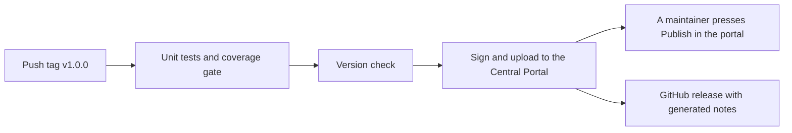

# Publicar uma versão

[English](../en/releasing.md) · [Español](../es/releasing.md) · [Français](../fr/releasing.md) · [Voltar ao README](../../README.md)

Esta página explica como uma pessoa mantenedora publica `mx.dev1.fintoc:fintoc-sdk` no
[Maven Central](https://central.sonatype.com). Nada secreto está no repositório: suas credenciais ficam no seu próprio
`~/.gradle/gradle.properties` ou em variáveis de ambiente.

## Configuração inicial (uma única vez)

1. Crie uma conta no [Central Portal](https://central.sonatype.com).
2. **Verifique o namespace** `mx.dev1` no portal (Namespaces). Ele prova, com um registro DNS, que você é dono do domínio
   `dev1.mx`. As coordenadas `mx.dev1.fintoc` ficam sob ele. Um namespace como `io.github.dev1-softworks` não precisaria
   de domínio, mas mudaria as coordenadas da biblioteca, então decida antes da primeira versão.
3. **Gere um user token** no portal (Account e depois Generate User Token). É um usuário e uma senha para o envio, não os
   que você usa para entrar.
4. **Crie uma chave GPG** que assine os artefatos, e publique a parte pública dela em um servidor de chaves que o Maven
   Central leia, como `keyserver.ubuntu.com`:

```bash
gpg --full-generate-key
gpg --keyserver keyserver.ubuntu.com --send-keys <id da chave>
gpg --export-secret-keys --armor <id da chave>    # imprime a chave privada: não a deixe em logs nem em chats
```

5. Dê ao Gradle as credenciais, no seu `gradle.properties` de usuário:

```properties
# ~/.gradle/gradle.properties, never in the repository
mavenCentralUsername=<token username>
mavenCentralPassword=<token password>
signingInMemoryKey=<armored secret key, on one line or with \n for the line breaks>
signingInMemoryKeyPassword=<password of the key>
```

Em um servidor de CI use os mesmos nomes como variáveis de ambiente com o prefixo `ORG_GRADLE_PROJECT_`, por exemplo
`ORG_GRADLE_PROJECT_mavenCentralUsername`.

## Versionamento

A versão é `VERSION_NAME` em `gradle.properties`. O projeto segue o [Versionamento Semântico](https://semver.org). Entre
versões ela termina em `-SNAPSHOT`. O Maven Central nunca aceita a mesma versão duas vezes, então um erro se corrige com
uma versão nova. A primeira versão é a 1.0.0, então a API pública é um compromisso desde o início: uma mudança que a
quebre sobe a versão maior, um recurso novo sobe a versão menor e uma correção sobe a versão de correção. Só é pública o
que a documentação da API lista: tudo o que está marcado como `internal` pode mudar livremente. O
[registro de mudanças](changelog.md) lista cada mudança.

## Passos da publicação

Seguem o Git flow deste projeto, em que `master` é produção.

1. Crie a branch `release/<versão>` a partir de `develop`.
2. Ponha `VERSION_NAME` na versão, sem `-SNAPSHOT`, e mova as notas de `Unreleased` dos quatro registros de mudanças para
   debaixo da versão nova.
3. Execute tudo, com um telefone conectado e desbloqueado:
   `./gradlew testDebugUnitTest connectedDebugAndroidTest jacocoDebugCoverageReport jacocoDebugCoverageVerification lintDebug lintRelease assembleRelease`.
4. Faça um [ensaio](#ensaio) e corrija o que ele mostrar.
5. Abra um pull request de `release/<versão>` para `master`, e faça o merge.
6. Em `master`, marque o commit com `v<versão>` e envie a tag: `git tag v<versão> && git push origin v<versão>`. Isso
   inicia o [fluxo de publicação](#publicação-automática), que testa, assina, envia e cria o release do GitHub.
7. Quando o fluxo terminar, abra o [Central Portal](https://central.sonatype.com), vá em Publish e depois em Deployments,
   espere a validação passar e pressione **Publish**. Nada é público antes disso.
8. Faça o merge de `master` de volta em `develop` com um pull request que ponha `VERSION_NAME` no próximo `-SNAPSHOT`.
9. O fluxo já criou o release do GitHub, com notas geradas. Cole nele as notas do registro de mudanças se preferir.

## Publicação automática

`.github/workflows/cd.yml` publica uma versão quando uma tag que começa com `v` é enviada. Ele também pode ser iniciado à mão
na aba Actions, para publicar de novo a versão de `gradle.properties` depois de uma falha.



1. **Primeiro os testes.** A publicação é bloqueada a menos que os testes unitários passem e a cobertura seja de pelo menos
   80 %.
2. **Verificação da versão.** A execução falha se `VERSION_NAME` terminar em `-SNAPSHOT`, ou se a tag não for `v` mais
   `VERSION_NAME`, então uma tag errada não pode sair.
3. **Envio assinado.** `./gradlew :fintoc-sdk:publishToMavenCentral` assina os arquivos e os envia ao Central Portal como
   um deployment. A compilação começa do zero, sem cache do Gradle.
4. **Confirmação manual.** Nada se torna público sozinho: uma pessoa mantenedora pressiona **Publish** no deployment
   validado do portal. O resumo da execução lembra você.
5. **Release do GitHub.** O fluxo cria o release da tag com notas geradas. Uma versão com sufixo, como `1.1.0-rc.1`, é
   marcada como pré-release.

As credenciais são segredos do repositório (Settings, Secrets and variables, Actions), com os mesmos nomes dos do
[openpay-android](https://github.com/DEV1-Softworks/openpay-android):

| Segredo | O que contém | Propriedade do Gradle em que se transforma |
|---|---|---|
| `MAVEN_REPOSITORY_USERNAME` | O usuário do token de usuário do Central Portal. | `mavenCentralUsername` |
| `MAVEN_REPOSITORY_PASSWORD` | A senha do token de usuário do Central Portal. | `mavenCentralPassword` |
| `SIGNING_KEY` | A chave privada no formato armored: `gpg --export-secret-keys --armor <id da chave>`. | `signingInMemoryKey` |
| `SIGNING_PASSWORD` | A senha dessa chave. | `signingInMemoryKeyPassword` |

Se uma execução falhar:

- **Antes do envio** (os testes ou a verificação da versão): nada foi publicado. Corrija a causa e, se o commit mudar,
  apague a tag (`git push --delete origin v<versão>` e `git tag -d v<versão>`) e marque de novo.
- **Durante ou depois do envio:** veja o deployment no portal. Um deployment recusado pode ser descartado lá e a mesma
  versão enviada de novo. Uma versão que foi publicada nunca mais pode ser enviada: corrija o problema com uma versão nova.

## Publicação manual

Se o fluxo não estiver disponível, publique da sua máquina com as credenciais do seu `gradle.properties`:

```bash
./gradlew :fintoc-sdk:publishAndReleaseToMavenCentral
```

Isso assina, envia e libera sem a confirmação manual. Para ver o envio no portal antes, execute `publishToMavenCentral` e
pressione Publish lá.

## O que é publicado

| Arquivo | O que é |
|---|---|
| `fintoc-sdk-<versão>.aar` | A biblioteca. |
| `fintoc-sdk-<versão>.pom` e `.module` | Metadados para o Maven e para o Gradle. O POM nomeia os desenvolvedores, a licença e o repositório, que o Central exige, e a descrição diz que o SDK não é oficial. |
| `fintoc-sdk-<versão>-sources.jar` | As fontes em Kotlin. |
| `fintoc-sdk-<versão>-javadoc.jar` | A documentação da API, gerada pelo Dokka a partir do KDoc. Só a API pública aparece. |
| `*.asc` | Uma assinatura GPG de cada arquivo acima. |

## Ensaio

Publicar em uma pasta local não precisa de credenciais e não assina nada, então é seguro fazer a qualquer momento. Mostra
exatamente o que seria enviado:

```bash
./gradlew :fintoc-sdk:publishToMavenLocal -Dmaven.repo.local=/tmp/fintoc-m2
```

Depois verifique o que um consumidor vê: crie um app vazio com `compileSdk 37`, aponte seus repositórios para essa pasta e
adicione a biblioteca. Três verificações valem o tempo:

- **Ele compila e constrói com o R8**, usando a API pública que você mudou.
- **O Kotlin dele não é forçado para cima.** Olhe a biblioteca padrão do Kotlin que o Gradle resolve para o app. Deve ser a
  do app, não a deste build.
- **O manifesto se funde.** O manifesto fundido do app tem a permissão `INTERNET` e a Activity do SDK.

Para verificar as assinaturas com uma chave descartável, defina `signingInMemoryKey` com uma chave de teste no mesmo
comando, e verifique cada `.asc` com `gpg --verify`.

## Se o portal recusar o envio

O portal explica cada falha. As comuns são um namespace não verificado, uma chave pública que nenhum servidor de chaves
ainda tem, uma assinatura, um jar de javadoc ou de fontes faltando, um POM sem desenvolvedores ou sem licença, e uma
versão que já existe. Corrija a causa, mude a versão se uma foi consumida, e publique de novo.
